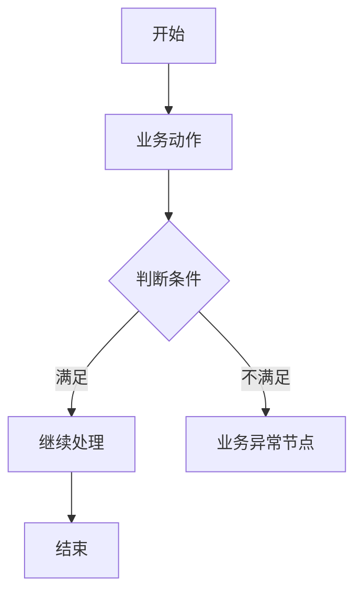
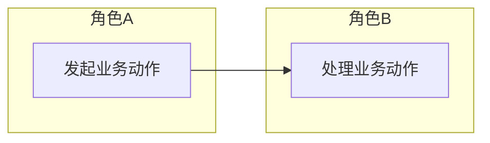
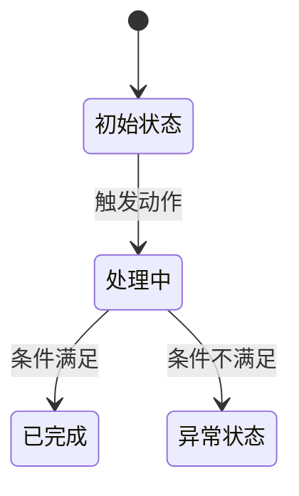
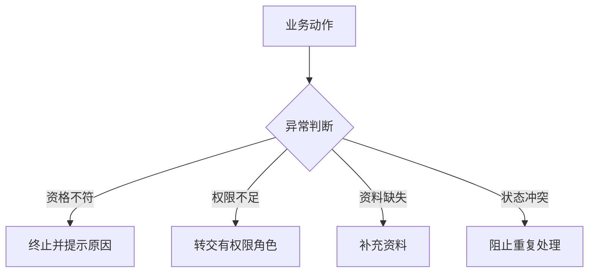
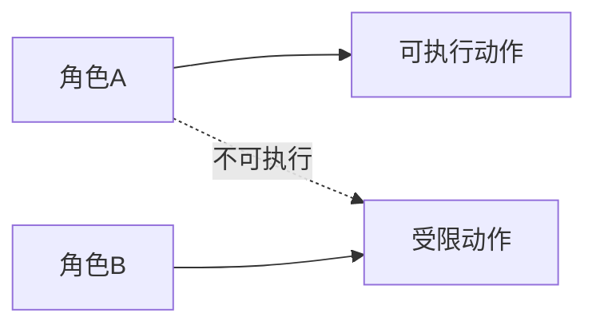

# 业务流程输出模板

## 使用要求

业务流程助手每次正式处理 05_需求分析/ 中的需求分析稿时，必须输出一个业务流程设计稿。

文件保存到：

- 06_业务流程/

建议文件名：

业务流程_流程设计_v1_20260602.md

## 业务流程设计稿模板

~~~md
# 业务流程设计稿

## 背景

## 目标

## 输入来源

## 需求覆盖范围

| 需求 | 来源 | 是否纳入本次流程设计 | 说明 |
| --- | --- | --- | --- |

## 角色与职责

| 角色 | 职责 | 权限边界 | 备注 |
| --- | --- | --- | --- |

## 关键业务对象

| 业务对象 | 定义 | 关键属性 | 相关角色 |
| --- | --- | --- | --- |

## 业务动作流程图

### Mermaid

### 节点清单

| 节点ID | 节点名称 | 节点类型 | 说明 |
| --- | --- | --- | --- |

### 连线清单

| 起点 | 终点 | 条件 | 说明 |
| --- | --- | --- | --- |

### draw.io 建图说明

## 角色泳道图

### Mermaid

### 泳道/分组说明

| 泳道 | 对应角色或系统 | 职责 |
| --- | --- | --- |

### 节点清单

| 节点ID | 节点名称 | 所属泳道 | 说明 |
| --- | --- | --- | --- |

### 连线清单

| 起点 | 终点 | 条件 | 说明 |
| --- | --- | --- | --- |

### draw.io 建图说明

## 状态流转图

### Mermaid

### 状态流转表

| 业务对象 | 当前状态 | 触发动作 | 触发角色 | 前置条件 | 结果状态 | 异常状态 |
| --- | --- | --- | --- | --- | --- | --- |

### draw.io 建图说明

## 异常流程图

### Mermaid

### 业务异常节点

| 异常类型 | 触发条件 | 影响范围 | 处理方式 | 下游关注点 |
| --- | --- | --- | --- | --- |

### draw.io 建图说明

## 权限边界图

### Mermaid

### 权限边界表

| 角色 | 可执行动作 | 不可执行动作 | 需要确认/审核的动作 | 备注 |
| --- | --- | --- | --- | --- |

### draw.io 建图说明

## 流程步骤表

| 步骤 | 角色 | 业务动作 | 前置条件 | 判断点 | 结果 | 异常处理 |
| --- | --- | --- | --- | --- | --- | --- |

## 业务规则

| 规则 | 适用场景 | 影响对象 | 来源依据 |
| --- | --- | --- | --- |

## 关键决策点

| 决策点 | 判断条件 | 分支结果 | 风险 |
| --- | --- | --- | --- |

## 下游交接说明

| 下游助手 | 需要关注的内容 |
| --- | --- |
| 信息架构助手 |  |
| 交互设计助手 |  |
| 数据交互助手 |  |

## 风险与依赖

## 下一步动作
~~~

## 边界说明

业务流程助手不输出页面结构、页面跳转、交互控件、表单字段、接口字段、高保真原型或最终 PRD。
