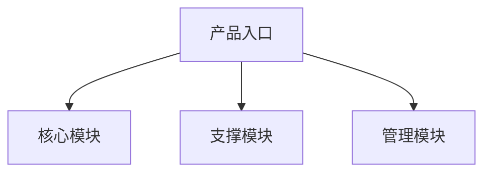
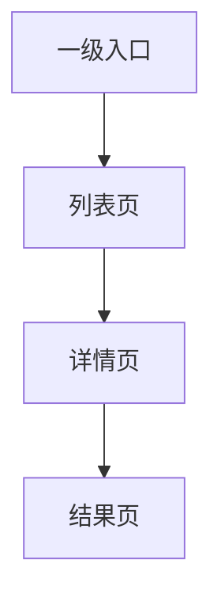

# 信息架构输出模板

## 使用要求

信息架构助手每次正式处理 `05_需求分析/` 中的需求分析稿和 `06_业务流程/` 中的业务流程设计稿时，必须输出一个信息架构设计稿。

文件保存到：

- `07_信息架构/`

建议文件名：

信息架构_页面结构_v1_20260602.md

## 信息架构设计稿模板

~~~md
# 信息架构设计稿

## 背景

## 目标

## 输入来源

## 关键结论

## 需求覆盖范围

| 需求 | 来源 | 是否纳入信息架构 | 对应模块 | 对应页面 | 说明 |
| --- | --- | --- | --- | --- | --- |

## 角色与页面权限视图

| 角色 | 可见模块 | 可访问页面 | 不可访问页面 | 权限说明 |
| --- | --- | --- | --- | --- |

## 模块结构图

### Mermaid

### 节点清单

| 节点ID | 节点名称 | 节点类型 | 说明 |
| --- | --- | --- | --- |

### 连线清单

| 起点 | 终点 | 关系 | 说明 |
| --- | --- | --- | --- |

## 模块结构表

| 模块 | 模块类型 | 模块目标 | 覆盖需求 | 服务角色 | 关联业务对象 | 对应流程阶段 | 是否纳入 MVP |
| --- | --- | --- | --- | --- | --- | --- | --- |

## 页面结构图

### Mermaid

### 节点清单

| 节点ID | 页面名称 | 所属模块 | 页面类型 | 说明 |
| --- | --- | --- | --- | --- |

### 连线清单

| 起点页面 | 终点页面 | 触发条件 | 说明 |
| --- | --- | --- | --- |

## 页面清单

| 页面 | 所属模块 | 页面目标 | 服务角色 | 对应需求 | 对应业务动作 | 关联业务对象 | 页面类型 | 是否纳入 MVP |
| --- | --- | --- | --- | --- | --- | --- | --- | --- |

## 导航关系

| 页面 | 导航层级 | 入口类型 | 上级页面 | 下级页面 | 跨模块入口 | 是否可直达 | 说明 |
| --- | --- | --- | --- | --- | --- | --- | --- |

## 页面入口与出口

| 页面 | 主流程入口 | 异常流程入口 | 角色入口 | 外部入口 | 完成后出口 | 失败或中止后出口 | 返回路径 |
| --- | --- | --- | --- | --- | --- | --- | --- |

## 页面状态

| 页面 | 默认状态 | 空状态 | 加载状态 | 错误状态 | 无权限状态 | 不可操作状态 | 已完成状态 | 异常业务状态 |
| --- | --- | --- | --- | --- | --- | --- | --- | --- |

## 页面上下游关系

| 前置页面 | 当前页面 | 后续页面 | 承接业务对象 | 承接业务状态 | 触发角色 | 触发条件 | 权限条件 |
| --- | --- | --- | --- | --- | --- | --- | --- |

## 权限差异说明

| 页面 | 角色 | 可见内容 | 可进入条件 | 不可进入原因 | 替代去向 |
| --- | --- | --- | --- | --- | --- |

## 暂不纳入页面或模块

| 页面或模块 | 暂不纳入原因 | 来源依据 | 后续建议 |
| --- | --- | --- | --- |

## 下游交接说明

| 下游助手 | 需要关注的内容 |
| --- | --- |
| 交互设计助手 |  |
| 数据交互助手 |  |
| 高保真原型助手 |  |
| 需求文档助手 |  |
| 评审助手 |  |

## 待确认问题

| 问题 | 影响范围 | 建议确认对象 | 处理建议 |
| --- | --- | --- | --- |

## 风险与依赖

## 下一步动作
~~~

## 边界说明

信息架构助手只输出页面级信息架构，不输出组件交互细节、表单字段规则、接口字段、视觉稿、HTML 原型或最终 PRD。
