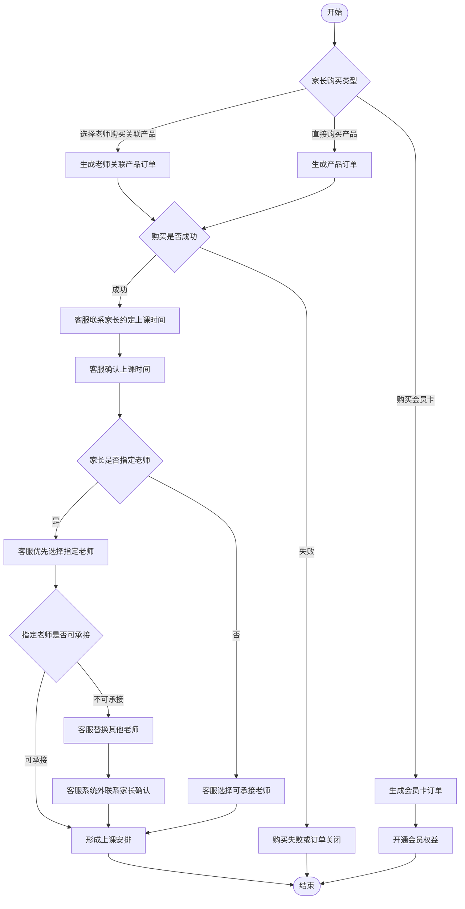
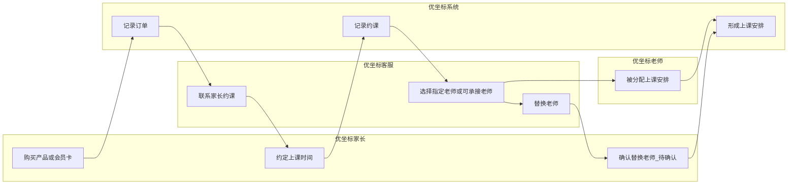
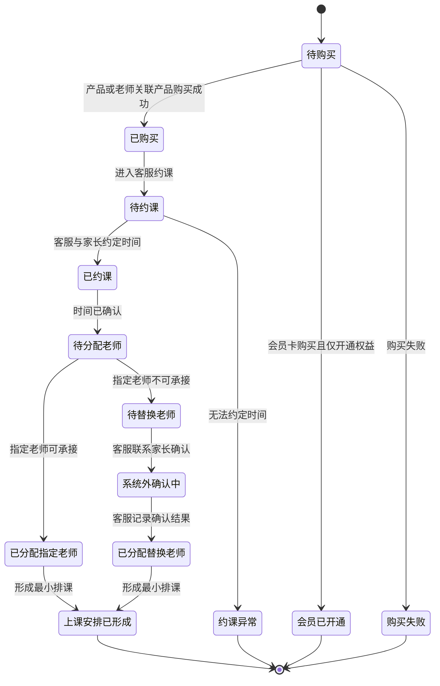
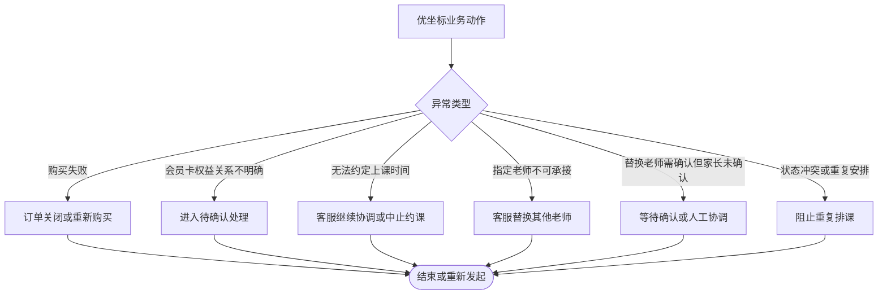
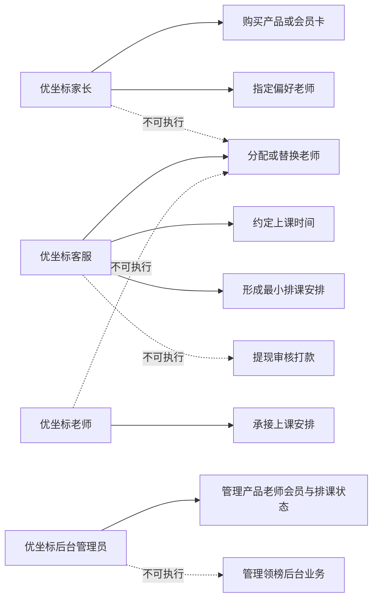

# 业务流程_优坐标B2C流程_v1_20260603

## 背景

本稿由 `03 - 业务流程助手` 基于上游需求分析和用户确认 MVP 边界生成。已确认优坐标与领榜教育后台完全独立；优坐标采用 B2C 模式，家长可以选择老师购买该老师关联产品，也可以直接购买产品，并包含会员卡购买业务。购买后由客服与家长约定上课时间，客服选择上课老师，优先选择家长指定老师，也允许替换其他老师。第三方排课系统对接方式暂不确定，本稿按不依赖第三方系统的最小排课业务建模。

## 目标

将优坐标已成型需求转为业务动作级流程，覆盖主流程、异常流程、角色泳道、状态流转、权限边界、最小排课闭环与 draw.io 兼容图集。本稿不输出页面结构、页面跳转、交互控件、表单字段、接口字段、高保真原型或 PRD。

## 输入来源

- `/Users/xuyunfeng/Documents/k12/03_需求提取/需求提取_领榜优坐标需求线索_v1_20260603.md`
- `/Users/xuyunfeng/Documents/k12/04_需求澄清/需求澄清_领榜优坐标问题清单_v1_20260603.md`
- `/Users/xuyunfeng/Documents/k12/05_需求分析/需求分析_领榜优坐标MVP范围_v1_20260603.md`
- `/Users/xuyunfeng/Documents/k12/05_需求分析/需求分析_用户确认MVP边界_v1_20260603.md`

## 关键结论

- 优坐标后台独立管理产品、老师关联产品、会员卡、客服约课、老师分配、排课、分销、提现和佣金。
- 优坐标购买路径包含三类：选择老师购买关联产品、直接购买产品、购买会员卡。
- 最小排课闭环为：购买成功后，客服与家长约定上课时间，客服选择或替换老师，形成上课安排。
- 客服替换家长指定老师时，确认动作发生在系统外，由客服联系家长确认；系统内不要求家长二次确认。
- 会员卡当前先作为独立购买与权益开通处理，不做复杂抵扣。
- 第三方排课深度对接不作为强依赖；当前流程以人工可跑通的最小排课为准。

## 用户确认规则优先级

本节规则覆盖本文早期图表中关于“替换老师是否需家长二次确认”“会员卡是否进入约课”的旧待确认表述。下游 04 信息架构应按本节规则建模：

- 系统内不做家长二次确认老师替换页面。
- 客服可在后台记录“已系统外联系家长确认”的操作备注或确认状态。
- 会员卡先作为独立订单与权益开通页面处理。
- 会员卡与产品订单、课时抵扣、折扣的复杂关系保留为后续待确认规则。

## 需求覆盖范围

| 需求 | 来源 | 是否纳入本次流程设计 | 说明 |
| --- | --- | --- | --- |
| 优坐标后台独立 | 用户确认 MVP 边界 CFM-01 | 是 | 不与领榜共用后台 |
| 家长选择老师购买关联产品 | 用户确认 MVP 边界 CFM-06 | 是 | B2C 购买路径之一 |
| 家长直接购买产品 | 用户确认 MVP 边界 CFM-07 | 是 | B2C 购买路径之一 |
| 会员卡购买 | 用户确认 MVP 边界 CFM-11 | 是 | 单独作为购买路径 |
| 客服约课 | 用户确认 MVP 边界 CFM-08 | 是 | 购买后服务动作 |
| 客服选择/替换老师 | 用户确认 MVP 边界 CFM-09/CFM-10 | 是 | 后台必须支持操控能力 |
| 最小排课业务 | 用户确认 MVP 边界 CFM-15 | 是 | 不依赖第三方系统 |
| 替换老师系统外确认 | 用户在 03 业务流程关口确认 | 是 | 系统内不要求家长二次确认 |
| 会员卡独立权益开通 | 用户在 03 业务流程关口确认 | 是 | 当前不做复杂抵扣 |

## 角色与职责

| 角色 | 职责 | 权限边界 | 备注 |
| --- | --- | --- | --- |
| 优坐标家长 | 购买老师关联产品、直接购买产品、购买会员卡、与客服约定上课时间 | 不能分配或替换上课老师 | 可指定老师 |
| 优坐标客服 | 联系家长约课、选择上课老师、必要时替换老师、记录系统外家长确认、形成上课安排 | 不能管理领榜业务，不能执行财务审核 | 后台必须支持替换操控和留痕 |
| 优坐标老师 | 被关联产品、被客服选择承接课程、按安排上课 | 不能替客服确认排课，不能替家长购买 | 是否确认接课待后续确认 |
| 优坐标后台管理员 | 管理产品、老师关联、会员卡、订单和排课状态 | 仅管理优坐标后台 | 不触达领榜后台 |
| 财务 | 处理优坐标提现和佣金审核 | 不处理排课老师选择 | 详见分销提现佣金流程 |
| 系统 | 记录购买、约课、老师分配和排课状态 | 不替代客服业务判断 | 最小排课可不依赖第三方 |

## 关键业务对象

| 业务对象 | 定义 | 关键属性 | 相关角色 |
| --- | --- | --- | --- |
| 产品订单 | 家长购买产品或老师关联产品形成的交易对象 | 购买类型、订单状态、关联老师 | 家长、客服、系统 |
| 会员卡订单 | 家长购买会员卡形成的交易对象 | 会员状态、权益开通状态 | 家长、后台、系统 |
| 约课记录 | 客服与家长约定上课时间的业务记录 | 状态、约定时间、关联订单 | 家长、客服 |
| 上课安排 | 客服选择或替换老师后形成的最小排课结果 | 状态、老师、时间、关联订单 | 客服、老师、家长 |
| 老师关联产品 | 老师与产品之间的业务关联 | 老师、产品、可售状态 | 后台管理员、老师 |

## 业务动作流程图

### Mermaid

### 节点清单

| 节点ID | 节点名称 | 节点类型 | 所属泳道 | 说明 |
| --- | --- | --- | --- | --- |
| S | 开始 | 开始 | 业务阶段 | 优坐标购买与排课开始 |
| D1 | 家长购买类型 | 判断 | 家长 | 三类购买入口 |
| B1 | 生成老师关联产品订单 | 动作 | 系统 | 选老师购买关联产品 |
| B2 | 生成产品订单 | 动作 | 系统 | 直接购买产品 |
| B3 | 生成会员卡订单 | 动作 | 系统 | 购买会员卡 |
| D2 | 购买是否成功 | 判断 | 系统 | 判断产品类购买结果 |
| C1 | 客服联系家长约定上课时间 | 动作 | 客服 | 购买后约课 |
| C2 | 客服确认上课时间 | 动作 | 客服 | 确定最小排课时间 |
| D4 | 家长是否指定老师 | 判断 | 客服 | 判断是否按指定老师优先 |
| C3 | 客服优先选择指定老师 | 动作 | 客服 | 已确认优先选择指定老师 |
| C4 | 客服选择可承接老师 | 动作 | 客服 | 未指定时客服选择老师 |
| D5 | 指定老师是否可承接 | 判断 | 客服 | 判断指定老师可用性 |
| C5 | 客服替换其他老师 | 动作 | 客服 | 已确认允许替换 |
| C7 | 客服系统外联系家长确认 | 动作 | 客服 | 系统内记录确认结果或备注 |
| C6 | 形成上课安排 | 动作 | 系统 | 最小排课结果 |
| M1 | 开通会员权益 | 动作 | 系统 | 会员卡不约课时的结果 |
| E1 | 购买失败或订单关闭 | 异常 | 系统 | 购买失败 |
| F | 结束 | 结束 | 业务阶段 | 流程结束 |

### 连线清单

| 起点 | 终点 | 条件 | 说明 |
| --- | --- | --- | --- |
| S | D1 | 开始 | 判断购买类型 |
| D1 | B1 | 选择老师购买关联产品 | 生成关联产品订单 |
| D1 | B2 | 直接购买产品 | 生成产品订单 |
| D1 | B3 | 购买会员卡 | 生成会员卡订单 |
| B1 | D2 | 订单生成 | 判断购买是否成功 |
| B2 | D2 | 订单生成 | 判断购买是否成功 |
| B3 | M1 | 会员卡购买成功 | 开通会员权益 |
| D2 | C1 | 成功 | 客服约课 |
| D2 | E1 | 失败 | 订单关闭 |
| C1 | C2 | 联系完成 | 确认时间 |
| C2 | D4 | 时间确认后 | 判断指定老师 |
| D4 | C3 | 是 | 优先指定老师 |
| D4 | C4 | 否 | 客服选择老师 |
| C3 | D5 | 已选指定老师 | 判断可承接 |
| D5 | C6 | 可承接 | 形成安排 |
| D5 | C5 | 不可承接 | 替换老师 |
| C4 | C6 | 选定老师 | 形成安排 |
| C5 | C7 | 替换后 | 客服系统外确认 |
| C7 | C6 | 确认记录后 | 形成安排 |
| C6 | F | 完成 | 结束 |
| M1 | F | 完成 | 结束 |
| E1 | F | 终止 | 结束 |

### 泳道/分组说明

| 分组名称 | 分组类型 | 包含节点 | 说明 |
| --- | --- | --- | --- |
| 家长购买 | 阶段 | D1,B1,B2,B3,D2,D3,E1,M1 | 三类购买路径 |
| 客服约课 | 角色 | C1,C2,D4,C3,C4,D5,C5,C7 | 客服主导最小排课 |
| 系统外确认 | 阶段 | C7 | 客服线下/系统外联系家长确认 |
| 系统排课结果 | 系统 | C6 | 形成最小上课安排 |

### draw.io 建图建议

- 建议图形类型：业务动作流程图。
- 建议泳道或分组：家长购买、客服约课、家长确认、系统排课结果。
- 判断节点样式：菱形；待确认判断使用黄色。
- 异常节点样式：红色矩形。
- 状态节点样式：蓝色圆角矩形。
- 颜色或标注建议：购买路径用蓝色，客服排课用绿色，待确认规则用黄色。

## 角色泳道图

### Mermaid

### 泳道/分组说明

| 分组名称 | 分组类型 | 包含节点 | 说明 |
| --- | --- | --- | --- |
| 优坐标家长 | 角色 | P1,P2,P3 | 购买、约课、待确认替换确认 |
| 优坐标客服 | 角色 | C1,C2,C3 | 约课、选老师、替换老师 |
| 优坐标老师 | 角色 | T1 | 承接上课安排 |
| 优坐标系统 | 系统 | S1,S2,S3 | 记录订单、约课和安排 |

### 节点清单

| 节点ID | 节点名称 | 节点类型 | 所属泳道 | 说明 |
| --- | --- | --- | --- | --- |
| P1 | 购买产品或会员卡 | 动作 | 优坐标家长 | 家长购买 |
| P2 | 约定上课时间 | 动作 | 优坐标家长 | 与客服确认时间 |
| P3 | 确认替换老师_待确认 | 动作 | 优坐标家长 | 是否需要二次确认待定 |
| C1 | 联系家长约课 | 动作 | 优坐标客服 | 客服发起约课 |
| C2 | 选择指定老师或可承接老师 | 动作 | 优坐标客服 | 客服选择老师 |
| C3 | 替换老师 | 动作 | 优坐标客服 | 指定老师不可用时替换 |
| T1 | 被分配上课安排 | 动作 | 优坐标老师 | 老师承接安排 |
| S1 | 记录订单 | 系统 | 优坐标系统 | 记录购买结果 |
| S2 | 记录约课 | 系统 | 优坐标系统 | 记录约定时间 |
| S3 | 形成上课安排 | 系统 | 优坐标系统 | 最小排课闭环 |

### 连线清单

| 起点 | 终点 | 条件 | 说明 |
| --- | --- | --- | --- |
| P1 | S1 | 购买后 | 系统记录订单 |
| S1 | C1 | 购买成功 | 客服约课 |
| C1 | P2 | 联系家长 | 约定时间 |
| P2 | S2 | 时间确认 | 记录约课 |
| S2 | C2 | 进入分配老师 | 客服选择老师 |
| C2 | T1 | 老师可承接 | 分配老师 |
| T1 | S3 | 分配完成 | 形成安排 |
| C2 | C3 | 指定老师不可承接 | 替换老师 |
| C3 | P3 | 待确认: 需要二次确认 | 家长确认替换 |
| P3 | S3 | 确认后 | 形成安排 |

### draw.io 建图建议

- 建议图形类型：水平泳道图。
- 建议泳道或分组：优坐标家长、优坐标客服、优坐标老师、优坐标系统。
- 判断节点样式：替换老师确认规则用黄色标签。
- 异常节点样式：未约成、老师不可用等异常使用红色边框。
- 状态节点样式：系统记录节点使用蓝色。
- 颜色或标注建议：客服动作使用绿色，家长动作使用蓝色。

## 状态流转图

### Mermaid

### 状态流转表

| 业务对象 | 当前状态 | 触发动作 | 触发角色 | 前置条件 | 结果状态 | 异常状态 |
| --- | --- | --- | --- | --- | --- | --- |
| 订单 | 待购买 | 购买产品或会员卡 | 家长 | 选择购买对象 | 已购买或会员已开通 | 购买失败 |
| 订单 | 已购买 | 发起约课 | 客服 | 购买成功 | 待约课 | 约课异常 |
| 约课记录 | 待约课 | 约定时间 | 客服/家长 | 客服联系家长 | 已约课 | 约课异常 |
| 上课安排 | 已约课 | 选择老师 | 客服 | 时间已确认 | 已分配指定老师或待替换老师 | 老师不可承接 |
| 上课安排 | 待替换老师 | 替换老师并系统外确认 | 客服 | 指定老师不可承接 | 系统外确认中或已分配替换老师 | 约课异常 |
| 上课安排 | 系统外确认中 | 记录确认结果 | 客服 | 已联系家长确认 | 已分配替换老师 | 约课异常 |
| 上课安排 | 已分配老师 | 形成安排 | 系统 | 老师和时间已确定 | 上课安排已形成 | 状态冲突 |

### 节点清单

| 节点ID | 节点名称 | 节点类型 | 所属泳道 | 说明 |
| --- | --- | --- | --- | --- |
| ST1 | 待购买 | 状态 | 订单 | 购买前 |
| ST2 | 已购买 | 状态 | 订单 | 产品类购买成功 |
| ST3 | 会员已开通 | 状态 | 会员 | 会员卡权益开通 |
| ST4 | 待约课 | 状态 | 约课记录 | 等待客服约课 |
| ST5 | 已约课 | 状态 | 约课记录 | 时间已确认 |
| ST6 | 待分配老师 | 状态 | 上课安排 | 等待客服选老师 |
| ST7 | 已分配指定老师 | 状态 | 上课安排 | 指定老师可承接 |
| ST8 | 待替换老师 | 状态 | 上课安排 | 指定老师不可承接 |
| ST9 | 系统外确认中 | 状态 | 上课安排 | 客服正在系统外联系家长确认 |
| ST10 | 已分配替换老师 | 状态 | 上课安排 | 替换老师已确定 |
| ST11 | 上课安排已形成 | 状态 | 上课安排 | 最小排课完成 |
| EX1 | 购买失败 | 异常 | 订单 | 购买失败 |
| EX2 | 约课异常 | 异常 | 约课记录 | 无法约定时间或确认 |

### 连线清单

| 起点 | 终点 | 条件 | 说明 |
| --- | --- | --- | --- |
| ST1 | ST2 | 产品或关联产品购买成功 | 进入约课 |
| ST1 | ST3 | 会员卡购买且仅开通权益 | 开通会员 |
| ST1 | EX1 | 购买失败 | 订单失败 |
| ST2 | ST4 | 客服发起约课 | 待约课 |
| ST4 | ST5 | 时间确认 | 已约课 |
| ST4 | EX2 | 无法约定时间 | 约课异常 |
| ST5 | ST6 | 时间已确认 | 待分配老师 |
| ST6 | ST7 | 指定老师可承接 | 分配指定老师 |
| ST6 | ST8 | 指定老师不可承接 | 待替换 |
| ST8 | ST9 | 客服联系家长 | 系统外确认 |
| ST9 | ST10 | 客服记录确认结果 | 替换完成 |
| ST7 | ST11 | 形成安排 | 最小排课完成 |
| ST10 | ST11 | 形成安排 | 最小排课完成 |

### 泳道/分组说明

| 分组名称 | 分组类型 | 包含节点 | 说明 |
| --- | --- | --- | --- |
| 订单状态 | 阶段 | ST1,ST2,ST3,EX1 | 购买与会员开通 |
| 约课状态 | 阶段 | ST4,ST5,EX2 | 客服与家长约课 |
| 排课状态 | 阶段 | ST6,ST7,ST8,ST9,ST10,ST11 | 客服选老师并形成安排 |

### draw.io 建图建议

- 建议图形类型：状态机图。
- 建议泳道或分组：订单状态、约课状态、排课状态。
- 判断节点样式：用状态连线标签表达条件。
- 异常节点样式：红色状态节点。
- 状态节点样式：圆角矩形。
- 颜色或标注建议：会员状态可用紫色，排课状态用绿色，待确认连线用黄色。

## 异常流程图

### Mermaid

### 业务异常节点

| 异常类型 | 触发条件 | 影响范围 | 处理方式 | 下游关注点 |
| --- | --- | --- | --- | --- |
| 购买失败 | 产品、关联产品或会员卡购买未成功 | 订单、家长 | 订单关闭或重新购买 | 不展开支付接口 |
| 会员卡权益关系不明确 | 会员卡是否可抵扣产品或课时未确认 | 会员、订单、排课 | 进入待确认处理 | 后续需用户确认抵扣关系 |
| 无法约定上课时间 | 客服与家长无法达成时间 | 约课记录 | 客服继续协调或中止 | 交互阶段处理沟通路径 |
| 指定老师不可承接 | 指定老师时间或资格不满足 | 上课安排 | 客服替换老师 | 是否需家长二次确认待定 |
| 家长未确认替换老师 | 替换规则要求确认但未确认 | 上课安排 | 等待确认或人工协调 | 规则待确认 |
| 状态冲突或重复安排 | 同一订单重复排课或状态变化 | 上课安排 | 阻止重复排课 | 数据阶段需关注状态锁定 |

### 节点清单

| 节点ID | 节点名称 | 节点类型 | 所属泳道 | 说明 |
| --- | --- | --- | --- | --- |
| A | 优坐标业务动作 | 动作 | 业务阶段 | 购买、约课或排课动作 |
| B | 异常类型 | 判断 | 系统 | 判断异常种类 |
| E1 | 订单关闭或重新购买 | 异常 | 订单 | 购买失败 |
| E2 | 进入待确认处理 | 异常 | 会员 | 会员权益关系未定 |
| E3 | 客服继续协调或中止约课 | 异常 | 客服 | 无法约课 |
| E4 | 客服替换其他老师 | 异常 | 客服 | 指定老师不可承接 |
| E5 | 等待确认或人工协调 | 异常 | 家长/客服 | 替换确认未完成 |
| E6 | 阻止重复排课 | 异常 | 系统 | 状态冲突 |
| F | 结束或重新发起 | 结束 | 业务阶段 | 异常处理结果 |

### 连线清单

| 起点 | 终点 | 条件 | 说明 |
| --- | --- | --- | --- |
| A | B | 出现异常 | 判断异常 |
| B | E1 | 购买失败 | 订单异常 |
| B | E2 | 会员权益不明确 | 待确认 |
| B | E3 | 无法约定时间 | 客服协调 |
| B | E4 | 指定老师不可承接 | 替换老师 |
| B | E5 | 家长未确认替换 | 等待或协调 |
| B | E6 | 重复安排 | 阻止冲突 |
| E1 | F | 处理后 | 结束或重发 |
| E2 | F | 处理后 | 结束 |
| E3 | F | 处理后 | 结束 |
| E4 | F | 处理后 | 结束 |
| E5 | F | 处理后 | 结束 |
| E6 | F | 处理后 | 结束 |

### 泳道/分组说明

| 分组名称 | 分组类型 | 包含节点 | 说明 |
| --- | --- | --- | --- |
| 订单异常 | 阶段 | E1 | 购买失败 |
| 会员异常 | 阶段 | E2 | 会员权益关系待确认 |
| 约课异常 | 阶段 | E3,E5 | 时间或确认异常 |
| 排课异常 | 阶段 | E4,E6 | 老师不可承接或重复安排 |

### draw.io 建图建议

- 建议图形类型：异常流程图。
- 建议泳道或分组：订单异常、会员异常、约课异常、排课异常。
- 判断节点样式：中心菱形。
- 异常节点样式：红色矩形。
- 状态节点样式：灰色终止节点。
- 颜色或标注建议：待确认异常使用黄色，排课冲突使用红色。

## 权限边界图

### Mermaid

### 权限边界表

| 角色 | 可执行动作 | 不可执行动作 | 需要确认/审核的动作 | 备注 |
| --- | --- | --- | --- | --- |
| 优坐标家长 | 购买产品、购买会员卡、指定偏好老师、约定上课时间 | 分配或替换老师、后台管理 | 替换老师是否需二次确认待定 | 家长指定老师优先但不决定最终分配 |
| 优坐标客服 | 联系约课、选择老师、替换老师、形成最小排课安排 | 财务审核打款、管理领榜业务 | 替换老师是否需家长确认待定 | 后台必须支持操控能力 |
| 优坐标老师 | 承接上课安排 | 替客服分配老师、替家长购买 | 是否需老师确认接课待后续确认 | 本稿不扩展老师确认流程 |
| 优坐标后台管理员 | 管理优坐标产品、老师关联、会员卡、排课状态 | 管理领榜后台业务 | 高风险状态调整需留痕 | 两后台完全独立 |
| 财务 | 审核优坐标提现和佣金打款 | 约课、排课、替换老师 | 提现审核 | 详见分销提现佣金流程 |

### 节点清单

| 节点ID | 节点名称 | 节点类型 | 所属泳道 | 说明 |
| --- | --- | --- | --- | --- |
| P | 优坐标家长 | 角色 | 权限域 | 家长主体 |
| C | 优坐标客服 | 角色 | 权限域 | 客服主体 |
| T | 优坐标老师 | 角色 | 权限域 | 老师主体 |
| A | 优坐标后台管理员 | 角色 | 权限域 | 管理员主体 |
| P1 | 购买产品或会员卡 | 动作 | 家长权限 | 家长可执行 |
| P2 | 指定偏好老师 | 动作 | 家长权限 | 指定偏好 |
| C1 | 约定上课时间 | 动作 | 客服权限 | 客服可执行 |
| C2 | 分配或替换老师 | 动作 | 客服权限 | 客服可执行 |
| C3 | 形成最小排课安排 | 动作 | 客服权限 | 客服主导 |
| T1 | 承接上课安排 | 动作 | 老师权限 | 老师承接 |
| A1 | 管理产品老师会员与排课状态 | 动作 | 管理员权限 | 优坐标后台 |
| F1 | 提现审核打款 | 动作 | 财务权限 | 非客服权限 |
| L1 | 管理领榜后台业务 | 动作 | 禁止越权 | 优坐标不得操作 |

### 连线清单

| 起点 | 终点 | 条件 | 说明 |
| --- | --- | --- | --- |
| P | P1 | 可执行 | 家长购买 |
| P | P2 | 可执行 | 指定偏好老师 |
| P | C2 | 不可执行 | 家长不分配老师 |
| C | C1 | 可执行 | 客服约课 |
| C | C2 | 可执行 | 客服分配或替换 |
| C | C3 | 可执行 | 形成排课 |
| C | F1 | 不可执行 | 客服不做财务审核 |
| T | T1 | 可执行 | 老师承接 |
| T | C2 | 不可执行 | 老师不替客服分配 |
| A | A1 | 可执行 | 管理优坐标后台 |
| A | L1 | 不可执行 | 不得管理领榜 |

### 泳道/分组说明

| 分组名称 | 分组类型 | 包含节点 | 说明 |
| --- | --- | --- | --- |
| 家长权限 | 权限域 | P,P1,P2 | 购买和偏好指定 |
| 客服权限 | 权限域 | C,C1,C2,C3 | 约课、分配、替换 |
| 老师权限 | 权限域 | T,T1 | 承接安排 |
| 管理员权限 | 权限域 | A,A1 | 优坐标后台管理 |
| 禁止越权 | 权限域 | F1,L1 | 不可执行动作 |

### draw.io 建图建议

- 建议图形类型：权限关系图。
- 建议泳道或分组：家长权限、客服权限、老师权限、管理员权限、禁止越权。
- 判断节点样式：替换确认待定处用黄色标注。
- 异常节点样式：不可执行动作使用红色虚线。
- 状态节点样式：权限主体使用圆角矩形。
- 颜色或标注建议：客服可执行动作使用绿色实线，不可执行使用红色虚线。

## 流程步骤表

| 步骤 | 角色 | 业务动作 | 前置条件 | 判断点 | 结果 | 异常处理 |
| --- | --- | --- | --- | --- | --- | --- |
| 1 | 家长 | 购买老师关联产品、产品或会员卡 | 家长选择购买对象 | 购买类型 | 订单或会员卡订单生成 | 购买失败关闭或重发 |
| 2 | 系统 | 记录购买结果 | 购买已发起 | 是否购买成功 | 已购买或会员已开通 | 购买失败 |
| 3 | 客服 | 联系家长约课 | 购买成功且需约课 | 是否能约定时间 | 已约课 | 继续协调或中止 |
| 4 | 客服 | 选择老师 | 时间已确认 | 是否有指定老师 | 指定老师或可承接老师 | 进入替换 |
| 5 | 客服 | 替换老师 | 指定老师不可承接 | 是否需家长二次确认 | 替换老师确定 | 等待确认或协调 |
| 6 | 系统 | 形成上课安排 | 时间和老师已确定 | 状态是否冲突 | 上课安排已形成 | 阻止重复排课 |

## 业务规则

| 规则 | 适用场景 | 影响对象 | 来源依据 |
| --- | --- | --- | --- |
| 优坐标后台独立 | 全部优坐标业务 | 后台、权限、数据 | 用户确认 MVP 边界 CFM-01 |
| 家长可选择老师购买关联产品 | 购买主流程 | 产品订单、老师 | 用户确认 MVP 边界 CFM-06 |
| 家长可直接购买产品 | 购买主流程 | 产品订单 | 用户确认 MVP 边界 CFM-07 |
| 包含会员卡购买 | 会员业务 | 会员卡订单 | 用户确认 MVP 边界 CFM-11 |
| 客服约课并选择老师 | 购买后服务 | 约课记录、上课安排 | 用户确认 MVP 边界 CFM-08/CFM-09 |
| 优先指定老师但允许替换 | 排课业务 | 上课安排、老师 | 用户确认 MVP 边界 CFM-10 |
| 不依赖第三方系统跑通最小排课 | 排课业务 | 上课安排 | 用户确认 MVP 边界 CFM-15 |

## 关键决策点

| 决策点 | 判断条件 | 分支结果 | 风险 |
| --- | --- | --- | --- |
| 家长购买类型 | 老师关联产品、直接产品、会员卡 | 进入对应订单或会员路径 | 会员卡与课程关系未确认 |
| 购买是否成功 | 购买结果 | 约课或关闭 | 不展开支付接口 |
| 会员卡是否进入复杂抵扣 | 后续待确认权益规则 | 当前仅开通权益 | 不阻塞信息架构 |
| 家长是否指定老师 | 家长购买或约课偏好 | 优先指定或客服选择 | 指定老师不可用会触发替换 |
| 替换老师确认方式 | 用户已确认系统外确认 | 客服记录确认或备注 | 影响客服后台留痕 |

## 待确认问题

- 优坐标老师被分配上课安排后是否需要老师确认接课。
- 客服系统外确认替换老师时，系统内需要记录哪些确认凭证或备注。
- 优坐标会员卡后续是否需要与产品购买、课时抵扣或折扣建立复杂关系。

## 风险与依赖

- 若后续会员卡权益与产品购买存在抵扣关系，订单与排课状态需补充联动规则。
- 第三方排课系统暂不确定，当前仅保证最小排课业务可人工跑通。
- 优坐标分销、提现、佣金流程需与订单和会员卡购买结果联动。

## 下一步动作

- 本稿已按用户确认解除替换老师和会员卡独立权益阻塞，主控可派发 04 号信息架构助手。
- 信息架构助手可基于本稿识别优坐标业务对象、角色、状态和权限域。
- 数据交互助手需等待会员权益、替换确认、佣金规则明确后再定义字段和接口。
