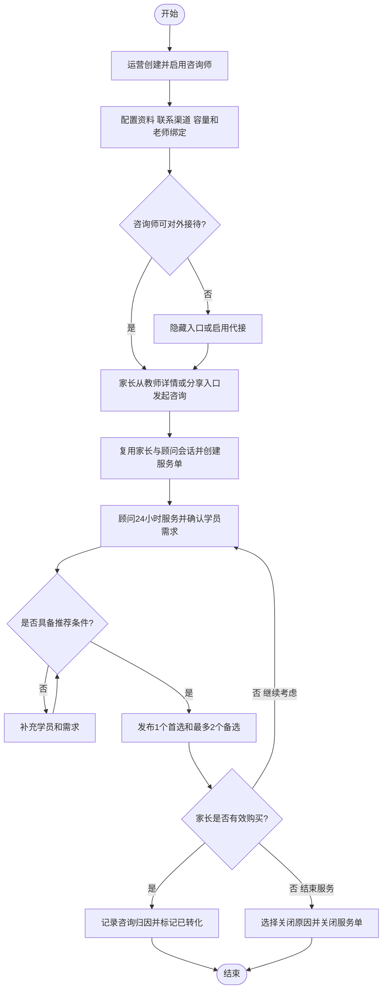
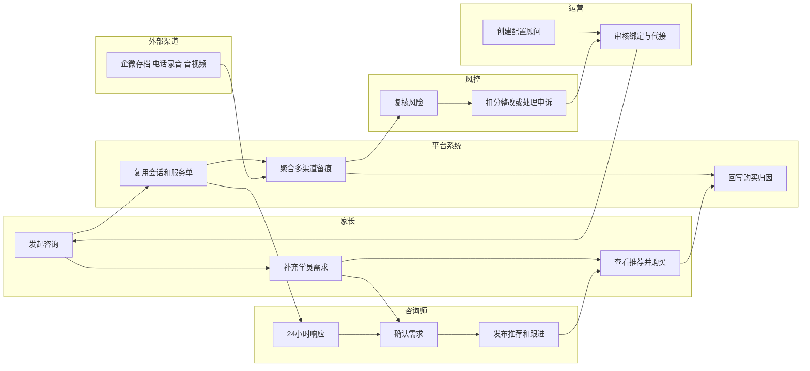
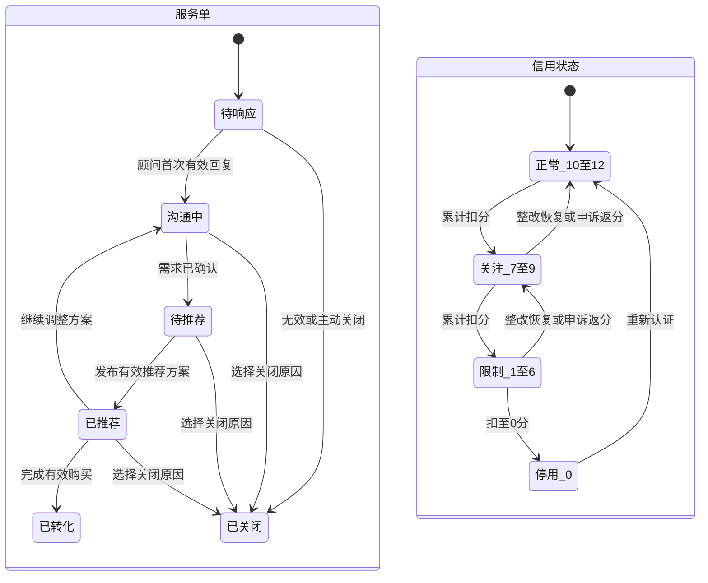
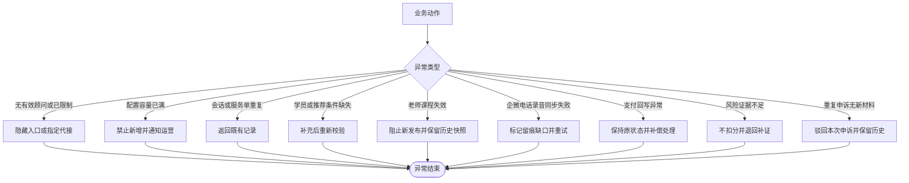
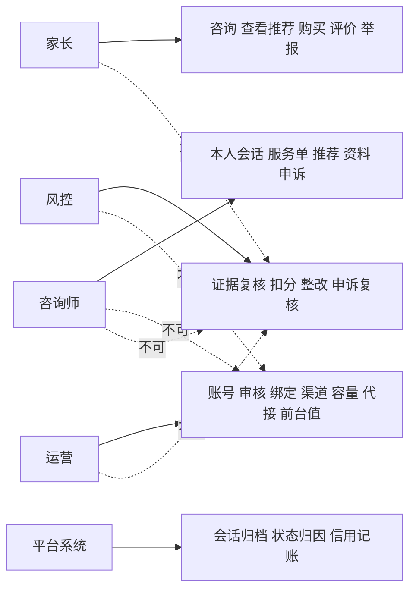

# 业务流程_优坐标咨询师轻量销售闭环_v1_20260716

## 背景

优坐标已完成咨询师轻量销售闭环需求分析。本阶段将具名顾问展示、多渠道咨询、学员服务单、个性化推荐、有效购买、企微/电话留痕和12分信用治理转化为可执行的业务动作、角色协作、状态流转、异常处理与权限边界。

## 目标

- 明确家长从教师详情或顾问分享入口到有效购买的完整主流程。
- 明确家长、咨询师、运营、风控、平台系统和外部渠道的协作责任。
- 固化服务单、资料审核、风险事件、申诉和12分信用状态流转。
- 为信息架构、交互设计和数据交互提供统一业务边界。

## 输入来源

- `03_需求提取/需求提取_优坐标咨询师参考图调整_v2_20260716.md`
- `04_需求澄清/需求澄清_优坐标咨询师关键规则_v2_20260716.md`
- `05_需求分析/需求分析_优坐标咨询师轻量销售闭环_v2_20260716.md`

## 关键结论

- 家长与每位咨询师只建立一条会话，具体服务通过多个服务单区分。
- 服务单从待响应流转至沟通、推荐、转化或关闭；有效购买是主要成功终点。
- 平台IM、企业微信存档、双向隐私号、平台真实电话和音视频均进入统一留痕与风控链路。
- 12分信用只由人工确认的独立风险事件累计扣减；同一事件不重复扣分，申诉撤销后返还分值。
- 本次按全阶段完整范围设计，不把多渠道和风控能力推迟到后续版本。

## 需求覆盖范围

| 需求 | 来源 | 是否纳入 | 说明 |
| --- | --- | --- | --- |
| 顾问准入、资料审核、老师绑定 | 需求分析2.1 | 是 | 形成对外服务前置条件 |
| 家长会话与服务单 | 需求分析2.2 | 是 | 家长×顾问唯一会话 |
| 学员绑定、推荐与购买 | 需求分析2.2/2.3 | 是 | 推荐前绑定学员 |
| 平台IM、企微、隐私号、真实电话、音视频 | 需求分析2.4 | 是 | 全渠道留痕 |
| 容量、代接与转交 | 需求分析2.5 | 是 | 默认无限，可配置上限 |
| 评分、履历、案例和近期服务值 | 需求分析2.6 | 是 | 前台值由运营维护 |
| 12分信用、举报、复核、申诉、整改 | 需求分析2.7-2.9 | 是 | 2/4/6/12累计扣分 |
| 完整CRM、绩效、佣金拆分 | 需求分析范围 | 否 | 暂不纳入 |

## 角色与职责

| 角色 | 职责 | 权限边界 | 备注 |
| --- | --- | --- | --- |
| 家长 | 发起咨询、提供学员需求、查看推荐、购买、评价、举报 | 不查看内部证据和真实评价后台统计 | 可使用多种联系渠道 |
| 咨询师 | 回复会话、管理本人服务单、绑定学员、发布推荐、维护资料、整改申诉 | 不配置前台评分、信用分、老师绑定和联系方式策略 | PC与小程序能力一致 |
| 运营 | 创建顾问、审核资料、绑定老师、配置渠道/容量/代接、维护前台展示值 | 不直接确认风险扣分 | 真实电话切换须留痕 |
| 风控 | 复核风险、选择扣分规则、处理整改与重复申诉 | 自动分析结果不能替代人工结论 | 申诉由非原处理人复核 |
| 平台系统 | 统一会话、服务单、消息归档、订单归因、状态和信用台账自动处理 | 不自行确认违规 | 负责幂等和审计 |
| 企微/电话/音视频服务 | 传递消息和通话、提供存档/录音 | 不决定业务状态和信用处置 | 同步失败形成留痕缺口 |

## 关键业务对象

| 对象 | 定义 | 关键属性 | 相关角色 |
| --- | --- | --- | --- |
| 咨询师资料 | 顾问公开专业信息及审核版本 | 草稿、待审核、已发布、已驳回 | 咨询师、运营 |
| 老师顾问绑定 | 老师当前顾问及代接关系 | 当前顾问、容量、代接、生效历史 | 运营、系统 |
| 顾问会话 | 家长与咨询师唯一沟通容器 | 家长、顾问、渠道消息、未读 | 家长、咨询师、系统 |
| 服务单 | 单个学员需求的业务闭环 | 学员、入口老师、负责人、六状态 | 家长、咨询师、运营 |
| 推荐方案 | 针对学员的老师/课程建议 | 首选、备选、理由、版本 | 咨询师、家长 |
| 咨询归因 | 咨询对购买的来源记录 | 渠道、服务单、方案、卡片 | 系统、运营 |
| 风险事件 | 待复核或已确认的独立违规事实 | 证据、等级、扣分、处理状态 | 风控、咨询师 |
| 信用台账 | 12分余额的不可覆盖流水 | 扣分、返还、恢复、余额 | 系统、风控 |
| 申诉记录 | 对风险事件的独立复核请求 | 新证据、处理人、结论 | 咨询师、风控 |

## 业务动作流程图

### Mermaid

### 节点清单

| ID | 名称 | 类型 | 说明 |
| --- | --- | --- | --- |
| M0/M14 | 开始/结束 | 开始/结束 | 咨询业务起止 |
| M1 | 创建启用顾问 | 动作 | 运营完成角色准入 |
| M2 | 配置服务条件 | 动作 | 资料、渠道、容量、绑定 |
| M3 | 可对外接待 | 判断 | 资料、信用、容量、状态综合判断 |
| M4 | 隐藏或代接 | 异常动作 | 无有效顾问时的承接 |
| M5 | 家长发起咨询 | 动作 | 教师详情或分享来源 |
| M6 | 建会话和服务单 | 系统动作 | 会话复用、服务单幂等创建 |
| M7 | 顾问沟通需求 | 动作 | 24小时连续服务 |
| M8 | 推荐条件判断 | 判断 | 已绑定学员且需求完整 |
| M9 | 补充学员需求 | 动作 | 补齐推荐前置条件 |
| M10 | 发布推荐 | 动作 | 1首选+最多2备选 |
| M11 | 购买结果判断 | 判断 | 有效购买/继续/关闭 |
| M12 | 标记转化 | 系统动作 | 回写归因和已转化 |
| M13 | 关闭服务单 | 动作 | 标准原因+补充说明 |

### 连线清单

| 起点 | 终点 | 条件 | 说明 |
| --- | --- | --- | --- |
| M2 | M3 | 配置完成 | 检查接待资格 |
| M3 | M4 | 不可接待 | 启用代接或隐藏入口 |
| M3/M4 | M5 | 可用顾问确定 | 家长进入服务 |
| M6 | M7 | 创建成功 | 顾问承接 |
| M8 | M9 | 条件不足 | 补充信息 |
| M9 | M8 | 补充完成 | 重新校验 |
| M8 | M10 | 条件满足 | 发布推荐 |
| M11 | M12 | 有效购买 | 完成转化 |
| M11 | M7 | 继续考虑 | 返回跟进 |
| M11 | M13 | 明确结束 | 关闭服务 |

### 分组说明

| 分组 | 类型 | 节点 | 说明 |
| --- | --- | --- | --- |
| 准入配置 | 阶段 | M1-M4 | 顾问可服务前置条件 |
| 咨询服务 | 阶段 | M5-M9 | 建立服务关系并识别需求 |
| 推荐转化 | 阶段 | M10-M14 | 推荐、购买或关闭 |

### draw.io 建图建议

- 类型：TB业务流程图；判断节点黄色菱形，异常节点红色，成功终点绿色。
- 将准入、咨询、转化分为三个横向阶段，回退路径走外侧避免交叉。

## 角色泳道图

### Mermaid

### 泳道/分组说明

| 泳道 | 职责 | 节点 |
| --- | --- | --- |
| 家长 | 发起、提供需求、决策购买 | P1-P3 |
| 平台系统 | 会话、留痕、归因、状态 | S1-S3 |
| 咨询师 | 响应、识别、推荐、跟进 | C1-C3 |
| 运营 | 准入、配置、审核、绑定、代接 | O1-O2 |
| 风控 | 证据复核、扣分、整改、申诉 | R1-R2 |
| 外部渠道 | 企微/电话/音视频数据 | E1 |

### 节点清单

| ID | 名称 | 泳道 | 说明 |
| --- | --- | --- | --- |
| O1/O2 | 顾问创建配置/审核代接 | 运营 | 建立可服务资源 |
| P1/P2/P3 | 咨询/需求/购买 | 家长 | 家长主动作 |
| S1/S2/S3 | 会话/留痕/归因 | 平台系统 | 自动处理 |
| C1/C2/C3 | 响应/确认/推荐 | 咨询师 | 顾问服务动作 |
| E1 | 多渠道记录 | 外部渠道 | 同步到平台 |
| R1/R2 | 风险复核/处置申诉 | 风控 | 信用治理 |

### 连线清单

| 起点 | 终点 | 条件 | 说明 |
| --- | --- | --- | --- |
| O2 | P1 | 顾问可用 | 开放咨询入口 |
| P1 | S1 | 发起咨询 | 建立上下文 |
| S1 | C1 | 待响应 | 顾问承接 |
| P2 | C2 | 提供需求 | 顾问确认 |
| C3 | P3 | 发布方案 | 家长决策 |
| P3 | S3 | 有效购买 | 归因转化 |
| E1 | S2 | 渠道产生记录 | 统一留痕 |
| S2 | R1 | 风险命中/举报/抽检 | 进入人工复核 |
| R2 | O2 | 触发限制/代接 | 运营执行资源调整 |

### draw.io 建图建议

- 类型：LR横向泳道图；使用六条水平泳道，平台系统放中心，外部渠道与风控放底部。
- 自动系统动作使用紫色，外部渠道灰色虚线，人工动作蓝色。

## 状态流转图

### Mermaid

### 状态流转表

| 对象 | 当前状态 | 触发动作 | 角色 | 前置条件 | 结果状态 | 异常 |
| --- | --- | --- | --- | --- | --- | --- |
| 服务单 | 待响应 | 首次有效回复 | 咨询师 | 服务单有效 | 沟通中 | 超时仍保持待响应并预警 |
| 服务单 | 沟通中 | 确认需求 | 咨询师 | 已绑定学员 | 待推荐 | 学员缺失不能进入 |
| 服务单 | 待推荐 | 发布方案 | 咨询师 | 推荐校验通过 | 已推荐 | 内容失效阻止发布 |
| 服务单 | 已推荐 | 有效购买 | 系统 | 订单有效 | 已转化 | 回写延迟保持已推荐 |
| 服务单 | 非终态 | 关闭 | 咨询师 | 原因完整 | 已关闭 | 状态冲突阻止重复关闭 |
| 信用 | 10-12 | 确认扣分 | 风控/系统记账 | 人工复核 | 7-9/1-6/0 | 同一事件不得重复记账 |
| 信用 | 7-9/1-6 | 整改恢复 | 风控 | 观察期完成 | 上一等级 | 新增违规则不恢复 |
| 信用 | 任意扣分后 | 申诉通过 | 风控/系统 | 非原处理人复核 | 返分后状态 | 余额不超过12 |
| 信用 | 0 | 重新认证 | 运营/风控 | 认证通过 | 10-12 | 未通过继续停用 |

### 节点清单

| 节点ID | 节点名称 | 节点类型 | 所属分组 | 说明 |
| --- | --- | --- | --- | --- |
| ST0-ST5 | 待响应、沟通中、待推荐、已推荐、已转化、已关闭 | 状态 | 服务单生命周期 | 六个服务单状态，已转化和已关闭为终态 |
| CR1 | 正常（10-12分） | 状态 | 信用生命周期 | 可正常对外服务 |
| CR2 | 关注（7-9分） | 状态 | 信用生命周期 | 进入关注区间 |
| CR3 | 限制（1-6分） | 状态 | 信用生命周期 | 按规则限制服务能力 |
| CR4 | 停用/重新认证（0分） | 状态 | 信用生命周期 | 停用并进入重新认证流程 |

### 连线清单

| 起点 | 终点 | 条件 | 说明 |
| --- | --- | --- | --- |
| ST0 | ST1 | 首次有效回复 | 服务单进入沟通中 |
| ST1 | ST2 | 需求已确认且绑定学员 | 服务单进入待推荐 |
| ST2 | ST3 | 发布有效推荐方案 | 服务单进入已推荐 |
| ST3 | ST4 | 完成有效购买 | 服务单完成转化 |
| ST3 | ST1 | 继续调整方案 | 返回沟通中 |
| ST0-ST3 | ST5 | 选择合法关闭原因 | 任一非终态可关闭 |
| CR1 | CR2/CR3/CR4 | 累计扣分后的余额 | 按余额进入对应区间 |
| CR2/CR3 | 上一信用区间 | 整改恢复或申诉返分 | 余额回升后更新状态 |
| CR4 | CR1 | 重新认证通过 | 恢复正常服务资格 |

### 分组说明

| 分组 | 类型 | 状态 | 说明 |
| --- | --- | --- | --- |
| 服务单生命周期 | 状态域 | 六状态 | 咨询到购买或关闭 |
| 信用生命周期 | 状态域 | 正常/关注/限制/停用 | 12分治理 |

### draw.io 建图建议

- 两个状态域上下分区；服务单使用蓝色，信用状态按绿、黄、橙、红色。
- 恢复与申诉返分使用绿色反向箭头，扣分使用红色箭头。

## 异常流程图

### Mermaid

### 节点清单

| 节点ID | 节点名称 | 节点类型 | 所属分组 | 说明 |
| --- | --- | --- | --- | --- |
| X0 | 关键业务动作 | 开始 | 异常入口 | 任一关键业务动作 |
| X1 | 异常类型 | 判断 | 异常入口 | 按异常事实分流 |
| X2 | 无有效顾问/已限制 | 异常 | 业务限制 | 隐藏入口或指定代接 |
| X3 | 容量已满 | 异常 | 业务限制 | 禁止新增并通知运营；默认无限不触发 |
| X4 | 重复会话/服务单 | 异常 | 幂等处理 | 返回既有记录 |
| X5 | 推荐条件缺失 | 异常 | 业务限制 | 补充后重新校验 |
| X6 | 老师/课程失效 | 异常 | 业务限制 | 阻止新发布并保留历史快照 |
| X7 | 渠道留痕同步失败 | 异常 | 数据与渠道 | 标记缺口、重试并允许人工补充 |
| X8 | 支付回写异常 | 异常 | 数据与渠道 | 保持原状态并补偿处理 |
| X9 | 风险证据不足 | 异常 | 风险治理 | 不扣分并退回补证 |
| X10 | 重复申诉无新材料 | 异常 | 风险治理 | 驳回本次并保留历史 |
| X11 | 当前异常分支结束 | 结束 | 异常出口 | 完成当前异常承接 |

### 连线清单

| 起点 | 终点 | 条件 | 说明 |
| --- | --- | --- | --- |
| X0 | X1 | 发生异常 | 进入异常类型判断 |
| X1 | X2-X6 | 业务条件异常 | 进入业务限制或幂等处理 |
| X1 | X7-X8 | 数据或渠道异常 | 进入留痕或回写补偿 |
| X1 | X9-X10 | 风险治理异常 | 进入补证或申诉驳回 |
| X2-X10 | X11 | 当前分支已承接 | 结束当前异常分支 |

### 分组说明

| 分组名称 | 分组类型 | 包含节点 | 说明 |
| --- | --- | --- | --- |
| 异常入口 | 阶段 | X0-X1 | 识别异常事实 |
| 业务限制 | 异常域 | X2、X3、X5、X6 | 接待、容量、推荐内容条件异常 |
| 幂等处理 | 异常域 | X4 | 防止重复创建 |
| 数据与渠道 | 异常域 | X7-X8 | 留痕和订单状态一致性 |
| 风险治理 | 异常域 | X9-X10 | 证据与重复申诉处理 |
| 异常出口 | 阶段 | X11 | 当前分支收口 |

### draw.io 建图建议

- 中央异常判断向左右两列分支，业务限制使用橙色，数据/渠道异常红色，幂等返回绿色。

## 权限边界图

### Mermaid

### 权限边界表

| 角色 | 可执行 | 不可执行 | 需要审核/确认 | 备注 |
| --- | --- | --- | --- | --- |
| 家长 | 咨询、购买、评价、举报 | 查看内部证据、修改顾问信用 | 举报需风控确认 | 只看公开12分状态 |
| 咨询师 | 本人会话、服务单、推荐、资料、重复申诉 | 老师绑定、渠道策略、前台评分、扣分 | 资料需运营审核 | 不查看其他顾问数据 |
| 运营 | 顾问准入、资料审核、绑定、渠道、容量、代接、前台值 | 直接确认风险扣分 | 真实电话切换需原因和审计 | 可直接发布运营编辑资料 |
| 风控 | 证据复核、2/4/6/12扣分、整改、申诉 | 修改前台评分和老师绑定 | 申诉由非原处理人复核 | 不得任意填写扣分 |
| 系统 | 会话复用、归档、归因、状态、台账计算 | 自行认定违规 | 风险结论依赖人工 | 自动动作必须幂等 |

### 节点清单

| 节点ID | 节点名称 | 节点类型 | 所属分组 | 说明 |
| --- | --- | --- | --- | --- |
| A | 家长 | 角色 | 角色域 | 只能使用公开服务能力 |
| C | 咨询师 | 角色 | 角色域 | 管理本人服务与资料 |
| O | 运营 | 角色 | 角色域 | 负责准入、配置、审核和前台值 |
| R | 风控 | 角色 | 角色域 | 负责风险事实与信用治理 |
| S | 平台系统 | 系统 | 角色域 | 执行幂等、归档、归因和记账 |
| A1/C1/O1/R1/S1 | 对应允许动作域 | 权限域 | 允许域 | 各主体可直接执行的动作集合 |

### 连线清单

| 起点 | 终点 | 条件 | 说明 |
| --- | --- | --- | --- |
| A/C/O/R/S | 对应允许动作域 | 具备主体权限 | 实线表示允许执行 |
| A | 内部证据与真实评价后台 | 任意情况 | 禁止查看 |
| C | 老师绑定/渠道策略/前台评分/扣分 | 任意情况 | 禁止自行配置或确认 |
| O | 风险扣分结论 | 任意情况 | 禁止直接确认 |
| R | 前台评分与老师绑定 | 任意情况 | 禁止跨域修改 |
| S | 违规认定 | 任意情况 | 系统不得自行确认违规 |

### 分组说明

| 分组名称 | 分组类型 | 包含节点 | 说明 |
| --- | --- | --- | --- |
| 角色域 | 角色 | A、C、O、R、S | 五类业务主体 |
| 允许域 | 权限域 | A1、C1、O1、R1、S1 | 实线连接的授权动作 |
| 禁止跨域 | 权限域 | 各禁止动作 | 红色虚线连接的明确禁区 |

### draw.io 建图建议

- 五个角色纵向排列，右侧放对应动作域；禁止关系用红色虚线，允许关系用蓝/绿色实线。

## 流程步骤表

| 步骤 | 角色 | 业务动作 | 前置条件 | 判断点 | 结果 | 异常处理 |
| --- | --- | --- | --- | --- | --- | --- |
| 1 | 运营 | 创建并配置顾问 | 有运营权限 | 资料/渠道/状态完整 | 顾问可审核启用 | 缺失则不可启用 |
| 2 | 运营/系统 | 绑定老师并检查容量信用 | 顾问已启用 | 是否可接待 | 展示入口或代接 | 隐藏/禁止新增 |
| 3 | 家长/系统 | 发起咨询 | 有有效顾问 | 会话是否存在 | 复用会话、创建服务单 | 重复则返回既有记录 |
| 4 | 咨询师 | 响应并确认需求 | 服务单待响应 | 学员是否明确 | 进入沟通/待推荐 | 继续补充需求 |
| 5 | 咨询师 | 发布推荐 | 条件完整 | 内容是否有效 | 已推荐 | 阻止失效内容 |
| 6 | 家长/系统 | 购买并回写 | 推荐可购买 | 是否有效购买 | 已转化并归因 | 补偿回写 |
| 7 | 家长/系统 | 举报/自动分析 | 产生风险线索 | 证据是否完整 | 待复核事件 | 补证或关闭 |
| 8 | 风控/系统 | 确认并扣分 | 人工复核 | 2/4/6/12档位 | 台账更新和处置 | 同事件禁止重复 |
| 9 | 咨询师/风控 | 整改或重复申诉 | 已确认事件 | 是否新增证据/满足恢复 | 返分/恢复/维持 | 重复材料驳回 |

## 业务规则

| 规则 | 场景 | 影响对象 | 来源 |
| --- | --- | --- | --- |
| 家长×顾问唯一会话 | 发起咨询 | 会话 | 需求分析2.2 |
| 推荐前必须绑定学员 | 推荐 | 服务单/推荐 | 需求分析2.2 |
| 1首选+最多2备选 | 推荐 | 推荐方案 | 需求分析2.3 |
| 咨询归因不覆盖分销 | 购买 | 订单归因 | 需求分析2.3 |
| 电话默认隐私号，可切真实电话 | 渠道配置 | 顾问/家长 | 需求分析2.4 |
| 企微和电话全部平台留痕 | 多渠道沟通 | 风控证据 | 需求分析2.4 |
| 24小时连续服务 | 响应 | 服务单/顾问 | 需求分析2.4 |
| 容量默认无限，可单独配置 | 绑定/新咨询 | 顾问 | 需求分析2.5 |
| 前台评分由运营维护 | 专业展示 | 顾问主页 | 需求分析2.6 |
| 2/4/6/12累计扣分 | 风控 | 信用台账 | 需求分析2.7/2.9 |
| 同一事件最高档一次扣分 | 风控 | 风险事件 | 需求分析2.7/2.9 |
| 重复申诉独立留痕 | 申诉 | 申诉记录 | 需求分析2.8 |

## 关键决策点

| 决策点 | 条件 | 分支结果 | 风险 |
| --- | --- | --- | --- |
| 顾问是否可接待 | 启用、资料、信用、容量、代接 | 展示/隐藏/代接 | 入口与实际服务不一致 |
| 是否复用会话 | 家长和顾问是否已有会话 | 复用/新建 | 重复会话导致信息割裂 |
| 是否可推荐 | 学员和推荐内容完整有效 | 发布/补充 | 错误推荐影响转化 |
| 是否有效购买 | 支付且未即时取消 | 已转化/继续跟进 | 归因重复或误记 |
| 是否确认风险 | 证据能否证明独立事实 | 扣分/补证/关闭 | 误判影响顾问信用 |
| 扣分档位 | 违规事实及影响 | 2/4/6/12 | 同案重复处罚 |
| 是否恢复信用 | 观察期、整改、新增违规 | 恢复/维持 | 恢复标准不一致 |
| 是否受理再次申诉 | 是否有新增证据或说明 | 复核/驳回 | 重复材料挤占资源 |

## 待确认问题

- 24小时服务条件下首响SLA具体分钟数。
- 平台电话、企微存档、音视频、录制和转写的服务商与协议。
- 违规扣分清单、整改课程和重新认证标准需在风控运营规则中继续细化。

以上问题不阻塞信息架构设计，但会影响数据交互和真实上线。

## 下游交接说明

| 下游 | 重点输入 |
| --- | --- |
| 信息架构助手 | 六角色、九类业务对象、准入/咨询/推荐/转化/风控阶段、服务单与信用状态 |
| 交互设计助手 | 关键判断点、异常节点、24小时响应、多渠道留痕、代接、重复申诉和低分限制 |
| 数据交互助手 | 会话唯一性、服务单状态、归因、渠道留痕、信用台账、风险与申诉状态 |

## 风险与依赖

- 真实电话即使接入平台录音，号码对外后仍可能产生脱离平台回拨。
- 企微、电话和音视频第三方同步失败会形成风控证据缺口。
- 24小时连续服务但首响阈值未定，会影响超时判断与2分违规执行。
- 前台评分由运营维护，必须与后台真实评价分开审计。

## 下一步动作

- 本阶段进入业务流程关键确认关口，需用户确认主流程、异常流程、状态和权限边界。
- 确认后交由信息架构助手，基于本文件设计模块结构、页面结构和导航关系。
