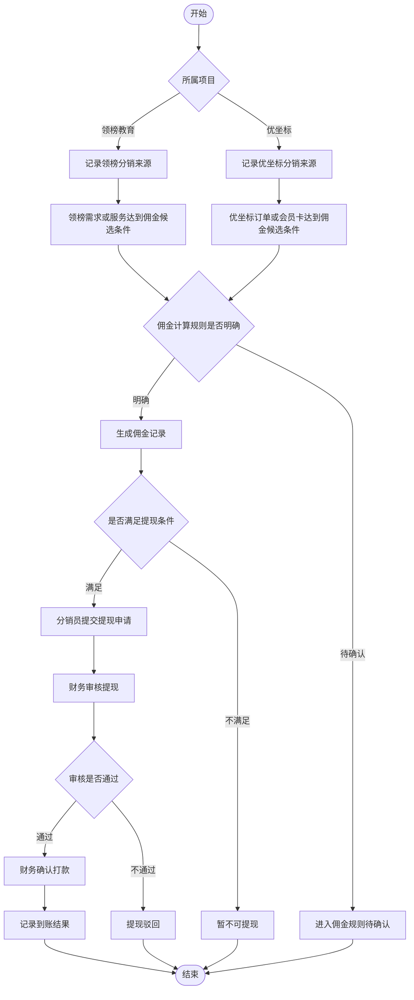
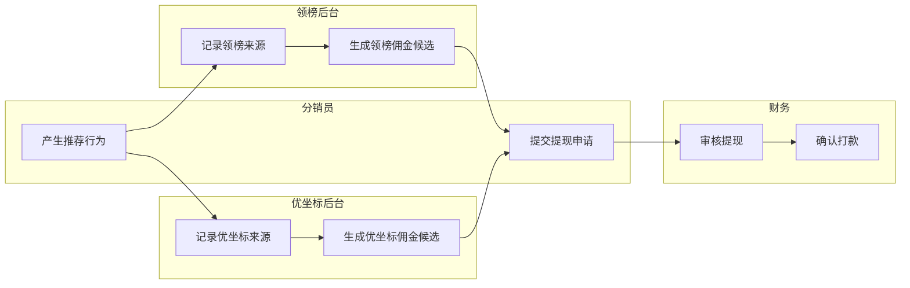
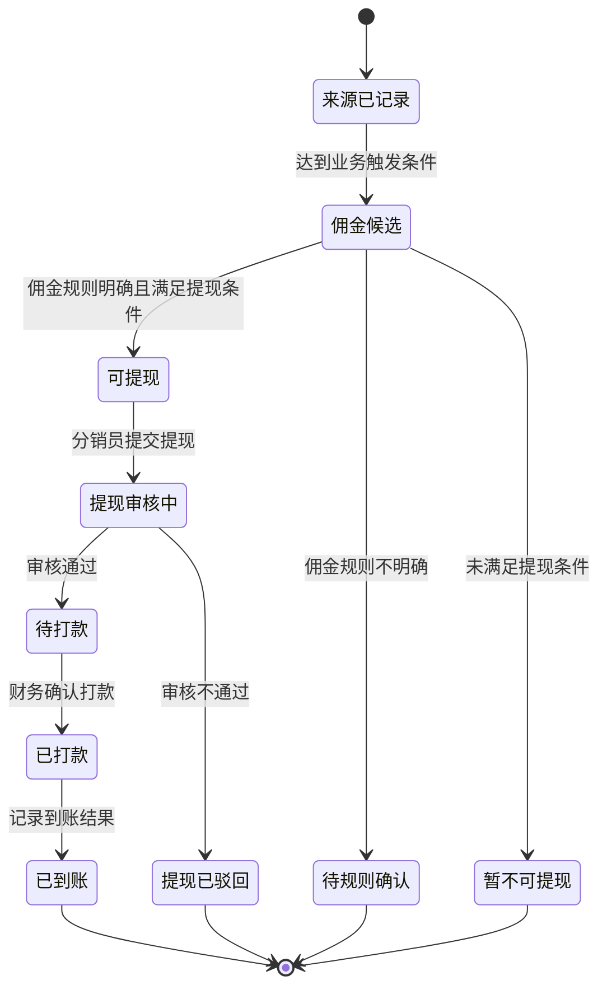
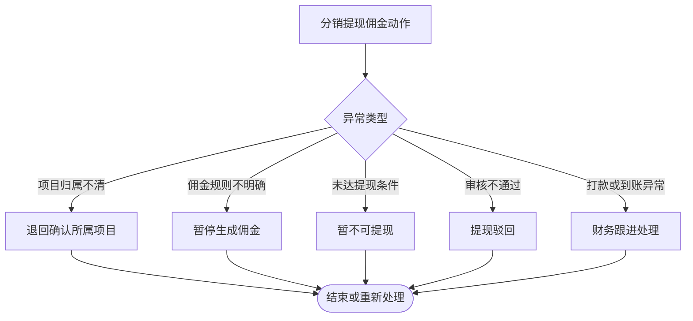
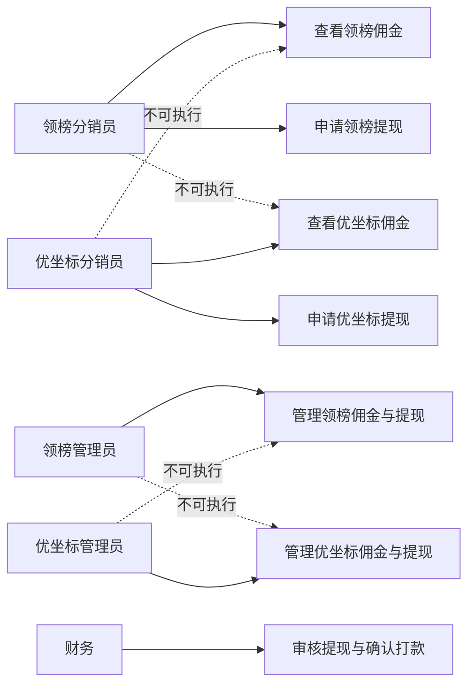

# 业务流程_分销提现佣金流程_v1_20260603

## 背景

本稿基于上游需求分析与用户确认 MVP 边界生成。已确认领榜教育和优坐标都有分销业务，且两者规则不同；分销、提现、佣金进入当前 MVP。两个后台完全独立，因此本稿分别建模领榜教育与优坐标的分销、佣金和提现流程，不设计共享后台或共享中台。

## 目标

输出两个项目各自的分销、佣金、提现业务动作流程、异常流程、角色泳道、状态流转、权限边界和 draw.io 兼容图集。本稿不输出页面结构、页面跳转、交互控件、表单字段、接口字段、高保真原型或 PRD。

## 输入来源

- `/Users/xuyunfeng/Documents/k12/05_需求分析/需求分析_领榜优坐标MVP范围_v1_20260603.md`
- `/Users/xuyunfeng/Documents/k12/05_需求分析/需求分析_用户确认MVP边界_v1_20260603.md`
- `/Users/xuyunfeng/Documents/k12/04_需求澄清/需求澄清_领榜优坐标问题清单_v1_20260603.md`

## 关键结论

- 分销、提现、佣金进入 MVP。
- 领榜教育分销佣金应绑定领榜 C2C 需求/服务结果。
- 优坐标分销佣金应绑定优坐标产品订单、老师关联产品订单或会员卡订单。
- 两个项目的佣金规则分别设计，不合并为一套共用流程。
- 分销需支持 2 级分销、拉新注册家长或老师、销售提成、拉新注册老师上课后的课消提成；课消提成只支持一级。
- 提现采用人工审核、系统外打款，系统不限制提现门槛；结算周期按月结算；平台内所有用户都可以成为分销员，老师、家长均可成为分销员。
- 审核角色、具体比例或金额仍待确认；本稿按“类型明确、比例和审核规则待细化”的方式进入后续信息架构。

## 用户确认规则优先级

本节规则覆盖本文早期图表中“佣金计算规则仍待确认，只做最小闭环”的泛化表述。下游 04 信息架构应至少支持以下佣金类型和归因关系：

- 2 级分销关系。
- 拉新注册家长。
- 拉新注册老师。
- 平台购买产品或会员卡产生的销售提成。
- 拉新注册老师上课后产生的课消提成。
- 课消提成只计算一级，不做二级课消提成。

## 需求覆盖范围

| 需求 | 来源 | 是否纳入本次流程设计 | 说明 |
| --- | --- | --- | --- |
| 两项目都有分销 | 用户确认 MVP 边界 CFM-12 | 是 | 分别建模 |
| 两项目分销规则不同 | 用户确认 MVP 边界 CFM-13 | 是 | 不合并规则 |
| 分销、提现、佣金进入 MVP | 用户确认 MVP 边界 CFM-14 | 是 | 输出最小闭环 |
| 佣金类型 | 用户在 03 业务流程关口确认 | 是 | 支持注册、销售、课消等类型 |
| 2 级分销 | 用户在 03 业务流程关口确认 | 是 | 销售提成可支持 2 级 |
| 课消提成仅一级 | 用户在 03 业务流程关口确认 | 是 | 拉新老师课消提成只做一级 |
| 提现门槛、审核角色、结算周期 | 用户确认待确认问题 | 作为待确认 | 不写成已确认规则 |

## 角色与职责

| 角色 | 职责 | 权限边界 | 备注 |
| --- | --- | --- | --- |
| 领榜分销员 | 推荐领榜家长或需求，触发领榜佣金候选 | 不能查看或操作优坐标分销数据 | 角色归属可来自家长、老师或合伙人，待确认 |
| 优坐标分销员 | 推荐优坐标产品、老师关联产品或会员卡购买 | 不能查看或操作领榜分销数据 | 角色归属待确认 |
| 领榜后台管理员 | 管理领榜佣金记录、提现申请和异常 | 不能处理优坐标财务单据 | 后台独立 |
| 优坐标后台管理员 | 管理优坐标佣金记录、提现申请和异常 | 不能处理领榜财务单据 | 后台独立 |
| 财务 | 审核提现、确认打款、反馈到账结果 | 不决定业务成交或排课 | 审核角色和周期待确认 |
| 系统 | 记录分销来源、生成佣金候选、流转提现状态 | 不自动决定未确认佣金规则 | 当前只做最小闭环 |

## 关键业务对象

| 业务对象 | 定义 | 关键属性 | 相关角色 |
| --- | --- | --- | --- |
| 分销关系 | 推荐人与被推荐业务对象之间的归因关系 | 所属项目、推荐人、被推荐人、层级 | 分销员、系统 |
| 佣金记录 | 达成业务条件后生成的收益记录 | 所属项目、佣金类型、层级、状态、金额规则待确认 | 分销员、财务、管理员 |
| 提现申请 | 分销员申请提取可提现佣金的业务对象 | 所属项目、审核状态、打款状态 | 分销员、财务 |
| 领榜成交来源 | 领榜需求/服务产生佣金的业务来源 | 需求单、服务结果 | 家长、老师、系统 |
| 优坐标订单来源 | 优坐标产品或会员订单产生佣金的业务来源 | 产品订单、会员卡订单 | 家长、系统 |
| 拉新注册来源 | 家长或老师注册产生的归因来源 | 被推荐人、注册身份、来源渠道 | 分销员、系统 |
| 课消来源 | 被推荐老师上课并产生课消后的佣金来源 | 老师、课次、课消结果 | 老师、系统、财务 |

## 业务动作流程图

### Mermaid

### 节点清单

| 节点ID | 节点名称 | 节点类型 | 所属泳道 | 说明 |
| --- | --- | --- | --- | --- |
| S | 开始 | 开始 | 业务阶段 | 分销佣金流程开始 |
| D1 | 所属项目 | 判断 | 系统 | 判断领榜或优坐标 |
| L1 | 记录领榜分销来源 | 动作 | 领榜系统 | 领榜独立归因 |
| U1 | 记录优坐标分销来源 | 动作 | 优坐标系统 | 优坐标独立归因 |
| L2 | 领榜需求或服务达到佣金候选条件 | 动作 | 领榜系统 | 绑定领榜业务来源 |
| U2 | 优坐标订单或会员卡达到佣金候选条件 | 动作 | 优坐标系统 | 绑定优坐标订单来源 |
| D2 | 佣金计算规则是否明确 | 判断 | 业务规则 | 规则待确认 |
| C1 | 生成佣金记录 | 动作 | 系统 | 形成佣金 |
| E1 | 进入佣金规则待确认 | 异常 | 管理员 | 无法计算 |
| D3 | 是否满足提现条件 | 判断 | 系统 | 门槛待确认 |
| W1 | 分销员提交提现申请 | 动作 | 分销员 | 发起提现 |
| E2 | 暂不可提现 | 异常 | 系统 | 未达条件 |
| F1 | 财务审核提现 | 动作 | 财务 | 审核申请 |
| D4 | 审核是否通过 | 判断 | 财务 | 审核结果 |
| F2 | 财务确认打款 | 动作 | 财务 | 执行打款确认 |
| E3 | 提现驳回 | 异常 | 财务 | 审核不通过 |
| F3 | 记录到账结果 | 动作 | 系统 | 结束提现闭环 |
| END | 结束 | 结束 | 业务阶段 | 流程结束 |

### 连线清单

| 起点 | 终点 | 条件 | 说明 |
| --- | --- | --- | --- |
| S | D1 | 开始 | 判断项目 |
| D1 | L1 | 领榜教育 | 进入领榜分销 |
| D1 | U1 | 优坐标 | 进入优坐标分销 |
| L1 | L2 | 来源记录后 | 判断领榜佣金条件 |
| U1 | U2 | 来源记录后 | 判断优坐标佣金条件 |
| L2 | D2 | 达到候选条件 | 判断计算规则 |
| U2 | D2 | 达到候选条件 | 判断计算规则 |
| D2 | C1 | 明确 | 生成佣金 |
| D2 | E1 | 待确认 | 暂停计算 |
| C1 | D3 | 佣金生成 | 判断提现条件 |
| D3 | W1 | 满足 | 提交提现 |
| D3 | E2 | 不满足 | 暂不可提现 |
| W1 | F1 | 提交后 | 财务审核 |
| F1 | D4 | 审核完成 | 判断通过 |
| D4 | F2 | 通过 | 打款确认 |
| D4 | E3 | 不通过 | 驳回 |
| F2 | F3 | 打款后 | 记录到账 |
| F3 | END | 完成 | 结束 |
| E1 | END | 阻塞 | 等待规则 |
| E2 | END | 终止 | 等待条件 |
| E3 | END | 终止 | 驳回结束 |

### 泳道/分组说明

| 分组名称 | 分组类型 | 包含节点 | 说明 |
| --- | --- | --- | --- |
| 领榜分销域 | 权限域 | L1,L2 | 只处理领榜分销 |
| 优坐标分销域 | 权限域 | U1,U2 | 只处理优坐标分销 |
| 佣金规则域 | 阶段 | D2,C1,E1 | 计算规则待确认 |
| 提现域 | 阶段 | D3,W1,E2,F1,D4,F2,E3,F3 | 提现申请到到账 |

### draw.io 建图建议

- 建议图形类型：跨项目分组流程图。
- 建议泳道或分组：领榜分销域、优坐标分销域、佣金规则域、提现域。
- 判断节点样式：佣金规则、提现条件用黄色菱形。
- 异常节点样式：规则待确认、暂不可提现、提现驳回用红色矩形。
- 状态节点样式：佣金记录和提现申请用蓝色圆角矩形。
- 颜色或标注建议：领榜用蓝色，优坐标用绿色，财务节点用紫色。

## 角色泳道图

### Mermaid

### 泳道/分组说明

| 分组名称 | 分组类型 | 包含节点 | 说明 |
| --- | --- | --- | --- |
| 分销员 | 角色 | A1,A2 | 推荐与提现申请 |
| 领榜后台 | 权限域 | L1,L2 | 领榜独立分销 |
| 优坐标后台 | 权限域 | U1,U2 | 优坐标独立分销 |
| 财务 | 角色 | F1,F2 | 提现审核与打款 |

### 节点清单

| 节点ID | 节点名称 | 节点类型 | 所属泳道 | 说明 |
| --- | --- | --- | --- | --- |
| A1 | 产生推荐行为 | 动作 | 分销员 | 推荐来源产生 |
| A2 | 提交提现申请 | 动作 | 分销员 | 申请提现 |
| L1 | 记录领榜来源 | 动作 | 领榜后台 | 领榜归因 |
| L2 | 生成领榜佣金候选 | 动作 | 领榜后台 | 领榜佣金候选 |
| U1 | 记录优坐标来源 | 动作 | 优坐标后台 | 优坐标归因 |
| U2 | 生成优坐标佣金候选 | 动作 | 优坐标后台 | 优坐标佣金候选 |
| F1 | 审核提现 | 动作 | 财务 | 财务审核 |
| F2 | 确认打款 | 动作 | 财务 | 打款确认 |

### 连线清单

| 起点 | 终点 | 条件 | 说明 |
| --- | --- | --- | --- |
| A1 | L1 | 推荐领榜业务 | 记录领榜来源 |
| A1 | U1 | 推荐优坐标业务 | 记录优坐标来源 |
| L1 | L2 | 达到领榜候选条件 | 生成领榜佣金候选 |
| U1 | U2 | 达到优坐标候选条件 | 生成优坐标佣金候选 |
| L2 | A2 | 满足提现条件 | 分销员提现 |
| U2 | A2 | 满足提现条件 | 分销员提现 |
| A2 | F1 | 提交后 | 财务审核 |
| F1 | F2 | 审核通过 | 打款确认 |

### draw.io 建图建议

- 建议图形类型：水平泳道图。
- 建议泳道或分组：分销员、领榜后台、优坐标后台、财务。
- 判断节点样式：可在佣金候选到提现之间增加黄色规则节点。
- 异常节点样式：驳回和规则缺失使用红色。
- 状态节点样式：佣金候选、提现申请使用蓝色。
- 颜色或标注建议：两个后台用不同颜色，避免误读为共用后台。

## 状态流转图

### Mermaid

### 状态流转表

| 业务对象 | 当前状态 | 触发动作 | 触发角色 | 前置条件 | 结果状态 | 异常状态 |
| --- | --- | --- | --- | --- | --- | --- |
| 分销关系 | 初始 | 记录来源 | 系统 | 推荐行为产生 | 来源已记录 | 来源无效 |
| 佣金记录 | 来源已记录 | 达到触发条件 | 系统 | 业务达成 | 佣金候选 | 待规则确认 |
| 佣金记录 | 佣金候选 | 判断提现条件 | 系统 | 佣金规则明确 | 可提现 | 暂不可提现 |
| 提现申请 | 可提现 | 提交提现 | 分销员 | 满足提现条件 | 提现审核中 | 暂不可提现 |
| 提现申请 | 提现审核中 | 审核 | 财务 | 申请已提交 | 待打款 | 提现已驳回 |
| 提现申请 | 待打款 | 确认打款 | 财务 | 审核通过 | 已打款 | 打款异常 |
| 提现申请 | 已打款 | 记录到账 | 系统/财务 | 打款完成 | 已到账 | 到账异常 |

### 节点清单

| 节点ID | 节点名称 | 节点类型 | 所属泳道 | 说明 |
| --- | --- | --- | --- | --- |
| ST1 | 来源已记录 | 状态 | 分销关系 | 推荐来源记录 |
| ST2 | 佣金候选 | 状态 | 佣金记录 | 可计算前状态 |
| ST3 | 待规则确认 | 异常 | 佣金记录 | 规则不明确 |
| ST4 | 可提现 | 状态 | 佣金记录 | 满足提现条件 |
| ST5 | 暂不可提现 | 异常 | 佣金记录 | 未达条件 |
| ST6 | 提现审核中 | 状态 | 提现申请 | 财务审核 |
| ST7 | 提现已驳回 | 异常 | 提现申请 | 审核不通过 |
| ST8 | 待打款 | 状态 | 提现申请 | 等待打款 |
| ST9 | 已打款 | 状态 | 提现申请 | 财务已确认 |
| ST10 | 已到账 | 状态 | 提现申请 | 闭环完成 |

### 连线清单

| 起点 | 终点 | 条件 | 说明 |
| --- | --- | --- | --- |
| ST1 | ST2 | 达到业务触发条件 | 形成佣金候选 |
| ST2 | ST3 | 规则不明确 | 待确认 |
| ST2 | ST4 | 规则明确且满足提现条件 | 可提现 |
| ST2 | ST5 | 未满足提现条件 | 暂不可提现 |
| ST4 | ST6 | 提交提现 | 进入审核 |
| ST6 | ST7 | 审核不通过 | 驳回 |
| ST6 | ST8 | 审核通过 | 待打款 |
| ST8 | ST9 | 财务打款 | 已打款 |
| ST9 | ST10 | 记录到账 | 已到账 |

### 泳道/分组说明

| 分组名称 | 分组类型 | 包含节点 | 说明 |
| --- | --- | --- | --- |
| 分销关系状态 | 阶段 | ST1 | 来源记录 |
| 佣金状态 | 阶段 | ST2,ST3,ST4,ST5 | 佣金生成与可提现 |
| 提现状态 | 阶段 | ST6,ST7,ST8,ST9,ST10 | 审核、打款、到账 |

### draw.io 建图建议

- 建议图形类型：状态流转图。
- 建议泳道或分组：分销关系状态、佣金状态、提现状态。
- 判断节点样式：用连线标签表达规则条件。
- 异常节点样式：待规则确认、暂不可提现、已驳回用红色。
- 状态节点样式：圆角矩形。
- 颜色或标注建议：提现状态用紫色，规则待确认用黄色。

## 异常流程图

### Mermaid

### 业务异常节点

| 异常类型 | 触发条件 | 影响范围 | 处理方式 | 下游关注点 |
| --- | --- | --- | --- | --- |
| 项目归属不清 | 无法判断领榜或优坐标 | 分销关系、佣金 | 退回确认所属项目 | 不得合并后台 |
| 佣金规则不明确 | 计算规则未确认 | 佣金记录 | 暂停生成佣金 | 需要用户确认 |
| 未达提现条件 | 门槛或周期未满足 | 提现申请 | 暂不可提现 | 门槛待确认 |
| 审核不通过 | 财务审核拒绝 | 提现申请 | 驳回并记录原因 | 审核角色待确认 |
| 打款或到账异常 | 打款状态无法闭环 | 提现申请 | 财务跟进 | 不展开支付接口 |

### 节点清单

| 节点ID | 节点名称 | 节点类型 | 所属泳道 | 说明 |
| --- | --- | --- | --- | --- |
| A | 分销提现佣金动作 | 动作 | 业务阶段 | 任一财务动作 |
| B | 异常类型 | 判断 | 系统 | 判断异常 |
| E1 | 退回确认所属项目 | 异常 | 管理员 | 项目归属不清 |
| E2 | 暂停生成佣金 | 异常 | 佣金规则 | 规则不明确 |
| E3 | 暂不可提现 | 异常 | 提现 | 条件不足 |
| E4 | 提现驳回 | 异常 | 财务 | 审核不通过 |
| E5 | 财务跟进处理 | 异常 | 财务 | 打款或到账异常 |
| F | 结束或重新处理 | 结束 | 业务阶段 | 异常处理结果 |

### 连线清单

| 起点 | 终点 | 条件 | 说明 |
| --- | --- | --- | --- |
| A | B | 出现异常 | 判断异常类型 |
| B | E1 | 项目归属不清 | 退回确认 |
| B | E2 | 佣金规则不明确 | 暂停佣金 |
| B | E3 | 未达提现条件 | 暂不可提现 |
| B | E4 | 审核不通过 | 驳回 |
| B | E5 | 打款或到账异常 | 财务处理 |
| E1 | F | 处理后 | 结束或重处理 |
| E2 | F | 处理后 | 等待规则 |
| E3 | F | 处理后 | 等待条件 |
| E4 | F | 处理后 | 驳回结束 |
| E5 | F | 处理后 | 异常结束 |

### 泳道/分组说明

| 分组名称 | 分组类型 | 包含节点 | 说明 |
| --- | --- | --- | --- |
| 项目归属异常 | 权限域 | E1 | 防止两个后台混用 |
| 佣金规则异常 | 阶段 | E2 | 规则待确认 |
| 提现异常 | 阶段 | E3,E4,E5 | 提现和打款异常 |

### draw.io 建图建议

- 建议图形类型：异常流程图。
- 建议泳道或分组：项目归属异常、佣金规则异常、提现异常。
- 判断节点样式：中心菱形。
- 异常节点样式：红色矩形。
- 状态节点样式：灰色终止节点。
- 颜色或标注建议：项目归属错误用红色醒目标注。

## 权限边界图

### Mermaid

### 权限边界表

| 角色 | 可执行动作 | 不可执行动作 | 需要确认/审核的动作 | 备注 |
| --- | --- | --- | --- | --- |
| 领榜分销员 | 查看领榜佣金、申请领榜提现 | 查看或申请优坐标佣金提现 | 提现申请需审核 | 分销角色归属待确认 |
| 优坐标分销员 | 查看优坐标佣金、申请优坐标提现 | 查看或申请领榜佣金提现 | 提现申请需审核 | 分销角色归属待确认 |
| 领榜管理员 | 管理领榜佣金与提现异常 | 管理优坐标佣金与提现 | 高风险调整需审核或留痕 | 后台独立 |
| 优坐标管理员 | 管理优坐标佣金与提现异常 | 管理领榜佣金与提现 | 高风险调整需审核或留痕 | 后台独立 |
| 财务 | 审核提现、确认打款、记录到账 | 决定业务成交、抢单或排课 | 打款需审核通过 | 审核角色和周期待确认 |

### 节点清单

| 节点ID | 节点名称 | 节点类型 | 所属泳道 | 说明 |
| --- | --- | --- | --- | --- |
| LD | 领榜分销员 | 角色 | 权限域 | 领榜分销主体 |
| UD | 优坐标分销员 | 角色 | 权限域 | 优坐标分销主体 |
| LA | 领榜管理员 | 角色 | 权限域 | 领榜后台 |
| UA | 优坐标管理员 | 角色 | 权限域 | 优坐标后台 |
| F | 财务 | 角色 | 权限域 | 财务审核 |
| L1 | 查看领榜佣金 | 动作 | 领榜权限 | 领榜可执行 |
| L2 | 申请领榜提现 | 动作 | 领榜权限 | 领榜可执行 |
| L3 | 管理领榜佣金与提现 | 动作 | 领榜权限 | 领榜后台管理 |
| U1 | 查看优坐标佣金 | 动作 | 优坐标权限 | 优坐标可执行 |
| U2 | 申请优坐标提现 | 动作 | 优坐标权限 | 优坐标可执行 |
| U3 | 管理优坐标佣金与提现 | 动作 | 优坐标权限 | 优坐标后台管理 |
| F1 | 审核提现与确认打款 | 动作 | 财务权限 | 财务动作 |

### 连线清单

| 起点 | 终点 | 条件 | 说明 |
| --- | --- | --- | --- |
| LD | L1 | 可执行 | 领榜佣金可见 |
| LD | L2 | 可执行 | 领榜提现 |
| LD | U1 | 不可执行 | 不可看优坐标佣金 |
| UD | U1 | 可执行 | 优坐标佣金可见 |
| UD | U2 | 可执行 | 优坐标提现 |
| UD | L1 | 不可执行 | 不可看领榜佣金 |
| LA | L3 | 可执行 | 管理领榜 |
| LA | U3 | 不可执行 | 不可管理优坐标 |
| UA | U3 | 可执行 | 管理优坐标 |
| UA | L3 | 不可执行 | 不可管理领榜 |
| F | F1 | 可执行 | 财务审核打款 |

### 泳道/分组说明

| 分组名称 | 分组类型 | 包含节点 | 说明 |
| --- | --- | --- | --- |
| 领榜权限域 | 权限域 | LD,LA,L1,L2,L3 | 领榜分销财务权限 |
| 优坐标权限域 | 权限域 | UD,UA,U1,U2,U3 | 优坐标分销财务权限 |
| 财务权限域 | 权限域 | F,F1 | 审核与打款 |

### draw.io 建图建议

- 建议图形类型：权限边界图。
- 建议泳道或分组：领榜权限域、优坐标权限域、财务权限域。
- 判断节点样式：审核节点可用菱形补充。
- 异常节点样式：不可执行连线用红色虚线。
- 状态节点样式：角色节点用圆角矩形。
- 颜色或标注建议：领榜、优坐标使用不同底色，明确后台独立。

## 流程步骤表

| 步骤 | 角色 | 业务动作 | 前置条件 | 判断点 | 结果 | 异常处理 |
| --- | --- | --- | --- | --- | --- | --- |
| 1 | 分销员/系统 | 记录分销来源 | 推荐行为产生 | 所属项目 | 领榜或优坐标来源已记录 | 归属不清则退回确认 |
| 2 | 系统 | 判断佣金候选 | 业务达成候选 | 佣金规则是否明确 | 生成佣金记录 | 规则不明确则暂停 |
| 3 | 系统 | 判断提现条件 | 佣金生成 | 是否满足门槛和周期 | 可提现 | 暂不可提现 |
| 4 | 分销员 | 提交提现申请 | 可提现 | 所属项目是否匹配 | 提现审核中 | 阻止跨项目提现 |
| 5 | 财务 | 审核提现 | 提现已提交 | 审核是否通过 | 待打款或驳回 | 驳回 |
| 6 | 财务/系统 | 确认打款与到账 | 审核通过 | 打款是否完成 | 已到账 | 财务跟进 |

## 业务规则

| 规则 | 适用场景 | 影响对象 | 来源依据 |
| --- | --- | --- | --- |
| 两项目都有分销 | 分销业务 | 分销关系 | 用户确认 MVP 边界 CFM-12 |
| 两项目分销规则不同 | 佣金计算 | 佣金记录 | 用户确认 MVP 边界 CFM-13 |
| 分销、提现、佣金进入 MVP | 财务闭环 | 佣金、提现 | 用户确认 MVP 边界 CFM-14 |
| 两后台完全独立 | 权限边界 | 管理员、分销员 | 用户确认 MVP 边界 CFM-01 |
| 佣金计算规则待确认 | 佣金生成 | 佣金记录 | 用户确认待确认问题 |
| 提现门槛、审核角色、结算周期待确认 | 提现审核 | 提现申请 | 用户确认待确认问题 |

## 关键决策点

| 决策点 | 判断条件 | 分支结果 | 风险 |
| --- | --- | --- | --- |
| 所属项目 | 领榜或优坐标 | 进入对应后台流程 | 归属不清会导致账务混乱 |
| 佣金规则是否明确 | 项目规则已确认 | 生成佣金或暂停 | 规则未确认会阻塞 MVP |
| 是否满足提现条件 | 门槛和周期已满足 | 可提现或暂不可提现 | 门槛未定影响验收 |
| 审核是否通过 | 财务审核结果 | 打款或驳回 | 审核角色未定影响权限 |

## 待确认问题

- 领榜教育和优坐标各自的一级/二级销售提成比例或金额。
- 拉新注册家长和拉新注册老师是否都有注册奖励，以及奖励金额或条件。
- 拉新注册老师课消提成比例、有效期。
- 两个项目各自的提现审核角色。

## 风险与依赖

- 佣金和提现进入 MVP 会显著增加财务规则和状态流转复杂度。
- 两项目规则不同，若后续用同一套规则，会违背用户确认边界。
- 未确认审核角色和具体比例前，后续数据交互不能定义最终字段和接口。

## 下一步动作

- 本稿已按用户确认补充分销类型、提现方式、月结规则和分销员身份范围；具体比例、触发条件和审核角色后续继续确认。
- 数据交互助手需等待财务规则明确后再定义接口字段。
- 信息架构助手可先按两个独立后台识别分销、佣金、提现业务对象和状态。
