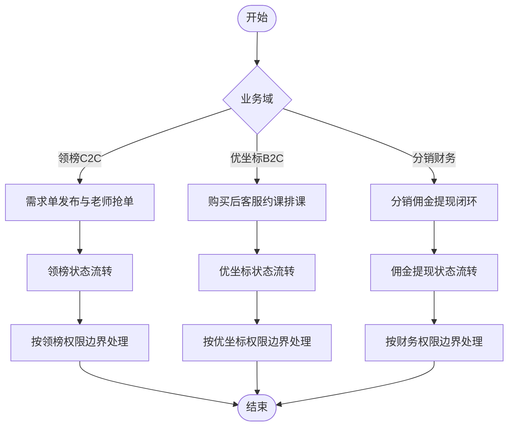
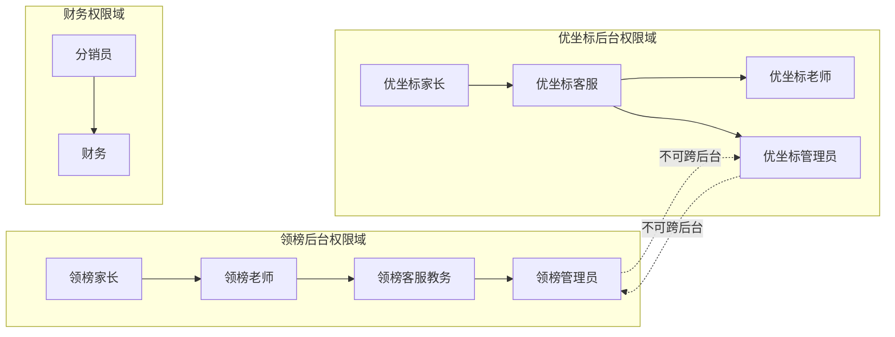
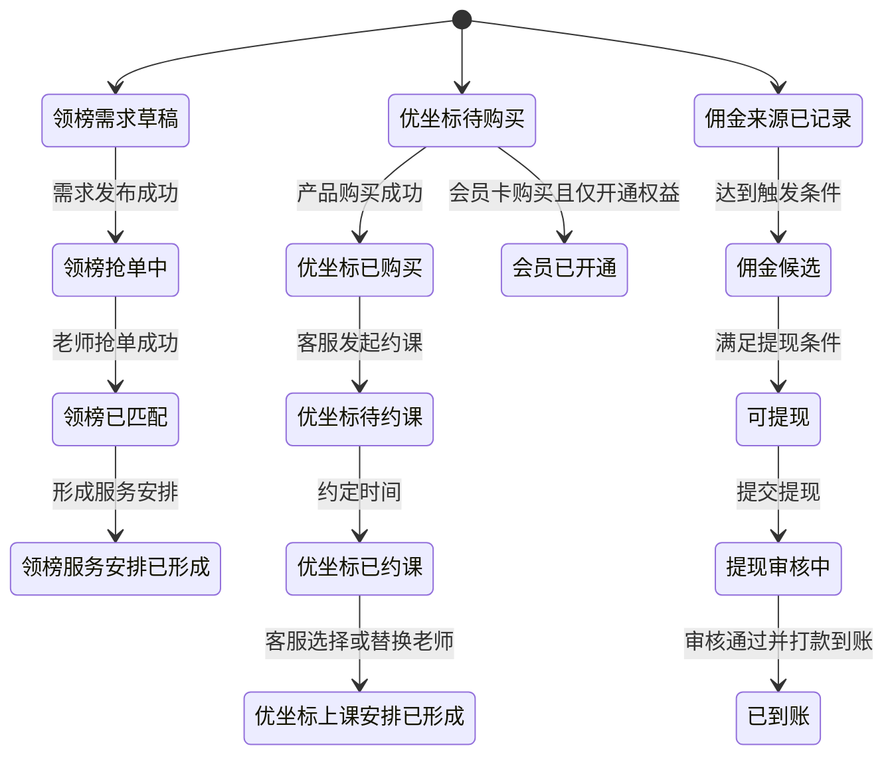
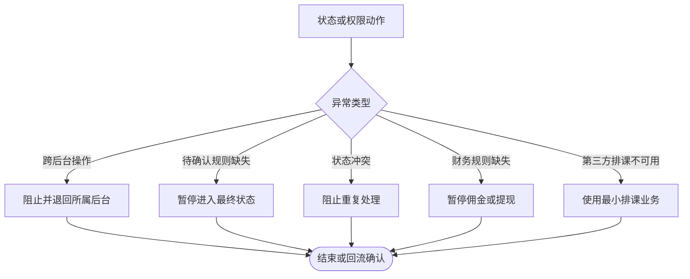
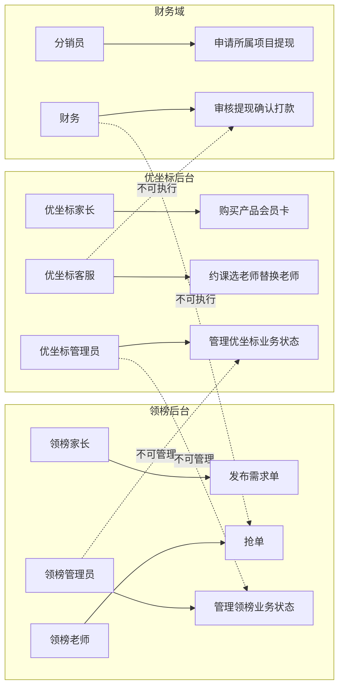

# 业务流程_状态流转与权限边界_v1_20260603

## 背景

本稿汇总 `03 - 业务流程助手` 对领榜教育 C2C、优坐标 B2C、分销提现佣金三个业务域的状态流转和权限边界设计。用户已确认领榜教育后台与优坐标后台完全独立，因此本稿按两个后台分别汇总，不设计共享后台或共享中台。

## 目标

为后续信息架构、交互设计和数据交互提供统一的业务对象状态、角色权限、异常状态和待确认规则清单。本稿不输出页面结构、页面跳转、交互控件、表单字段、接口字段、高保真原型或 PRD。

## 输入来源

- `/Users/xuyunfeng/Documents/k12/05_需求分析/需求分析_用户确认MVP边界_v1_20260603.md`
- `/Users/xuyunfeng/Documents/k12/06_业务流程/业务流程_领榜教育C2C流程_v1_20260603.md`
- `/Users/xuyunfeng/Documents/k12/06_业务流程/业务流程_优坐标B2C流程_v1_20260603.md`
- `/Users/xuyunfeng/Documents/k12/06_业务流程/业务流程_分销提现佣金流程_v1_20260603.md`

## 关键结论

- 领榜教育状态对象主要包括需求单、抢单记录、锁单记录、企业微信监管记录、服务安排、领榜佣金记录、领榜提现申请。
- 优坐标状态对象主要包括产品订单、会员卡订单、约课记录、上课安排、优坐标佣金记录、优坐标提现申请。
- 领榜后台管理员只能管理领榜业务，优坐标后台管理员只能管理优坐标业务。
- 优坐标客服拥有约课、选择老师、替换老师和形成最小排课安排的业务操控权限。
- 优坐标客服替换老师时，家长确认发生在系统外，系统内只需记录客服确认结果或备注，不设计家长二次确认动作。
- 分销需支持 2 级分销、拉新注册家长/老师、产品或会员卡销售提成、拉新老师课消提成；课消提成只支持一级。
- 财务负责提现审核、打款确认和到账闭环，不负责抢单、约课、排课或业务成交决策。

## 03 关口确认规则优先级

本节覆盖本文早期图表中关于抢单确认、替换老师确认、会员卡权益、分销规则的旧待确认表述。下游 04 信息架构必须按以下规则建模：

- 领榜不做家长系统内确认老师。
- 领榜老师付费购买/接单后，需求单锁定，禁止其他老师继续抢单。
- 领榜未成交或老师退单后，需求单重新开放给其他老师查看和抢单。
- 领榜客服在系统外拉企业微信群，将接单老师拉入群，平台通过企业微信监管沟通；系统内应考虑监管记录。
- 优坐标客服替换老师时，由客服系统外联系家长确认；系统内不要求家长二次确认。
- 优坐标会员卡先作为独立购买和权益开通处理，不做复杂抵扣。
- 分销支持 2 级、拉新注册家长或老师、销售提成、拉新老师课消提成；课消提成只有一级。

## 需求覆盖范围

| 需求 | 来源 | 是否纳入本次流程设计 | 说明 |
| --- | --- | --- | --- |
| 两后台完全独立 | 用户确认 MVP 边界 CFM-01 | 是 | 权限边界核心 |
| 领榜 C2C 状态 | 领榜 C2C 流程文件 | 是 | 需求单、抢单、服务安排 |
| 优坐标 B2C 状态 | 优坐标 B2C 流程文件 | 是 | 订单、约课、排课 |
| 分销提现佣金状态 | 分销提现佣金流程文件 | 是 | 两项目分别建模 |
| 待确认规则汇总 | 用户确认待确认问题 | 是 | 不写成已确认流程 |

## 角色与职责

| 角色 | 职责 | 权限边界 | 备注 |
| --- | --- | --- | --- |
| 领榜家长 | 发布需求单、按待确认规则确认老师 | 不操作老师抢单、财务审核或优坐标后台 | 是否确认老师待定 |
| 领榜老师 | 查看并抢领榜需求单 | 不发布家长需求，不管理后台 | 多老师抢单规则待定 |
| 领榜客服/教务 | 处理领榜异常需求和服务协调 | 不处理优坐标排课和财务审核 | 是否可派单待确认 |
| 领榜后台管理员 | 管理领榜需求、抢单、老师资格、状态异常、领榜分销财务状态 | 不管理优坐标后台 | 后台独立 |
| 优坐标家长 | 购买产品、购买会员卡、指定偏好老师、约定上课时间 | 不分配或替换老师 | 替换确认待定 |
| 优坐标客服 | 联系约课、选择老师、替换老师、形成最小排课安排 | 不审核提现，不管理领榜后台 | 必须支持操控能力 |
| 优坐标老师 | 承接上课安排 | 不替客服分配老师 | 是否需确认接课待定 |
| 优坐标后台管理员 | 管理优坐标产品、会员卡、老师关联、订单、排课、分销财务状态 | 不管理领榜后台 | 后台独立 |
| 分销员 | 推荐并申请所属项目提现 | 不跨项目查看佣金或提现 | 角色归属待确认 |
| 财务 | 审核提现、确认打款、记录到账 | 不处理抢单、约课、排课 | 审核角色和周期待确认 |

## 关键业务对象

| 业务对象 | 定义 | 关键属性 | 相关角色 |
| --- | --- | --- | --- |
| 领榜需求单 | 家长发布的 C2C 家教需求 | 状态、抢单结果、服务安排 | 家长、老师、客服/教务 |
| 领榜抢单记录 | 老师对需求单发起的抢单动作 | 状态、老师、需求单 | 老师、系统、管理员 |
| 领榜服务安排 | 抢单后形成的服务承接关系 | 状态、家长、老师 | 家长、老师、客服/教务 |
| 优坐标订单 | 产品或老师关联产品购买记录 | 状态、购买类型、关联老师 | 家长、客服 |
| 优坐标会员卡订单 | 会员卡购买记录 | 状态、权益关系待确认 | 家长、后台 |
| 优坐标约课记录 | 客服与家长约定上课时间的记录 | 状态、时间、关联订单 | 家长、客服 |
| 优坐标上课安排 | 客服选择或替换老师后形成的最小排课结果 | 状态、老师、时间 | 客服、老师、家长 |
| 佣金记录 | 达成业务条件后生成的收益记录 | 所属项目、状态、规则待确认 | 分销员、财务 |
| 提现申请 | 分销员申请提取佣金的记录 | 所属项目、审核和打款状态 | 分销员、财务 |

## 业务动作流程图

### Mermaid

### 节点清单

| 节点ID | 节点名称 | 节点类型 | 所属泳道 | 说明 |
| --- | --- | --- | --- | --- |
| S | 开始 | 开始 | 业务阶段 | 状态与权限汇总入口 |
| D1 | 业务域 | 判断 | 系统 | 判断业务归属 |
| L1 | 需求单发布与老师抢单 | 动作 | 领榜教育 | 领榜主流程 |
| U1 | 购买后客服约课排课 | 动作 | 优坐标 | 优坐标主流程 |
| F1 | 分销佣金提现闭环 | 动作 | 财务域 | 分销财务流程 |
| L2 | 领榜状态流转 | 状态 | 领榜教育 | 需求单和抢单状态 |
| U2 | 优坐标状态流转 | 状态 | 优坐标 | 订单、约课、排课状态 |
| F2 | 佣金提现状态流转 | 状态 | 财务域 | 佣金和提现状态 |
| P1 | 按领榜权限边界处理 | 权限 | 领榜教育 | 领榜权限域 |
| P2 | 按优坐标权限边界处理 | 权限 | 优坐标 | 优坐标权限域 |
| P3 | 按财务权限边界处理 | 权限 | 财务域 | 财务权限域 |
| END | 结束 | 结束 | 业务阶段 | 汇总结束 |

### 连线清单

| 起点 | 终点 | 条件 | 说明 |
| --- | --- | --- | --- |
| S | D1 | 开始 | 判断业务域 |
| D1 | L1 | 领榜C2C | 进入领榜流程 |
| D1 | U1 | 优坐标B2C | 进入优坐标流程 |
| D1 | F1 | 分销财务 | 进入财务流程 |
| L1 | L2 | 业务动作发生 | 状态流转 |
| U1 | U2 | 业务动作发生 | 状态流转 |
| F1 | F2 | 财务动作发生 | 状态流转 |
| L2 | P1 | 状态变更后 | 权限校验 |
| U2 | P2 | 状态变更后 | 权限校验 |
| F2 | P3 | 状态变更后 | 权限校验 |
| P1 | END | 完成 | 结束 |
| P2 | END | 完成 | 结束 |
| P3 | END | 完成 | 结束 |

### 泳道/分组说明

| 分组名称 | 分组类型 | 包含节点 | 说明 |
| --- | --- | --- | --- |
| 领榜教育 | 权限域 | L1,L2,P1 | 领榜后台独立状态与权限 |
| 优坐标 | 权限域 | U1,U2,P2 | 优坐标后台独立状态与权限 |
| 财务域 | 权限域 | F1,F2,P3 | 提现审核和打款状态 |

### draw.io 建图建议

- 建议图形类型：总览流程图。
- 建议泳道或分组：领榜教育、优坐标、财务域。
- 判断节点样式：业务域判断用菱形。
- 异常节点样式：本图只做总览，异常详见各流程文件。
- 状态节点样式：状态汇总节点用圆角矩形。
- 颜色或标注建议：领榜用蓝色，优坐标用绿色，财务用紫色。

## 角色泳道图

### Mermaid

### 泳道/分组说明

| 分组名称 | 分组类型 | 包含节点 | 说明 |
| --- | --- | --- | --- |
| 领榜后台权限域 | 权限域 | LP,LT,LO,LA | 领榜独立后台 |
| 优坐标后台权限域 | 权限域 | UP,UC,UT,UA | 优坐标独立后台 |
| 财务权限域 | 权限域 | FD,FF | 佣金提现审核 |

### 节点清单

| 节点ID | 节点名称 | 节点类型 | 所属泳道 | 说明 |
| --- | --- | --- | --- | --- |
| LP | 领榜家长 | 角色 | 领榜后台权限域 | 发布需求 |
| LT | 领榜老师 | 角色 | 领榜后台权限域 | 抢单 |
| LO | 领榜客服教务 | 角色 | 领榜后台权限域 | 协调异常 |
| LA | 领榜管理员 | 角色 | 领榜后台权限域 | 领榜管理 |
| UP | 优坐标家长 | 角色 | 优坐标后台权限域 | 购买和约课 |
| UC | 优坐标客服 | 角色 | 优坐标后台权限域 | 约课和排课 |
| UT | 优坐标老师 | 角色 | 优坐标后台权限域 | 承接安排 |
| UA | 优坐标管理员 | 角色 | 优坐标后台权限域 | 优坐标管理 |
| FD | 分销员 | 角色 | 财务权限域 | 推荐和提现 |
| FF | 财务 | 角色 | 财务权限域 | 审核与打款 |

### 连线清单

| 起点 | 终点 | 条件 | 说明 |
| --- | --- | --- | --- |
| LP | LT | 领榜需求可抢 | 家长需求被老师抢单 |
| LT | LO | 异常或协调 | 客服教务介入 |
| LO | LA | 需要后台处理 | 管理员处理 |
| UP | UC | 购买后约课 | 客服联系家长 |
| UC | UT | 分配老师 | 老师承接 |
| UC | UA | 后台状态管理 | 管理员处理 |
| FD | FF | 提现申请 | 财务审核 |
| LA | UA | 不可跨后台 | 领榜管理员不得管理优坐标 |
| UA | LA | 不可跨后台 | 优坐标管理员不得管理领榜 |

### draw.io 建图建议

- 建议图形类型：角色泳道图。
- 建议泳道或分组：领榜后台权限域、优坐标后台权限域、财务权限域。
- 判断节点样式：跨后台禁止关系使用虚线和红色标注。
- 异常节点样式：职责冲突用红色虚线。
- 状态节点样式：角色节点用圆角矩形。
- 颜色或标注建议：两个后台使用不同底色，强调完全独立。

## 状态流转图

### Mermaid

### 状态流转表

| 业务对象 | 当前状态 | 触发动作 | 触发角色 | 前置条件 | 结果状态 | 异常状态 |
| --- | --- | --- | --- | --- | --- | --- |
| 领榜需求单 | 草稿 | 发布需求 | 家长 | 需求满足发布条件 | 抢单中 | 发布失败 |
| 领榜抢单记录 | 抢单中 | 抢单 | 老师 | 老师具备资格 | 已匹配或待家长确认 | 状态冲突 |
| 领榜服务安排 | 已匹配 | 形成安排 | 系统/客服教务 | 匹配完成 | 服务安排已形成 | 待人工处理 |
| 优坐标订单 | 待购买 | 购买产品 | 家长 | 选择产品或老师关联产品 | 已购买 | 购买失败 |
| 优坐标会员卡订单 | 待购买 | 购买会员卡 | 家长 | 选择会员卡 | 会员已开通或待约课 | 购买失败 |
| 优坐标约课记录 | 待约课 | 约定时间 | 客服/家长 | 购买成功 | 已约课 | 约课异常 |
| 优坐标上课安排 | 已约课 | 选择或替换老师 | 客服 | 时间已确定 | 上课安排已形成 | 状态冲突 |
| 佣金记录 | 来源已记录 | 达到触发条件 | 系统 | 分销来源有效 | 佣金候选 | 待规则确认 |
| 提现申请 | 可提现 | 提交提现 | 分销员 | 满足提现条件 | 提现审核中 | 暂不可提现 |
| 提现申请 | 提现审核中 | 审核和打款 | 财务 | 审核通过 | 已到账 | 提现驳回或打款异常 |

### 节点清单

| 节点ID | 节点名称 | 节点类型 | 所属泳道 | 说明 |
| --- | --- | --- | --- | --- |
| LST1 | 领榜需求草稿 | 状态 | 领榜教育 | 需求发布前 |
| LST2 | 领榜抢单中 | 状态 | 领榜教育 | 老师可抢 |
| LST3 | 领榜已匹配 | 状态 | 领榜教育 | 老师匹配 |
| LST4 | 领榜服务安排已形成 | 状态 | 领榜教育 | 服务承接形成 |
| UST1 | 优坐标待购买 | 状态 | 优坐标 | 购买前 |
| UST2 | 优坐标已购买 | 状态 | 优坐标 | 产品购买成功 |
| UST3 | 会员已开通 | 状态 | 优坐标 | 会员权益开通 |
| UST4 | 优坐标待约课 | 状态 | 优坐标 | 客服待约课 |
| UST5 | 优坐标已约课 | 状态 | 优坐标 | 时间已确认 |
| UST6 | 优坐标上课安排已形成 | 状态 | 优坐标 | 最小排课完成 |
| FST1 | 佣金来源已记录 | 状态 | 财务域 | 来源记录 |
| FST2 | 佣金候选 | 状态 | 财务域 | 佣金候选 |
| FST3 | 可提现 | 状态 | 财务域 | 可申请提现 |
| FST4 | 提现审核中 | 状态 | 财务域 | 财务审核 |
| FST5 | 已到账 | 状态 | 财务域 | 财务闭环 |

### 连线清单

| 起点 | 终点 | 条件 | 说明 |
| --- | --- | --- | --- |
| LST1 | LST2 | 需求发布成功 | 进入抢单 |
| LST2 | LST3 | 老师抢单成功 | 完成匹配 |
| LST3 | LST4 | 形成服务安排 | 领榜闭环 |
| UST1 | UST2 | 产品购买成功 | 进入约课 |
| UST1 | UST3 | 会员卡购买且仅开通权益 | 会员开通 |
| UST2 | UST4 | 客服发起约课 | 待约课 |
| UST4 | UST5 | 约定时间 | 已约课 |
| UST5 | UST6 | 选择或替换老师 | 排课完成 |
| FST1 | FST2 | 达到触发条件 | 佣金候选 |
| FST2 | FST3 | 满足提现条件 | 可提现 |
| FST3 | FST4 | 提交提现 | 审核中 |
| FST4 | FST5 | 审核通过并到账 | 财务闭环 |

### 泳道/分组说明

| 分组名称 | 分组类型 | 包含节点 | 说明 |
| --- | --- | --- | --- |
| 领榜状态组 | 阶段 | LST1,LST2,LST3,LST4 | 领榜需求抢单闭环 |
| 优坐标状态组 | 阶段 | UST1,UST2,UST3,UST4,UST5,UST6 | 优坐标购买约课排课闭环 |
| 财务状态组 | 阶段 | FST1,FST2,FST3,FST4,FST5 | 分销佣金提现闭环 |

### draw.io 建图建议

- 建议图形类型：多泳道状态流转图。
- 建议泳道或分组：领榜状态组、优坐标状态组、财务状态组。
- 判断节点样式：状态图用连线标签表达触发条件。
- 异常节点样式：异常状态可在后续细图中使用红色补充。
- 状态节点样式：圆角矩形。
- 颜色或标注建议：三组状态使用三种颜色，避免跨项目混淆。

## 异常流程图

### Mermaid

### 业务异常节点

| 异常类型 | 触发条件 | 影响范围 | 处理方式 | 下游关注点 |
| --- | --- | --- | --- | --- |
| 跨后台操作 | 领榜角色操作优坐标或反向操作 | 权限、后台 | 阻止并退回所属后台 | 信息架构需分开模块 |
| 待确认规则缺失 | 抢单确认、替换确认等未明确 | 状态流转 | 暂停进入最终状态 | 主控需组织确认 |
| 状态冲突 | 重复抢单、重复排课、重复提现 | 业务对象 | 阻止重复处理 | 数据交互需状态锁定 |
| 财务规则缺失 | 佣金计算、提现门槛未明确 | 佣金、提现 | 暂停佣金或提现 | 财务需确认规则 |
| 第三方排课不可用 | 第三方对接未确定 | 优坐标排课 | 使用最小排课业务 | 不依赖第三方系统 |

### 节点清单

| 节点ID | 节点名称 | 节点类型 | 所属泳道 | 说明 |
| --- | --- | --- | --- | --- |
| A | 状态或权限动作 | 动作 | 业务阶段 | 任一状态或权限动作 |
| B | 异常类型 | 判断 | 系统 | 判断异常 |
| E1 | 阻止并退回所属后台 | 异常 | 权限域 | 跨后台异常 |
| E2 | 暂停进入最终状态 | 异常 | 待确认规则 | 规则未确认 |
| E3 | 阻止重复处理 | 异常 | 系统 | 状态冲突 |
| E4 | 暂停佣金或提现 | 异常 | 财务域 | 财务规则缺失 |
| E5 | 使用最小排课业务 | 异常 | 优坐标 | 第三方不可用降级 |
| F | 结束或回流确认 | 结束 | 业务阶段 | 异常处理结果 |

### 连线清单

| 起点 | 终点 | 条件 | 说明 |
| --- | --- | --- | --- |
| A | B | 出现异常 | 判断异常 |
| B | E1 | 跨后台操作 | 阻止越权 |
| B | E2 | 待确认规则缺失 | 等待确认 |
| B | E3 | 状态冲突 | 阻止重复 |
| B | E4 | 财务规则缺失 | 暂停财务动作 |
| B | E5 | 第三方排课不可用 | 最小排课跑通 |
| E1 | F | 处理后 | 结束或回流 |
| E2 | F | 处理后 | 等待确认 |
| E3 | F | 处理后 | 结束 |
| E4 | F | 处理后 | 等待财务规则 |
| E5 | F | 处理后 | 最小排课继续 |

### 泳道/分组说明

| 分组名称 | 分组类型 | 包含节点 | 说明 |
| --- | --- | --- | --- |
| 权限异常 | 权限域 | E1 | 防跨后台 |
| 规则异常 | 阶段 | E2,E4 | 业务和财务规则待确认 |
| 状态异常 | 系统 | E3 | 防重复处理 |
| 排课降级 | 阶段 | E5 | 第三方不可用时的最小排课 |

### draw.io 建图建议

- 建议图形类型：异常总览流程图。
- 建议泳道或分组：权限异常、规则异常、状态异常、排课降级。
- 判断节点样式：中心菱形。
- 异常节点样式：红色矩形。
- 状态节点样式：灰色终止节点。
- 颜色或标注建议：待确认规则用黄色，跨后台越权用红色。

## 权限边界图

### Mermaid

### 权限边界表

| 角色 | 可执行动作 | 不可执行动作 | 需要确认/审核的动作 | 备注 |
| --- | --- | --- | --- | --- |
| 领榜家长 | 发布需求单、待确认规则下确认老师 | 抢单、管理后台、操作优坐标业务 | 是否确认老师待确认 | 领榜权限域 |
| 领榜老师 | 抢单 | 发布家长需求、管理后台、操作优坐标业务 | 抢单资格可能需审核 | 领榜权限域 |
| 领榜管理员 | 管理领榜业务状态 | 管理优坐标业务状态 | 高风险调整需留痕 | 后台独立 |
| 优坐标家长 | 购买产品/会员卡、指定偏好老师、约定时间 | 分配/替换老师、管理后台 | 替换老师二次确认待确认 | 优坐标权限域 |
| 优坐标客服 | 约课、选择老师、替换老师、形成排课 | 财务审核、管理领榜后台 | 替换老师是否需确认待定 | 后台必须支持操控 |
| 优坐标管理员 | 管理优坐标业务状态 | 管理领榜业务状态 | 高风险调整需留痕 | 后台独立 |
| 分销员 | 申请所属项目提现 | 跨项目查看或申请提现 | 提现需财务审核 | 角色归属待确认 |
| 财务 | 审核提现、确认打款 | 抢单、约课、排课、替换老师 | 打款需审核通过 | 财务规则待确认 |

### 节点清单

| 节点ID | 节点名称 | 节点类型 | 所属泳道 | 说明 |
| --- | --- | --- | --- | --- |
| LP | 领榜家长 | 角色 | 领榜后台 | 领榜需求发起 |
| LT | 领榜老师 | 角色 | 领榜后台 | 领榜抢单 |
| LAdmin | 领榜管理员 | 角色 | 领榜后台 | 领榜管理 |
| UP | 优坐标家长 | 角色 | 优坐标后台 | 购买和约课 |
| UC | 优坐标客服 | 角色 | 优坐标后台 | 排课操控 |
| UAdmin | 优坐标管理员 | 角色 | 优坐标后台 | 优坐标管理 |
| Dist | 分销员 | 角色 | 财务域 | 提现申请 |
| Fin | 财务 | 角色 | 财务域 | 审核打款 |
| LA1 | 发布需求单 | 动作 | 领榜后台 | 家长动作 |
| LA2 | 抢单 | 动作 | 领榜后台 | 老师动作 |
| LA3 | 管理领榜业务状态 | 动作 | 领榜后台 | 管理员动作 |
| UA1 | 购买产品会员卡 | 动作 | 优坐标后台 | 家长动作 |
| UA2 | 约课选老师替换老师 | 动作 | 优坐标后台 | 客服动作 |
| UA3 | 管理优坐标业务状态 | 动作 | 优坐标后台 | 管理员动作 |
| FA1 | 申请所属项目提现 | 动作 | 财务域 | 分销员动作 |
| FA2 | 审核提现确认打款 | 动作 | 财务域 | 财务动作 |

### 连线清单

| 起点 | 终点 | 条件 | 说明 |
| --- | --- | --- | --- |
| LP | LA1 | 可执行 | 发布需求 |
| LT | LA2 | 可执行 | 抢单 |
| LAdmin | LA3 | 可执行 | 管理领榜 |
| UP | UA1 | 可执行 | 购买 |
| UC | UA2 | 可执行 | 约课排课 |
| UAdmin | UA3 | 可执行 | 管理优坐标 |
| Dist | FA1 | 可执行 | 提现申请 |
| Fin | FA2 | 可执行 | 审核打款 |
| LAdmin | UA3 | 不可管理 | 禁止跨后台 |
| UAdmin | LA3 | 不可管理 | 禁止跨后台 |
| UC | FA2 | 不可执行 | 客服不能审核提现 |
| Fin | LA2 | 不可执行 | 财务不能抢单 |

### 泳道/分组说明

| 分组名称 | 分组类型 | 包含节点 | 说明 |
| --- | --- | --- | --- |
| 领榜后台 | 权限域 | LP,LT,LAdmin,LA1,LA2,LA3 | 领榜独立后台 |
| 优坐标后台 | 权限域 | UP,UC,UAdmin,UA1,UA2,UA3 | 优坐标独立后台 |
| 财务域 | 权限域 | Dist,Fin,FA1,FA2 | 分销提现财务权限 |

### draw.io 建图建议

- 建议图形类型：权限边界图。
- 建议泳道或分组：领榜后台、优坐标后台、财务域。
- 判断节点样式：本图以权限连线为主，待确认动作可加黄色标签。
- 异常节点样式：不可执行连线用红色虚线。
- 状态节点样式：角色节点用圆角矩形，动作节点用矩形。
- 颜色或标注建议：不同后台用不同底色，红色虚线表示禁止跨域。

## 流程步骤表

| 步骤 | 角色 | 业务动作 | 前置条件 | 判断点 | 结果 | 异常处理 |
| --- | --- | --- | --- | --- | --- | --- |
| 1 | 系统 | 判断业务域 | 业务动作发生 | 领榜、优坐标或财务 | 进入对应状态流转 | 归属不清则回流确认 |
| 2 | 对应角色 | 执行业务动作 | 具备所属后台权限 | 是否越权 | 状态流转 | 阻止跨后台操作 |
| 3 | 系统 | 判断状态变更 | 业务动作提交 | 状态是否冲突 | 状态更新 | 阻止重复处理 |
| 4 | 管理员/客服/财务 | 处理异常 | 出现异常状态 | 是否职责内 | 异常闭环或等待确认 | 回流主控确认 |
| 5 | 系统 | 记录最终状态 | 业务动作完成 | 是否满足终态 | 进入终态 | 待规则确认 |

## 业务规则

| 规则 | 适用场景 | 影响对象 | 来源依据 |
| --- | --- | --- | --- |
| 两后台完全独立 | 全部后台权限 | 管理员、数据、流程 | 用户确认 MVP 边界 CFM-01 |
| 领榜 C2C | 领榜主流程 | 需求单、抢单记录 | 用户确认 MVP 边界 CFM-02/03/04 |
| 优坐标 B2C | 优坐标主流程 | 订单、约课、排课 | 用户确认 MVP 边界 CFM-05/06/07/08/09/10 |
| 优坐标会员卡进入 MVP | 优坐标购买 | 会员卡订单 | 用户确认 MVP 边界 CFM-11 |
| 分销提现佣金进入 MVP | 财务闭环 | 佣金、提现 | 用户确认 MVP 边界 CFM-12/13/14 |
| 最小排课不依赖第三方系统 | 优坐标排课 | 上课安排 | 用户确认 MVP 边界 CFM-15 |

## 关键决策点

| 决策点 | 判断条件 | 分支结果 | 风险 |
| --- | --- | --- | --- |
| 业务归属 | 领榜、优坐标或财务 | 进入对应权限域 | 归属不清会导致越权 |
| 是否跨后台 | 角色所属后台和动作所属后台是否一致 | 允许或阻止 | 两后台独立边界必须坚持 |
| 03 关口确认规则是否已同步 | 抢单锁单、系统外确认、会员独立权益、分销类型 | 进入终态或等待细节规则 | 已解除 04 信息架构阻塞 |
| 是否状态冲突 | 业务对象是否已进入不可重复处理状态 | 更新或阻止 | 数据交互需关注状态锁 |

## 待确认问题

- 领榜老师付费购买/接单金额、退款规则和财务归属。
- 若无人抢单，客服/教务是否可以转为人工派单。
- 老师抢单资格是否需要后台审核后才可生效。
- 优坐标会员卡后续是否需要与产品购买、课时抵扣或折扣建立复杂关系。
- 分销一级/二级销售提成比例、注册奖励、课消提成比例、归因有效期和审核角色。

## 已确认补充规则

- 领榜企微监管记录最小粒度为接单老师、关联需求单、当前监管状态、客服备注，不强制自动同步企业微信聊天内容。
- 领榜老师退单或未成交后，系统自动重新开放需求单；退款相关由客服人工处理，当前不在系统内处理。
- 优坐标 MVP 先不做老师端确认接课，由客服后台直接分配。
- 优坐标替换老师系统外确认留痕为“已联系家长确认”、确认时间、客服、备注，不强制上传截图或录音。
- 分销佣金比例和注册奖励支持系统配置并可随时调整。
- 提现人工审核、系统外打款，系统不限制提现门槛，按月结算。
- 平台内所有用户都可以成为分销员，老师、家长均可成为分销员。

## 风险与依赖

- 若后续将两个后台合并设计，会直接违背用户已确认边界。
- 抢单确认、替换确认和会员抵扣关系未确认，会影响交互设计和数据状态。
- 分销、提现、佣金进入 MVP，但财务规则未确认，会影响数据交互和验收标准。
- 第三方排课系统不确定，必须保留最小排课闭环，不得把第三方作为强依赖。

## 下一步动作

- 主控汇总本稿待确认问题，并组织业务、客服/教务、财务确认。
- 信息架构助手可基于本稿拆分两个后台的业务对象、权限域和状态分组。
- 交互设计助手需等待关键待确认问题确认后再细化操作路径。
- 数据交互助手需等待财务规则和会员权益规则明确后再定义字段和接口。
