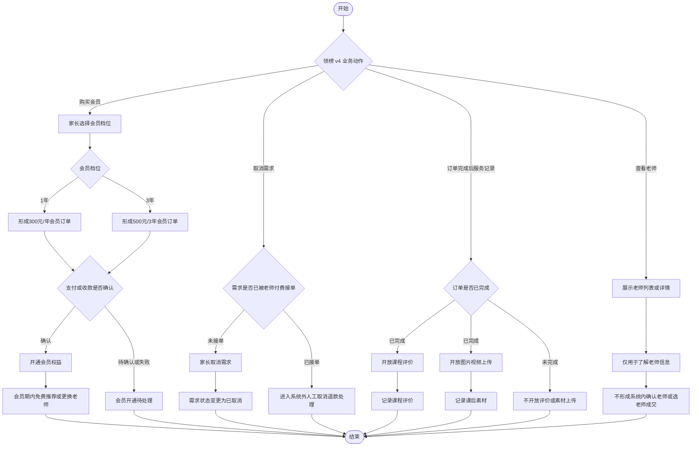
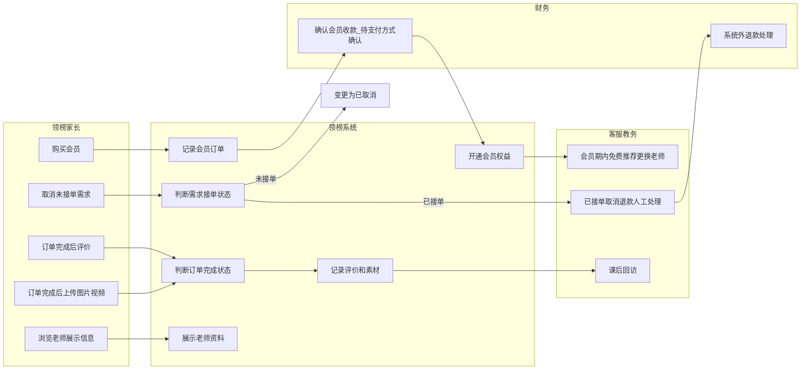
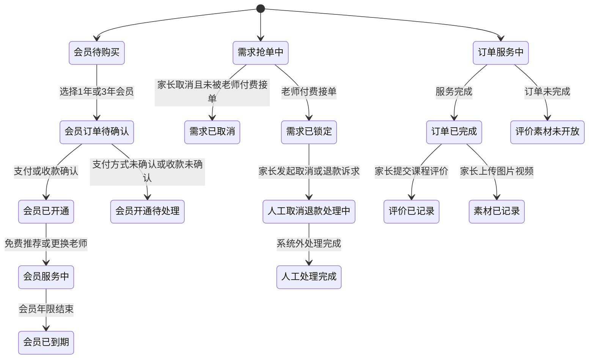
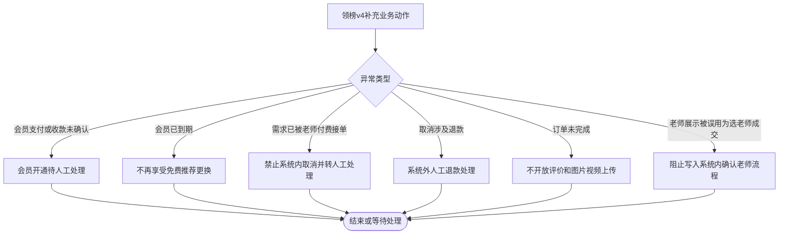
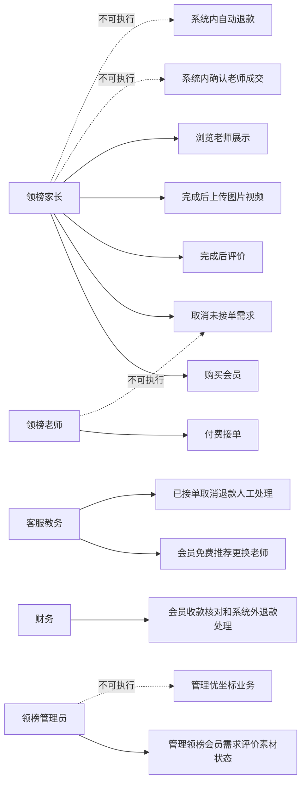

# 业务流程_领榜v4新增规则补充_v1_20260604

## 背景

本稿由 `03 - 业务流程助手` 基于领榜 v4 上游回流任务、需求分析补充稿、用户确认领榜原型新增规则、既有领榜 C2C 业务流程和原型问题记录生成。领榜 v4 已确认新增会员购买、未接单需求取消、已接单取消/退款系统外人工处理、订单完成后课程评价、订单完成后上传图片/视频，以及老师列表/详情仅展示的边界。

本稿只补充领榜教育业务流程，不修改优坐标流程，不输出页面结构、页面跳转、UI 控件、表单字段、接口字段、HTML 原型或 PRD。

## 目标

- 补充领榜会员购买/开通流程。
- 补充未被老师付费接单前的需求取消流程。
- 补充老师已接单后的取消/退款人工处理边界。
- 补充订单完成后的课程评价流程。
- 补充订单完成后的图片/视频上传流程。
- 补充老师列表/详情展示边界，明确不做家长系统内确认老师或选老师成交。
- 给出对应状态流转、异常流程、权限边界和业务规则。

## 输入来源

- `/Users/xuyunfeng/Documents/k12/work/任务交接_领榜v4上游回流_v1_20260604.md`
- `/Users/xuyunfeng/Documents/k12/05_需求分析/需求分析_领榜v4新增规则补充_v1_20260604.md`
- `/Users/xuyunfeng/Documents/k12/05_需求分析/需求分析_用户确认领榜原型新增规则_v1_20260604.md`
- `/Users/xuyunfeng/Documents/k12/06_业务流程/业务流程_领榜教育C2C流程_v1_20260603.md`
- `/Users/xuyunfeng/Documents/k12/06_业务流程/业务流程_状态流转与权限边界_v1_20260603.md`
- `/Users/xuyunfeng/Documents/k12/10_高保真原型/高保真原型_领榜离线原型适配说明_v1_20260604.md`
- `/Users/xuyunfeng/Documents/k12/10_高保真原型/高保真原型_问题记录_v1_20260603.md`

## 关键结论

- 领榜会员进入当前业务范围，包含 1 年会员和 3 年会员。
- 1 年会员价格为 300 元/年；3 年会员价格为 500 元/3 年。
- 会员期内，家长可免费推荐和更换在校大学生、在读硕博、专业教师、星级教员。
- 家长只能取消未被老师付费接单的需求。
- 老师已付费接单后的取消和退款走系统外人工处理；本阶段不设计系统内自动退款闭环。
- 课程评价和图片/视频上传只在订单完成后开放，用于课后服务记录和平台回访。
- 老师列表和老师详情只用于展示，不改变领榜 C2C 主线，不做家长系统内确认老师、选老师成交或系统派单。

## 需求覆盖范围

| 需求 | 来源 | 是否纳入本次流程补充 | 说明 |
| --- | --- | --- | --- |
| 领榜 1 年会员 | 用户确认领榜原型新增规则 LBV4-02/LBV4-03 | 是 | 300 元/年 |
| 领榜 3 年会员 | 用户确认领榜原型新增规则 LBV4-02/LBV4-04 | 是 | 500 元/3 年 |
| 会员期内免费推荐/更换老师 | 用户确认领榜原型新增规则 LBV4-05 | 是 | 覆盖四类老师 |
| 未接单需求取消 | 用户确认领榜原型新增规则 LBV4-06 | 是 | 仅未被老师付费接单前 |
| 已接单后取消/退款 | 用户确认领榜原型新增规则 LBV4-07 | 是，作为系统外人工处理边界 | 不做自动退款闭环 |
| 订单完成后课程评价 | 用户确认领榜原型新增规则 LBV4-08 | 是 | 仅完成后开放 |
| 订单完成后图片/视频上传 | 用户确认领榜原型新增规则 LBV4-09 | 是 | 仅完成后开放 |
| 老师展示边界 | 用户确认领榜原型新增规则；原型问题 P-015 | 是 | 只展示，不做系统内确认老师 |

## 角色与职责

| 角色 | 职责 | 权限边界 | 备注 |
| --- | --- | --- | --- |
| 领榜家长 | 购买会员、发布需求、取消未接单需求、订单完成后评价、订单完成后上传图片/视频、浏览老师展示信息 | 不能系统内确认老师成交，不能取消已被老师付费接单需求并触发自动退款 | 已接单后取消/退款需人工处理 |
| 领榜老师 | 付费接单、承接服务、被展示为老师资料 | 不能替家长开通会员，不能替家长取消需求，不能管理评价和素材 | 老师列表/详情只展示 |
| 领榜客服/教务 | 会员服务承接、免费推荐/更换老师、已接单取消退款的系统外人工处理、课后回访 | 不执行系统内自动退款，不操作优坐标业务 | 人工处理可记录进度和备注 |
| 领榜后台管理员 | 管理领榜会员状态、需求状态、订单完成状态、评价/素材记录、异常状态 | 不管理优坐标后台 | 高风险状态变更需留痕 |
| 财务 | 处理人工退款相关线下财务事项、会员收款核对 | 不处理老师展示、不自动退款 | 会员支付方式仍待确认 |
| 系统 | 记录会员、需求、订单完成、评价、素材上传和状态流转 | 不自动退款，不自动派单，不让家长系统内确认老师 | 仅承接已确认业务规则 |

## 关键业务对象

| 业务对象 | 定义 | 关键属性 | 相关角色 |
| --- | --- | --- | --- |
| 领榜会员 | 家长购买后获得一定年限内免费推荐/更换老师权益的会员身份 | 年限、价格、有效状态、权益状态 | 家长、客服/教务、后台管理员 |
| 会员订单 | 家长购买 1 年或 3 年会员形成的业务记录 | 档位、金额、支付确认状态 | 家长、财务、后台管理员 |
| 需求单 | 家长发布的家教需求 | 是否已被老师付费接单、取消状态、锁定状态 | 家长、老师、客服/教务 |
| 领榜订单/服务安排 | 老师付费接单后形成的服务承接对象 | 完成状态、取消人工处理状态 | 家长、老师、客服/教务 |
| 课程评价 | 订单完成后家长提交的课后反馈 | 关联订单、记录状态 | 家长、客服/运营 |
| 课后素材 | 订单完成后上传的图片/视频记录 | 关联订单、素材状态 | 家长、客服/运营 |
| 老师展示资料 | 老师列表和详情中供家长了解的资料 | 展示状态、老师类型 | 家长、老师、运营 |

## 业务动作流程图

### Mermaid

### 节点清单

| 节点ID | 节点名称 | 节点类型 | 所属泳道 | 说明 |
| --- | --- | --- | --- | --- |
| S | 开始 | 开始 | 业务阶段 | v4 补充流程开始 |
| D1 | 领榜 v4 业务动作 | 判断 | 系统 | 判断进入会员、取消、课后记录或老师展示 |
| M1 | 家长选择会员档位 | 动作 | 家长 | 选择 1 年或 3 年会员 |
| M2 | 会员档位 | 判断 | 系统 | 判断会员年限 |
| M3 | 形成300元/年会员订单 | 动作 | 系统 | 1 年会员订单 |
| M4 | 形成500元/3年会员订单 | 动作 | 系统 | 3 年会员订单 |
| M5 | 支付或收款是否确认 | 判断 | 财务/系统 | 支付方式待确认 |
| M6 | 开通会员权益 | 动作 | 系统 | 开通会员年限权益 |
| M7 | 会员期内免费推荐或更换老师 | 动作 | 客服/教务 | 会员核心权益承接 |
| ME1 | 会员开通待处理 | 异常 | 财务/客服 | 支付或收款未确认 |
| C1 | 需求是否已被老师付费接单 | 判断 | 系统 | 取消边界判断 |
| C2 | 家长取消需求 | 动作 | 家长 | 仅未接单需求可取消 |
| C3 | 需求状态变更为已取消 | 状态 | 系统 | 取消完成 |
| C4 | 进入系统外人工取消退款处理 | 异常 | 客服/财务 | 已接单后不做自动退款 |
| O1 | 订单是否已完成 | 判断 | 系统 | 评价和素材开放条件 |
| O2 | 开放课程评价 | 动作 | 系统 | 完成后开放 |
| O3 | 记录课程评价 | 动作 | 系统 | 课后服务记录 |
| O4 | 开放图片视频上传 | 动作 | 系统 | 完成后开放 |
| O5 | 记录课后素材 | 动作 | 系统 | 平台回访依据 |
| OE1 | 不开放评价或素材上传 | 异常 | 系统 | 未完成订单限制 |
| T1 | 展示老师列表或详情 | 动作 | 系统 | 老师资料展示 |
| T2 | 仅用于了解老师信息 | 动作 | 家长 | 浏览展示信息 |
| T3 | 不形成系统内确认老师或选老师成交 | 结束 | 系统 | 展示边界 |
| F | 结束 | 结束 | 业务阶段 | 流程结束 |

### 连线清单

| 起点 | 终点 | 条件 | 说明 |
| --- | --- | --- | --- |
| S | D1 | 开始 | 进入 v4 补充流程 |
| D1 | M1 | 购买会员 | 进入会员购买 |
| M1 | M2 | 选择档位 | 判断会员类型 |
| M2 | M3 | 1年 | 形成 300 元/年会员订单 |
| M2 | M4 | 3年 | 形成 500 元/3 年会员订单 |
| M3 | M5 | 订单形成 | 判断支付或收款确认 |
| M4 | M5 | 订单形成 | 判断支付或收款确认 |
| M5 | M6 | 确认 | 开通会员权益 |
| M5 | ME1 | 待确认或失败 | 人工处理或等待确认 |
| M6 | M7 | 会员有效期内 | 客服/教务免费推荐或更换老师 |
| D1 | C1 | 取消需求 | 判断接单状态 |
| C1 | C2 | 未接单 | 家长可取消 |
| C2 | C3 | 取消提交 | 需求已取消 |
| C1 | C4 | 已接单 | 系统外人工处理 |
| D1 | O1 | 订单完成后服务记录 | 判断完成状态 |
| O1 | O2 | 已完成 | 开放评价 |
| O2 | O3 | 提交评价 | 记录评价 |
| O1 | O4 | 已完成 | 开放素材上传 |
| O4 | O5 | 上传后 | 记录素材 |
| O1 | OE1 | 未完成 | 不开放评价和素材上传 |
| D1 | T1 | 查看老师 | 展示老师资料 |
| T1 | T2 | 查看详情 | 仅用于了解 |
| T2 | T3 | 结束浏览 | 不形成选老师成交 |
| M7 | F | 完成 | 结束 |
| ME1 | F | 暂停 | 结束 |
| C3 | F | 完成 | 结束 |
| C4 | F | 人工处理 | 结束 |
| O3 | F | 完成 | 结束 |
| O5 | F | 完成 | 结束 |
| OE1 | F | 阻止 | 结束 |
| T3 | F | 完成 | 结束 |

## 角色泳道图

### Mermaid

### 节点清单

| 节点ID | 节点名称 | 节点类型 | 所属泳道 | 说明 |
| --- | --- | --- | --- | --- |
| P1 | 购买会员 | 动作 | 领榜家长 | 购买 1 年或 3 年会员 |
| P2 | 取消未接单需求 | 动作 | 领榜家长 | 未被老师付费接单前可取消 |
| P3 | 订单完成后评价 | 动作 | 领榜家长 | 完成后开放 |
| P4 | 订单完成后上传图片视频 | 动作 | 领榜家长 | 完成后开放 |
| P5 | 浏览老师展示信息 | 动作 | 领榜家长 | 只展示 |
| S1 | 记录会员订单 | 系统 | 领榜系统 | 记录会员购买 |
| S2 | 开通会员权益 | 系统 | 领榜系统 | 开通会员年限和权益 |
| S3 | 判断需求接单状态 | 判断 | 领榜系统 | 判断是否已付费接单 |
| S3A | 变更为已取消 | 状态 | 领榜系统 | 未接单取消结果 |
| S4 | 判断订单完成状态 | 判断 | 领榜系统 | 判断评价和素材开放 |
| S5 | 记录评价和素材 | 系统 | 领榜系统 | 课后服务记录 |
| S6 | 展示老师资料 | 系统 | 领榜系统 | 仅展示老师信息 |
| O1 | 会员期内免费推荐更换老师 | 动作 | 客服教务 | 承接会员权益 |
| O2 | 已接单取消退款人工处理 | 动作 | 客服教务 | 系统外处理 |
| O3 | 课后回访 | 动作 | 客服教务 | 使用评价和素材 |
| F1 | 确认会员收款_待支付方式确认 | 动作 | 财务 | 支付方式待确认 |
| F2 | 系统外退款处理 | 动作 | 财务 | 不做系统内自动退款 |

### 连线清单

| 起点 | 终点 | 条件 | 说明 |
| --- | --- | --- | --- |
| P1 | S1 | 购买会员 | 记录会员订单 |
| S1 | F1 | 订单形成 | 确认收款 |
| F1 | S2 | 收款确认 | 开通权益 |
| S2 | O1 | 会员有效 | 客服/教务免费推荐更换 |
| P2 | S3 | 取消需求 | 判断接单状态 |
| S3 | S3A | 未接单 | 取消成功 |
| S3 | O2 | 已接单 | 转人工处理 |
| O2 | F2 | 涉及退款 | 系统外处理 |
| P3 | S4 | 提交评价 | 判断完成状态 |
| P4 | S4 | 上传素材 | 判断完成状态 |
| S4 | S5 | 已完成 | 记录评价和素材 |
| S5 | O3 | 记录完成 | 平台回访 |
| P5 | S6 | 查看老师 | 展示资料 |

## 状态流转图

### Mermaid

### 状态流转表

| 业务对象 | 当前状态 | 触发动作 | 触发角色 | 前置条件 | 结果状态 | 异常状态 |
| --- | --- | --- | --- | --- | --- | --- |
| 会员订单 | 会员待购买 | 选择会员档位 | 家长 | 选择 1 年或 3 年会员 | 会员订单待确认 | 会员开通待处理 |
| 会员 | 会员订单待确认 | 确认支付或收款 | 财务/系统 | 支付或收款已确认 | 会员已开通 | 会员开通待处理 |
| 会员 | 会员已开通 | 免费推荐或更换老师 | 客服/教务 | 会员在有效期内 | 会员服务中 | 会员已到期 |
| 需求单 | 需求抢单中 | 取消需求 | 家长 | 未被老师付费接单 | 需求已取消 | 已接单不可系统内取消 |
| 需求单 | 需求抢单中 | 老师付费接单 | 老师 | 需求未锁定 | 需求已锁定 | 状态冲突 |
| 服务安排 | 需求已锁定 | 发起取消或退款诉求 | 家长/客服 | 老师已接单 | 人工取消退款处理中 | 不做系统内自动退款 |
| 服务安排 | 人工取消退款处理中 | 人工处理完成 | 客服/财务 | 系统外处理完成 | 人工处理完成 | 人工处理异常 |
| 订单 | 订单服务中 | 服务完成 | 客服/系统 | 服务已完成 | 订单已完成 | 状态冲突 |
| 课程评价 | 订单已完成 | 提交评价 | 家长 | 订单已完成 | 评价已记录 | 评价素材未开放 |
| 课后素材 | 订单已完成 | 上传图片/视频 | 家长 | 订单已完成 | 素材已记录 | 评价素材未开放 |

### 节点清单

| 节点ID | 节点名称 | 节点类型 | 所属泳道 | 说明 |
| --- | --- | --- | --- | --- |
| MST1 | 会员待购买 | 状态 | 会员 | 未购买会员 |
| MST2 | 会员订单待确认 | 状态 | 会员订单 | 等待支付或收款确认 |
| MST3 | 会员已开通 | 状态 | 会员 | 会员权益生效 |
| MST4 | 会员服务中 | 状态 | 会员 | 免费推荐/更换老师 |
| MST5 | 会员已到期 | 状态 | 会员 | 会员年限结束 |
| MEX1 | 会员开通待处理 | 异常 | 会员订单 | 支付方式或收款未确认 |
| DST1 | 需求抢单中 | 状态 | 需求单 | 老师可付费接单 |
| DST2 | 需求已取消 | 状态 | 需求单 | 未接单前取消 |
| DST3 | 需求已锁定 | 状态 | 需求单 | 老师已付费接单 |
| DST4 | 人工取消退款处理中 | 状态 | 服务安排 | 系统外人工处理 |
| DST5 | 人工处理完成 | 状态 | 服务安排 | 人工处理结束 |
| OST1 | 订单服务中 | 状态 | 订单 | 服务未完成 |
| OST2 | 订单已完成 | 状态 | 订单 | 评价和素材开放 |
| OST3 | 评价已记录 | 状态 | 课程评价 | 课后评价记录 |
| OST4 | 素材已记录 | 状态 | 课后素材 | 图片/视频素材记录 |
| OEX1 | 评价素材未开放 | 异常 | 订单 | 订单未完成前不可评价/上传 |

### 连线清单

| 起点 | 终点 | 条件 | 说明 |
| --- | --- | --- | --- |
| MST1 | MST2 | 选择1年或3年会员 | 形成会员订单 |
| MST2 | MST3 | 支付或收款确认 | 会员开通 |
| MST2 | MEX1 | 支付方式未确认或收款未确认 | 待人工处理 |
| MST3 | MST4 | 免费推荐或更换老师 | 会员服务中 |
| MST4 | MST5 | 会员年限结束 | 到期 |
| DST1 | DST2 | 未被老师付费接单且家长取消 | 需求取消 |
| DST1 | DST3 | 老师付费接单 | 需求锁定 |
| DST3 | DST4 | 取消或退款诉求 | 系统外人工处理 |
| DST4 | DST5 | 人工处理完成 | 处理完成 |
| OST1 | OST2 | 服务完成 | 订单完成 |
| OST2 | OST3 | 提交评价 | 评价记录 |
| OST2 | OST4 | 上传图片视频 | 素材记录 |
| OST1 | OEX1 | 订单未完成 | 不开放评价/上传 |

## 异常流程图

### Mermaid

### 业务异常节点

| 异常类型 | 触发条件 | 影响范围 | 处理方式 | 下游关注点 |
| --- | --- | --- | --- | --- |
| 会员支付或收款未确认 | 支付方式未定或收款状态未确认 | 会员订单、会员权益 | 会员开通待人工处理 | 数据交互需标注支付方式待确认 |
| 会员已到期 | 会员有效期结束 | 会员权益、客服服务 | 不再享受免费推荐/更换权益 | 信息架构需体现会员状态 |
| 需求已被老师付费接单 | 家长尝试系统内取消已锁定需求 | 需求单、服务安排 | 禁止系统内取消，转人工处理 | 不得写成自动退款 |
| 取消涉及退款 | 已接单后产生取消/退款诉求 | 客服、财务 | 系统外人工处理 | 不定义系统内退款闭环 |
| 订单未完成 | 家长尝试评价或上传素材 | 课程评价、课后素材 | 不开放评价和上传 | 交互阶段处理状态提示 |
| 老师展示被误用 | 将老师列表/详情当成选老师成交 | 领榜主流程、PRD | 阻止写入系统内确认老师流程 | PRD 禁止误用 |

### 节点清单

| 节点ID | 节点名称 | 节点类型 | 所属泳道 | 说明 |
| --- | --- | --- | --- | --- |
| A | 领榜v4补充业务动作 | 动作 | 业务阶段 | 会员、取消、评价、素材、展示动作 |
| B | 异常类型 | 判断 | 系统 | 判断异常类型 |
| E1 | 会员开通待人工处理 | 异常 | 财务/客服 | 支付或收款未确认 |
| E2 | 不再享受免费推荐更换 | 异常 | 会员 | 会员到期 |
| E3 | 禁止系统内取消并转人工处理 | 异常 | 需求单 | 已接单后取消 |
| E4 | 系统外人工退款处理 | 异常 | 客服/财务 | 退款人工处理 |
| E5 | 不开放评价和图片视频上传 | 异常 | 订单 | 未完成限制 |
| E6 | 阻止写入系统内确认老师流程 | 异常 | 老师展示 | 展示边界 |
| F | 结束或等待处理 | 结束 | 业务阶段 | 异常结束 |

### 连线清单

| 起点 | 终点 | 条件 | 说明 |
| --- | --- | --- | --- |
| A | B | 出现异常 | 判断异常 |
| B | E1 | 会员支付或收款未确认 | 会员开通待处理 |
| B | E2 | 会员已到期 | 权益停止 |
| B | E3 | 需求已被老师付费接单 | 禁止自动取消 |
| B | E4 | 取消涉及退款 | 系统外人工处理 |
| B | E5 | 订单未完成 | 不开放评价/上传 |
| B | E6 | 老师展示被误用为成交 | 阻止误用 |
| E1 | F | 等待处理 | 结束 |
| E2 | F | 处理后 | 结束 |
| E3 | F | 转人工 | 结束 |
| E4 | F | 人工处理 | 结束 |
| E5 | F | 阻止 | 结束 |
| E6 | F | 阻止 | 结束 |

## 权限边界图

### Mermaid

### 权限边界表

| 角色 | 可执行动作 | 不可执行动作 | 需要确认/审核的动作 | 备注 |
| --- | --- | --- | --- | --- |
| 领榜家长 | 购买会员、取消未接单需求、订单完成后评价、订单完成后上传图片/视频、浏览老师展示 | 系统内确认老师成交、系统内自动退款、取消已接单需求并自动退款 | 会员支付方式待确认 | 老师展示只用于了解 |
| 领榜老师 | 付费接单、被展示资料 | 替家长取消需求、替家长购买会员、管理评价素材 | 老师资格审核沿用既有流程 | 本稿不扩展老师端新动作 |
| 领榜客服/教务 | 会员期内免费推荐/更换老师、已接单取消退款人工处理、课后回访 | 系统内自动退款、管理优坐标业务 | 已接单取消/退款人工处理需留痕 | 客服承担服务承接 |
| 财务 | 会员收款核对、系统外退款相关处理 | 确认老师成交、管理需求抢单 | 支付方式和财务路径待确认 | 不做自动退款闭环 |
| 领榜后台管理员 | 管理领榜会员、需求、订单完成、评价、素材状态 | 管理优坐标业务 | 高风险状态调整需留痕 | 两后台独立 |

### 节点清单

| 节点ID | 节点名称 | 节点类型 | 所属泳道 | 说明 |
| --- | --- | --- | --- | --- |
| P | 领榜家长 | 角色 | 家长权限 | 家长主体 |
| T | 领榜老师 | 角色 | 老师权限 | 老师主体 |
| O | 客服教务 | 角色 | 客服权限 | 服务承接 |
| F | 财务 | 角色 | 财务权限 | 收款和人工退款 |
| A | 领榜管理员 | 角色 | 管理员权限 | 领榜后台管理 |
| P1 | 购买会员 | 动作 | 家长权限 | 家长可执行 |
| P2 | 取消未接单需求 | 动作 | 家长权限 | 未接单前可执行 |
| P3 | 完成后评价 | 动作 | 家长权限 | 完成后可执行 |
| P4 | 完成后上传图片视频 | 动作 | 家长权限 | 完成后可执行 |
| P5 | 浏览老师展示 | 动作 | 家长权限 | 仅展示 |
| X1 | 系统内确认老师成交 | 动作 | 禁止越权 | 禁止误用 |
| X2 | 系统内自动退款 | 动作 | 禁止越权 | 禁止误用 |
| T1 | 付费接单 | 动作 | 老师权限 | 老师可执行 |
| O1 | 会员免费推荐更换老师 | 动作 | 客服权限 | 会员权益服务 |
| O2 | 已接单取消退款人工处理 | 动作 | 客服权限 | 系统外人工处理 |
| F1 | 会员收款核对和系统外退款处理 | 动作 | 财务权限 | 财务人工动作 |
| A1 | 管理领榜会员需求评价素材状态 | 动作 | 管理员权限 | 领榜后台状态管理 |
| U1 | 管理优坐标业务 | 动作 | 禁止越权 | 领榜管理员不可执行 |

### 连线清单

| 起点 | 终点 | 条件 | 说明 |
| --- | --- | --- | --- |
| P | P1 | 可执行 | 家长购买会员 |
| P | P2 | 未接单 | 家长取消需求 |
| P | P3 | 订单完成 | 家长评价 |
| P | P4 | 订单完成 | 家长上传素材 |
| P | P5 | 可执行 | 浏览老师展示 |
| P | X1 | 不可执行 | 不做系统内确认老师 |
| P | X2 | 不可执行 | 不做自动退款 |
| T | T1 | 可执行 | 老师付费接单 |
| T | P2 | 不可执行 | 老师不能替家长取消 |
| O | O1 | 会员有效期内 | 免费推荐/更换老师 |
| O | O2 | 已接单后取消/退款诉求 | 人工处理 |
| F | F1 | 收款或退款处理 | 财务人工动作 |
| A | A1 | 可执行 | 管理领榜状态 |
| A | U1 | 不可执行 | 不管理优坐标 |

## 流程步骤表

| 步骤 | 角色 | 业务动作 | 前置条件 | 判断点 | 结果 | 异常处理 |
| --- | --- | --- | --- | --- | --- | --- |
| 1 | 家长 | 购买会员 | 家长选择会员档位 | 1 年或 3 年 | 形成会员订单 | 支付或收款未确认则待处理 |
| 2 | 财务/系统 | 确认会员开通 | 会员订单已形成 | 支付或收款是否确认 | 开通会员权益 | 待人工处理 |
| 3 | 客服/教务 | 免费推荐或更换老师 | 会员在有效期内 | 老师类型是否在权益范围内 | 推荐或更换老师 | 会员到期则不享受权益 |
| 4 | 家长 | 取消需求 | 需求仍处于未接单状态 | 是否已被老师付费接单 | 需求已取消 | 已接单则转人工处理 |
| 5 | 客服/财务 | 已接单后取消/退款处理 | 老师已付费接单 | 是否涉及退款或责任判断 | 系统外人工处理 | 不做自动退款 |
| 6 | 家长 | 提交课程评价 | 订单已完成 | 订单是否完成 | 评价已记录 | 未完成不开放 |
| 7 | 家长 | 上传图片/视频 | 订单已完成 | 订单是否完成 | 素材已记录 | 未完成不开放 |
| 8 | 家长 | 浏览老师列表/详情 | 老师资料可展示 | 是否触发成交 | 仅展示资料 | 不形成系统内确认老师 |

## 业务规则

| 规则 | 适用场景 | 影响对象 | 来源依据 |
| --- | --- | --- | --- |
| 领榜会员进入当前业务范围 | 会员业务 | 会员、会员订单 | 需求分析补充 LBV4-DA-01 |
| 1 年会员为 300 元/年 | 会员购买 | 会员订单、财务 | 需求分析补充 LBV4-DA-03 |
| 3 年会员为 500 元/3 年 | 会员购买 | 会员订单、财务 | 需求分析补充 LBV4-DA-04 |
| 会员期内免费推荐和更换老师 | 会员权益 | 会员、客服服务 | 需求分析补充 LBV4-DA-05 |
| 会员权益覆盖四类老师 | 会员权益 | 老师展示、客服服务 | 需求分析补充 LBV4-DA-06 |
| 未接单需求可取消 | 取消需求 | 需求单 | 需求分析补充 LBV4-DA-07 |
| 已接单后取消/退款系统外人工处理 | 取消退款 | 服务安排、客服、财务 | 需求分析补充 LBV4-DA-08 |
| 课程评价仅完成后开放 | 课后服务 | 课程评价 | 需求分析补充 LBV4-DA-09 |
| 图片/视频上传仅完成后开放 | 课后服务 | 课后素材 | 需求分析补充 LBV4-DA-10 |
| 老师列表和详情仅展示 | 老师展示 | 老师展示资料 | 需求分析补充 LBV4-DA-12 |

## 关键决策点

| 决策点 | 判断条件 | 分支结果 | 风险 |
| --- | --- | --- | --- |
| 会员档位 | 1 年或 3 年 | 300 元/年或 500 元/3 年 | 不得新增默认档位 |
| 支付或收款是否确认 | 支付方式或人工收款确认 | 开通会员或待处理 | 支付方式未确认会影响数据交互 |
| 会员是否有效 | 当前时间在会员年限内 | 免费推荐/更换老师或权益失效 | 到期规则需后续数据交互承接 |
| 需求是否已接单 | 是否已被老师付费接单 | 可取消或转人工处理 | 不得写成自动退款 |
| 订单是否完成 | 订单完成状态 | 开放评价/上传或不开放 | 未完成开放会违背确认规则 |
| 老师展示是否触发成交 | 展示资料不等于确认老师 | 仅展示 | PRD 易误写为家长选老师成交 |

## 待确认问题

- 领榜会员支付是否接入线上支付，还是先记录支付状态并由人工确认。
- 招募合伙人、招商加盟等内容入口是否需要后台可配置。
- 领榜海报/返佣的佣金基数仍待财务确认。
- 上传图片/视频的数量、格式、大小、存储和审核策略需由数据交互和技术阶段确认。

## 风险与依赖

- 领榜会员与优坐标会员业务含义不同，后续不得混用价格、权益或会员模型。
- 取消订单不得被下游误写成系统内自动退款；已接单后的取消和退款必须维持系统外人工处理。
- 老师列表/详情不得被下游误写成家长系统内确认老师、选老师成交或系统派单。
- 评价和图片/视频上传虽然已进入当前范围，但素材技术限制依赖数据交互与技术确认。
- 若本补充稿未被 04-06 和 PRD 吸收，会继续出现“原型有、上游没有”的不一致。

## 下一步动作

- 可进入 `04 - 信息架构助手` 回流，补充领榜会员、订单完成后评价、素材上传、老师展示边界对应的信息架构。
- `05 - UI/UX 设计助手` 需补充会员权益表达、取消边界、完成后评价/上传状态表达。
- `06 - 数据交互助手` 需补充会员订单、会员权益、取消申请、评价记录、素材上传记录，并标注支付方式和素材限制待确认。
- `08 - 需求文档助手` 必须吸收本稿，禁止写入系统内自动退款和家长系统内确认老师成交。
