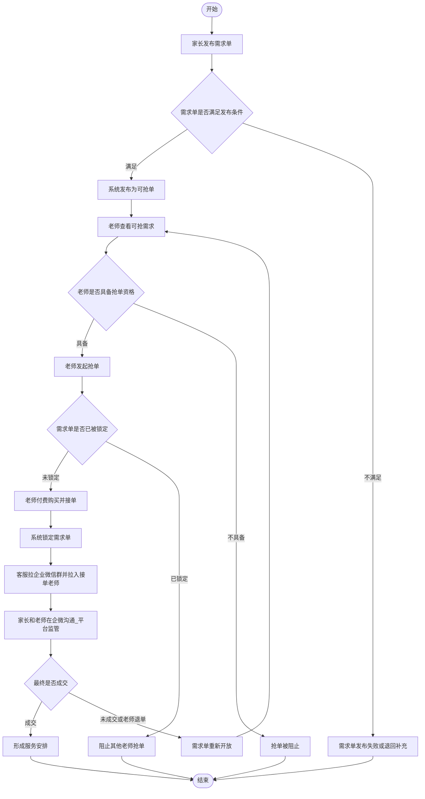
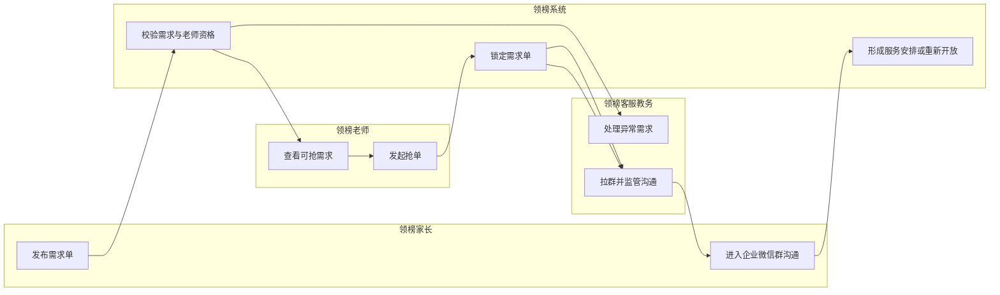
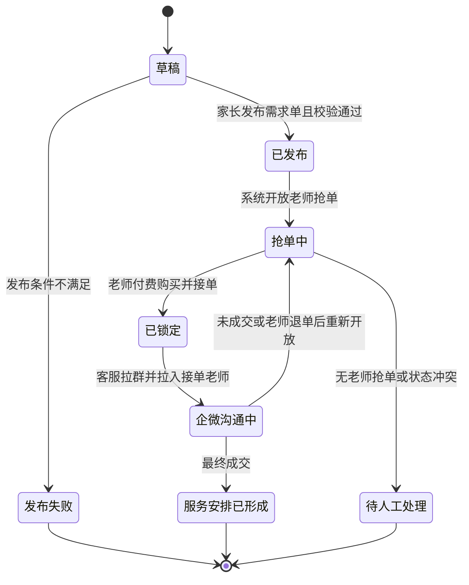
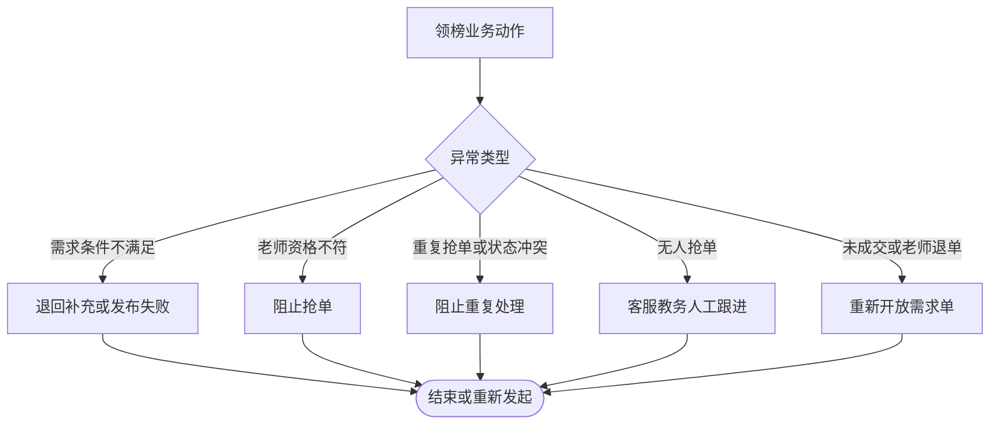
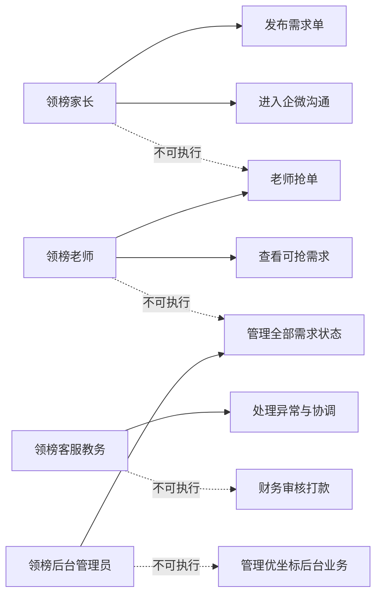

# 业务流程_领榜教育C2C流程_v1_20260603

## 背景

本稿由 `03 - 业务流程助手` 基于上游需求提取、需求澄清、需求分析与用户确认 MVP 边界生成。已确认领榜教育与优坐标后台完全独立；领榜教育采用 C2C 模式，家长发布需求单，老师付费购买/接单后锁定需求单，客服在系统外拉企业微信群并将接单老师拉入群内，平台通过企业微信监管家长与老师沟通。

## 目标

将领榜教育已成型需求转为业务动作级流程，覆盖主流程、异常流程、角色泳道、状态流转、权限边界与 draw.io 兼容图集。本稿不输出页面结构、页面跳转、交互控件、表单字段、接口字段、高保真原型或 PRD。

## 输入来源

- `/Users/xuyunfeng/Documents/k12/03_需求提取/需求提取_领榜优坐标需求线索_v1_20260603.md`
- `/Users/xuyunfeng/Documents/k12/04_需求澄清/需求澄清_领榜优坐标问题清单_v1_20260603.md`
- `/Users/xuyunfeng/Documents/k12/05_需求分析/需求分析_领榜优坐标MVP范围_v1_20260603.md`
- `/Users/xuyunfeng/Documents/k12/05_需求分析/需求分析_用户确认MVP边界_v1_20260603.md`

## 关键结论

- 领榜教育按独立后台建模，不与优坐标共享后台或共享中台。
- 核心业务闭环为：家长发布需求单，系统形成可抢单需求，老师付费购买/接单，需求单锁定，客服拉企业微信群并拉入接单老师，家长与老师在企微沟通，平台通过企微监管。
- 老师付费购买/接单后不需要家长在系统内确认老师；系统内应形成锁单和服务跟进状态。
- 同一需求单在未被老师付费购买/接单前可被多个老师查看或尝试抢单；一旦老师付费购买/接单成功，状态变更为已锁定，不允许其他老师继续抢单。
- 若订单最终未成交或老师退单，需求单重新开放给其他老师查看和抢单。
- 分销、提现、佣金进入 MVP，但领榜分销账务详见 `业务流程_分销提现佣金流程_v1_20260603.md`。
- 老师付费购买需求单的金额为需求单金额的 3 倍课时费。
- 无人抢单时不做系统派单，客服可以人工发送推送消息给老师，提醒该需求单可抢。

## 用户确认规则优先级

本节规则覆盖本文早期图表中关于“家长确认老师”“多老师同时抢单待确认”的旧表述。下游 04 信息架构应按本节规则建模：

- 不做家长系统内确认老师页面。
- 需要建模老师付费购买/接单后的锁单状态。
- 需要建模老师付费购买金额为需求单金额的 3 倍课时费。
- 需要建模客服企业微信群监管记录。
- 需要建模未成交/老师退单后的重新开放状态。
- 需要建模无人抢单时客服人工推送提醒老师的动作，不新增系统派单流程。

## 需求覆盖范围

| 需求 | 来源 | 是否纳入本次流程设计 | 说明 |
| --- | --- | --- | --- |
| 领榜后台独立 | 用户确认 MVP 边界 CFM-01 | 是 | 不按共享后台建模 |
| 家长发布需求单 | 用户确认 MVP 边界 CFM-03 | 是 | 作为流程起点 |
| 老师抢单 | 用户确认 MVP 边界 CFM-04 | 是 | 作为老师侧核心动作 |
| 老师付费购买/接单后锁单 | 用户在 03 业务流程关口确认 | 是 | 不需要家长系统内确认 |
| 未成交/老师退单后重新开放 | 用户在 03 业务流程关口确认 | 是 | 重新允许其他老师查看和抢单 |
| 企业微信群沟通监管 | 用户在 03 业务流程关口确认 | 是 | 客服系统外拉群，平台企微监管 |

## 角色与职责

| 角色 | 职责 | 权限边界 | 备注 |
| --- | --- | --- | --- |
| 领榜家长 | 发布需求单、进入企业微信群与接单老师沟通 | 不能替老师抢单，不能越权修改老师状态 | 不需要在系统内确认老师 |
| 领榜老师 | 查看可抢需求、付费购买/接单、进入企业微信群与家长沟通 | 只能处理自己可见且未锁定的需求 | 接单成功后锁定需求单 |
| 领榜客服/教务 | 拉企业微信群、将接单老师拉入群、监管沟通、处理未成交/退单后的重新开放 | 不能替代财务审核，不能跨优坐标后台处理 | 系统内需记录监管和异常处理 |
| 领榜后台管理员 | 管理需求单状态、老师资格、异常处理和权限 | 仅管理领榜教育业务 | 与优坐标后台完全独立 |
| 系统 | 记录需求状态、抢单状态和业务结果 | 不替业务方决定未确认规则 | 可承接自动状态流转 |

## 关键业务对象

| 业务对象 | 定义 | 关键属性 | 相关角色 |
| --- | --- | --- | --- |
| 需求单 | 家长发布的家教服务需求 | 状态、发布人、可抢范围、抢单结果 | 家长、老师、客服/教务、管理员 |
| 抢单记录 | 老师针对需求单发起的抢单动作记录 | 状态、抢单老师、关联需求单 | 老师、系统、客服/教务 |
| 企业微信监管记录 | 接单后客服在系统外建立的沟通监管记录 | 群状态、建群时间、接单老师、关联需求单 | 家长、老师、客服/教务 |
| 服务安排 | 老师付费购买/接单后形成的后续服务承接关系 | 状态、家长、老师、需求单 | 家长、老师、客服/教务 |

## 业务动作流程图

### Mermaid

### 节点清单

| 节点ID | 节点名称 | 节点类型 | 所属泳道 | 说明 |
| --- | --- | --- | --- | --- |
| S | 开始 | 开始 | 业务阶段 | 领榜需求发布流程开始 |
| P1 | 家长发布需求单 | 动作 | 家长 | 家长发起 C2C 需求 |
| D1 | 需求单是否满足发布条件 | 判断 | 系统 | 判断需求是否可进入抢单 |
| P2 | 系统发布为可抢单 | 系统 | 系统 | 需求进入老师可抢状态 |
| E1 | 需求单发布失败或退回补充 | 异常 | 系统 | 发布条件不满足 |
| T1 | 老师查看可抢需求 | 动作 | 老师 | 老师获取可抢需求 |
| D2 | 老师是否具备抢单资格 | 判断 | 系统 | 判断老师是否可抢 |
| T2 | 老师发起抢单 | 动作 | 老师 | 老师提交抢单动作 |
| E2 | 抢单被阻止 | 异常 | 系统 | 老师资格或状态不满足 |
| D3 | 需求单是否已被锁定 | 判断 | 系统 | 判断是否已有老师付费购买/接单 |
| P3 | 老师付费购买并接单 | 动作 | 老师 | 老师购买需求单并承接 |
| P4 | 系统锁定需求单 | 系统 | 系统 | 禁止其他老师继续抢单 |
| P5 | 客服拉企业微信群并拉入接单老师 | 动作 | 客服/教务 | 系统外沟通入口 |
| P6 | 家长和老师在企微沟通_平台监管 | 动作 | 客服/教务 | 平台通过企微监管 |
| D4 | 最终是否成交 | 判断 | 客服/教务 | 判断成交、未成交或退单 |
| P7 | 形成服务安排 | 系统 | 系统 | 成交后形成服务承接关系 |
| P8 | 需求单重新开放 | 系统 | 系统 | 未成交或老师退单后重新开放 |
| E3 | 阻止其他老师抢单 | 异常 | 系统 | 需求已锁定时阻止抢单 |
| F | 结束 | 结束 | 业务阶段 | 流程结束 |

### 连线清单

| 起点 | 终点 | 条件 | 说明 |
| --- | --- | --- | --- |
| S | P1 | 开始 | 家长发起需求 |
| P1 | D1 | 提交后 | 判断发布条件 |
| D1 | P2 | 满足 | 进入可抢单 |
| D1 | E1 | 不满足 | 发布失败或补充 |
| P2 | T1 | 需求可见 | 老师查看 |
| T1 | D2 | 老师准备抢单 | 判断资格 |
| D2 | T2 | 具备 | 可发起抢单 |
| D2 | E2 | 不具备 | 阻止抢单 |
| T2 | D3 | 抢单提交 | 判断需求是否已锁定 |
| D3 | P3 | 未锁定 | 老师可购买并接单 |
| D3 | E3 | 已锁定 | 阻止抢单 |
| P3 | P4 | 购买成功 | 锁定需求单 |
| P4 | P5 | 锁定后 | 客服拉企微沟通群 |
| P5 | P6 | 建群后 | 家长老师沟通，平台监管 |
| P6 | D4 | 沟通后 | 判断最终成交 |
| D4 | P7 | 成交 | 形成服务安排 |
| D4 | P8 | 未成交或老师退单 | 重新开放需求 |
| P7 | F | 完成 | 流程结束 |
| P8 | T1 | 重新开放 | 其他老师可查看抢单 |
| E1 | F | 终止 | 发布异常结束 |
| E2 | F | 终止 | 抢单异常结束 |

### 泳道/分组说明

| 分组名称 | 分组类型 | 包含节点 | 说明 |
| --- | --- | --- | --- |
| 家长 | 角色 | P1,P5 | 发布需求与确认老师 |
| 老师 | 角色 | T1,T2 | 查看需求与抢单 |
| 系统 | 系统 | D1,P2,E1,D2,E2,P3,P4,P6 | 状态判断与记录 |
| 企业微信监管 | 阶段 | P5,P6 | 系统外沟通，平台监管 |

### draw.io 建图建议

- 建议图形类型：流程图。
- 建议泳道或分组：家长、老师、系统、待确认规则。
- 判断节点样式：菱形，黄色标注“待确认”。
- 异常节点样式：红色圆角矩形。
- 状态节点样式：蓝色圆角矩形。
- 颜色或标注建议：已确认动作使用蓝色，待确认判断使用黄色，异常终止使用红色。

## 角色泳道图

### Mermaid

### 泳道/分组说明

| 分组名称 | 分组类型 | 包含节点 | 说明 |
| --- | --- | --- | --- |
| 领榜家长 | 角色 | P1,P5 | 需求发起方，是否确认老师待定 |
| 领榜老师 | 角色 | T1,T2 | 抢单参与方 |
| 领榜系统 | 系统 | S1,S2,S3 | 校验、记录与状态流转 |
| 领榜客服教务 | 角色 | O1,O2 | 处理异常与人工协调 |

### 节点清单

| 节点ID | 节点名称 | 节点类型 | 所属泳道 | 说明 |
| --- | --- | --- | --- | --- |
| P1 | 发布需求单 | 动作 | 领榜家长 | 发起需求 |
| P5 | 进入企业微信群沟通 | 动作 | 领榜家长 | 与接单老师在企微沟通 |
| T1 | 查看可抢需求 | 动作 | 领榜老师 | 老师查看需求 |
| T2 | 发起抢单 | 动作 | 领榜老师 | 老师抢单 |
| S1 | 校验需求与老师资格 | 系统 | 领榜系统 | 校验发布和抢单条件 |
| S2 | 锁定需求单 | 系统 | 领榜系统 | 老师付费购买/接单后锁定 |
| S3 | 形成服务安排或重新开放 | 系统 | 领榜系统 | 成交则安排，未成交/退单则重新开放 |
| O1 | 处理异常需求 | 动作 | 领榜客服教务 | 人工处理异常 |
| O2 | 拉群并监管沟通 | 动作 | 领榜客服教务 | 企业微信群监管 |

### 连线清单

| 起点 | 终点 | 条件 | 说明 |
| --- | --- | --- | --- |
| P1 | S1 | 需求提交 | 系统校验 |
| S1 | T1 | 需求可抢 | 老师可见 |
| T1 | T2 | 老师选择需求 | 老师抢单 |
| T2 | S2 | 抢单提交 | 系统记录 |
| S2 | O2 | 锁单后 | 客服拉群 |
| O2 | P5 | 建群后 | 家长进入企微沟通 |
| P5 | S3 | 成交或退单后 | 形成安排或重新开放 |
| S2 | O2 | 需要人工协调 | 客服教务介入 |
| S1 | O1 | 发布或资格异常 | 客服教务处理 |

### draw.io 建图建议

- 建议图形类型：水平泳道图。
- 建议泳道或分组：领榜家长、领榜老师、领榜系统、领榜客服教务。
- 判断节点样式：涉及“待确认”的节点使用黄色标签。
- 异常节点样式：客服教务异常处理节点使用红色边框。
- 状态节点样式：系统节点使用蓝色。
- 颜色或标注建议：跨角色连线加箭头，人工介入用虚线。

## 状态流转图

### Mermaid

### 状态流转表

| 业务对象 | 当前状态 | 触发动作 | 触发角色 | 前置条件 | 结果状态 | 异常状态 |
| --- | --- | --- | --- | --- | --- | --- |
| 需求单 | 草稿 | 发布需求单 | 家长 | 家长完成需求表达 | 已发布 | 发布失败 |
| 需求单 | 已发布 | 开放抢单 | 系统 | 需求通过校验 | 抢单中 | 待人工处理 |
| 抢单记录 | 抢单中 | 付费购买并接单 | 老师 | 老师具备资格且需求未锁定 | 已锁定 | 状态冲突 |
| 企业微信监管记录 | 已锁定 | 拉群并拉入接单老师 | 客服/教务 | 老师接单成功 | 企微沟通中 | 待人工处理 |
| 服务安排 | 企微沟通中 | 记录成交结果 | 客服/教务 | 家长老师沟通完成 | 服务安排已形成或重新开放抢单 | 待人工处理 |

### 节点清单

| 节点ID | 节点名称 | 节点类型 | 所属泳道 | 说明 |
| --- | --- | --- | --- | --- |
| ST1 | 草稿 | 状态 | 需求单 | 家长尚未成功发布 |
| ST2 | 已发布 | 状态 | 需求单 | 需求已通过发布校验 |
| ST3 | 抢单中 | 状态 | 需求单 | 老师可抢单 |
| ST4 | 已锁定 | 状态 | 需求单 | 老师已付费购买/接单 |
| ST5 | 企微沟通中 | 状态 | 企业微信监管记录 | 家长与接单老师沟通 |
| ST6 | 服务安排已形成 | 状态 | 服务安排 | 后续服务可承接 |
| EX1 | 发布失败 | 异常 | 需求单 | 发布条件不满足 |
| EX2 | 待人工处理 | 异常 | 客服教务 | 无抢单、争议或冲突 |

### 连线清单

| 起点 | 终点 | 条件 | 说明 |
| --- | --- | --- | --- |
| ST1 | ST2 | 校验通过 | 需求发布成功 |
| ST1 | EX1 | 条件不满足 | 发布失败 |
| ST2 | ST3 | 开放抢单 | 进入抢单 |
| ST3 | ST4 | 老师付费购买并接单 | 锁定需求单 |
| ST4 | ST5 | 客服拉群 | 进入企微沟通 |
| ST4 | EX2 | 未确认或争议 | 人工处理 |
| ST5 | ST6 | 形成安排 | 结束 |
| ST3 | EX2 | 无老师抢单或冲突 | 人工处理 |

### 泳道/分组说明

| 分组名称 | 分组类型 | 包含节点 | 说明 |
| --- | --- | --- | --- |
| 需求单状态 | 阶段 | ST1,ST2,ST3,ST4,ST5,EX1 | 需求单主状态 |
| 服务安排状态 | 阶段 | ST6 | 匹配后的服务状态 |
| 人工处理 | 角色 | EX2 | 客服教务处理异常 |

### draw.io 建图建议

- 建议图形类型：状态机图。
- 建议泳道或分组：需求单状态、服务安排状态、人工处理。
- 判断节点样式：状态图中用连线标签表达判断条件。
- 异常节点样式：红色状态节点。
- 状态节点样式：圆角矩形。
- 颜色或标注建议：待确认路径使用黄色连线。

## 异常流程图

### Mermaid

### 业务异常节点

| 异常类型 | 触发条件 | 影响范围 | 处理方式 | 下游关注点 |
| --- | --- | --- | --- | --- |
| 需求条件不满足 | 需求单未达到发布条件 | 家长、需求单 | 退回补充或发布失败 | 交互阶段只处理提示，不定义字段 |
| 老师资格不符 | 老师不具备抢单资格 | 老师、抢单记录 | 阻止抢单 | 数据阶段需关注资格规则 |
| 重复抢单或状态冲突 | 需求已锁定或状态变化 | 需求单、抢单记录 | 阻止重复处理 | 状态流转需防冲突 |
| 无人抢单 | 需求开放后无人响应 | 家长、客服教务 | 人工跟进 | 是否转派单待确认 |
| 未成交或老师退单 | 企微沟通后未成交或接单老师退单 | 家长、老师、客服教务 | 重新开放需求单 | 退单/退款规则待确认 |

### 节点清单

| 节点ID | 节点名称 | 节点类型 | 所属泳道 | 说明 |
| --- | --- | --- | --- | --- |
| A | 领榜业务动作 | 动作 | 业务阶段 | 任一主流程动作 |
| B | 异常类型 | 判断 | 系统 | 判断异常种类 |
| E1 | 退回补充或发布失败 | 异常 | 家长 | 需求条件不足 |
| E2 | 阻止抢单 | 异常 | 老师 | 老师资格不足 |
| E3 | 阻止重复处理 | 异常 | 系统 | 状态冲突 |
| E4 | 客服教务人工跟进 | 异常 | 客服教务 | 无人抢单 |
| E5 | 客服教务协调 | 异常 | 客服教务 | 确认争议 |
| F | 结束或重新发起 | 结束 | 业务阶段 | 异常处理结果 |

### 连线清单

| 起点 | 终点 | 条件 | 说明 |
| --- | --- | --- | --- |
| A | B | 出现异常 | 判断异常类型 |
| B | E1 | 需求条件不满足 | 退回或失败 |
| B | E2 | 老师资格不符 | 阻止抢单 |
| B | E3 | 重复抢单或状态冲突 | 阻止重复处理 |
| B | E4 | 无人抢单 | 人工跟进 |
| B | E5 | 家长确认争议 | 人工协调 |
| E1 | F | 处理后 | 结束或重发 |
| E2 | F | 处理后 | 结束 |
| E3 | F | 处理后 | 结束 |
| E4 | F | 处理后 | 结束 |
| E5 | F | 处理后 | 结束 |

### 泳道/分组说明

| 分组名称 | 分组类型 | 包含节点 | 说明 |
| --- | --- | --- | --- |
| 家长异常 | 角色 | E1 | 发布条件不满足 |
| 老师异常 | 角色 | E2 | 抢单资格不符 |
| 系统异常 | 系统 | B,E3 | 状态冲突类 |
| 人工介入 | 角色 | E4,E5 | 客服教务处理 |

### draw.io 建图建议

- 建议图形类型：异常分支流程图。
- 建议泳道或分组：家长异常、老师异常、系统异常、人工介入。
- 判断节点样式：中心菱形。
- 异常节点样式：红色矩形。
- 状态节点样式：灰色终止节点。
- 颜色或标注建议：人工介入使用橙色，业务终止使用红色。

## 权限边界图

### Mermaid

### 权限边界表

| 角色 | 可执行动作 | 不可执行动作 | 需要确认/审核的动作 | 备注 |
| --- | --- | --- | --- | --- |
| 领榜家长 | 发布需求单、进入企微沟通 | 老师抢单、后台管理 | 不需要系统内确认老师 | 不得处理老师资格 |
| 领榜老师 | 查看可抢需求、付费购买/接单 | 发布家长需求、管理全部需求状态 | 接单后锁定需求单 | 抢单资格可能需后台审核 |
| 领榜客服/教务 | 拉企业微信群、拉入接单老师、监管沟通、处理退单重新开放 | 财务审核打款、管理优坐标业务 | 异常转人工处理 | 系统内需留痕 |
| 领榜后台管理员 | 管理领榜需求、老师资格、状态异常 | 管理优坐标后台业务 | 高风险状态调整需留痕 | 后台完全独立 |
| 财务 | 处理领榜提现审核与打款 | 抢单和服务安排 | 提现审核 | 详见分销提现佣金流程 |

### 节点清单

| 节点ID | 节点名称 | 节点类型 | 所属泳道 | 说明 |
| --- | --- | --- | --- | --- |
| P | 领榜家长 | 角色 | 权限域 | 家长权限主体 |
| T | 领榜老师 | 角色 | 权限域 | 老师权限主体 |
| O | 领榜客服教务 | 角色 | 权限域 | 人工协作主体 |
| A | 领榜后台管理员 | 角色 | 权限域 | 后台管理主体 |
| P1 | 发布需求单 | 动作 | 家长权限 | 家长可执行 |
| P2 | 进入企微沟通 | 动作 | 家长权限 | 系统外沟通动作 |
| T1 | 查看可抢需求 | 动作 | 老师权限 | 老师可执行 |
| T2 | 老师抢单 | 动作 | 老师权限 | 老师可执行 |
| O1 | 处理异常与协调 | 动作 | 客服教务权限 | 人工介入 |
| A1 | 管理全部需求状态 | 动作 | 管理员权限 | 后台管理 |
| F1 | 财务审核打款 | 动作 | 财务权限 | 非客服权限 |
| U1 | 管理优坐标后台业务 | 动作 | 禁止越权 | 领榜不得操作 |

### 连线清单

| 起点 | 终点 | 条件 | 说明 |
| --- | --- | --- | --- |
| P | P1 | 可执行 | 家长发布需求 |
| P | P2 | 接单后 | 家长进入企微沟通 |
| P | T2 | 不可执行 | 家长不能抢单 |
| T | T1 | 可执行 | 老师查看需求 |
| T | T2 | 可执行 | 老师抢单 |
| T | A1 | 不可执行 | 老师不能管理全部状态 |
| O | O1 | 可执行 | 客服教务人工处理 |
| O | F1 | 不可执行 | 客服不做财务审核 |
| A | A1 | 可执行 | 管理领榜状态 |
| A | U1 | 不可执行 | 不得管理优坐标 |

### 泳道/分组说明

| 分组名称 | 分组类型 | 包含节点 | 说明 |
| --- | --- | --- | --- |
| 家长权限 | 权限域 | P,P1,P2 | 家长可执行与待确认动作 |
| 老师权限 | 权限域 | T,T1,T2 | 老师抢单权限 |
| 客服教务权限 | 权限域 | O,O1 | 异常处理 |
| 管理员权限 | 权限域 | A,A1 | 领榜后台管理 |
| 禁止越权 | 权限域 | F1,U1 | 不可执行动作 |

### draw.io 建图建议

- 建议图形类型：权限关系图。
- 建议泳道或分组：家长权限、老师权限、客服教务权限、管理员权限、禁止越权。
- 判断节点样式：待确认动作加黄色标签。
- 异常节点样式：不可执行动作使用红色虚线。
- 状态节点样式：权限主体使用圆角矩形。
- 颜色或标注建议：可执行用实线，不可执行用红色虚线。

## 流程步骤表

| 步骤 | 角色 | 业务动作 | 前置条件 | 判断点 | 结果 | 异常处理 |
| --- | --- | --- | --- | --- | --- | --- |
| 1 | 家长 | 发布需求单 | 家长有家教需求 | 需求是否满足发布条件 | 需求单已发布 | 退回补充或发布失败 |
| 2 | 系统 | 开放抢单 | 需求单已发布 | 是否可进入抢单 | 需求进入抢单中 | 人工处理 |
| 3 | 老师 | 查看并抢单 | 需求可抢、老师具备资格 | 是否具备抢单资格 | 抢单记录生成 | 阻止抢单 |
| 4 | 系统 | 处理抢单结果 | 抢单已提交 | 是否允许多老师抢单 | 记录候选或锁定老师 | 状态冲突处理 |
| 5 | 客服/系统 | 拉群监管并形成服务安排 | 老师付费购买/接单后锁单 | 最终是否成交 | 服务安排形成或重新开放 | 客服教务协调 |

## 业务规则

| 规则 | 适用场景 | 影响对象 | 来源依据 |
| --- | --- | --- | --- |
| 领榜后台独立 | 全部领榜业务 | 后台、权限、数据 | 用户确认 MVP 边界 CFM-01 |
| 家长发布需求单 | 领榜主流程 | 需求单 | 用户确认 MVP 边界 CFM-03 |
| 老师抢单 | 领榜主流程 | 抢单记录 | 用户确认 MVP 边界 CFM-04 |
| 老师付费购买/接单后锁单 | 抢单结果处理 | 需求单、服务安排 | 用户在 03 业务流程关口确认 |
| 未成交或老师退单后重新开放 | 抢单阶段 | 需求单、抢单记录 | 用户在 03 业务流程关口确认 |

## 关键决策点

| 决策点 | 判断条件 | 分支结果 | 风险 |
| --- | --- | --- | --- |
| 需求是否可发布 | 需求满足业务发布条件 | 发布或退回 | 条件未定会影响后续数据校验 |
| 老师是否可抢单 | 老师具备抢单资格 | 抢单成功或阻止 | 资格规则未定会影响老师端流程 |
| 是否允许多老师抢单 | 已确认 | 未锁定前可查看/尝试，付费接单后锁定 | 需关注状态锁 |
| 是否记录企微监管信息 | 已确认最小粒度 | 接单老师、关联需求单、当前监管状态、客服备注 | 不同步企微聊天内容 |

## 待确认问题

- 退款规则和财务归属仍由客服人工处理，当前不在系统内闭环。
- 老师抢单资格是否需要后台审核后才可生效。

## 风险与依赖

- 老师退单或未成交后系统自动重新开放需求单；退款金额和退款路径由客服人工处理，当前不在系统内处理。
- 若后续从“客服人工推送提醒”升级为“客服/教务系统派单”，需要补充分支，但不能与当前“老师抢单”核心机制冲突。
- 领榜分销、提现、佣金会影响服务完成后的财务闭环，需与分销提现流程联动。

## 下一步动作

- 本稿已按用户确认解除抢单确认规则阻塞，主控可派发 04 号信息架构助手。
- 信息架构助手可基于本稿识别领榜业务对象、角色、状态和权限域。
- 交互设计助手可基于已确认的抢单锁单、企微监管和自动重新开放规则细化操作路径。
