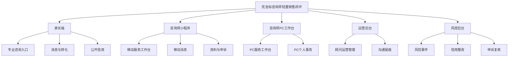
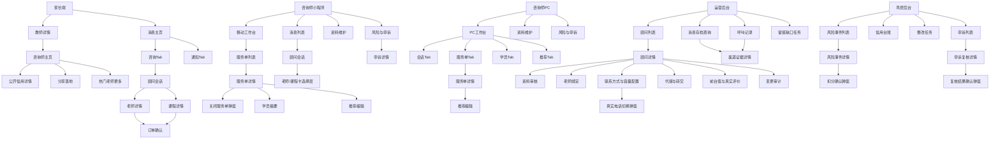

# 信息架构_优坐标咨询师轻量销售闭环_v1_20260716

## 背景

优坐标本次新增面向家长的具名咨询师角色，并围绕教师详情入口、咨询师专业主页、多渠道沟通、学员服务单、老师/课程推荐、购买归因和12分信用体系形成轻量销售闭环。需求分析和业务流程已经明确角色、业务对象、主流程、状态、异常与权限边界，本阶段将这些内容转换为可供交互设计和 Axure 原型使用的模块、页面和导航结构。

## 目标

- 建立家长端、咨询师小程序、咨询师PC工作台、运营后台和风控后台的页面体系。
- 明确页面层级、导航归属、入口出口、页面状态和跨模块关系。
- 将会切换主要内容的 Tab 和具有独立业务规则的弹窗纳入可发现的页面层级。
- 保持真实评价与前台运营值、运营配置与风控裁决、公开信用与内部证据之间的权限隔离。
- 为下一阶段交互设计提供完整页面清单，不提前定义组件、接口字段或视觉样式。

## 输入来源

- `05_需求分析/需求分析_优坐标咨询师轻量销售闭环_v2_20260716.md`
- `06_业务流程/业务流程_优坐标咨询师轻量销售闭环_v1_20260716.md`
- `06_业务流程/业务流程_优坐标咨询师轻量销售闭环图集_v1_20260716.drawio`
- 用户确认的双向隐私电话、真实电话平台接入、企微存档、24小时服务、容量配置、前台运营值、12分信用与重复申诉规则。

## 关键结论

- 本次信息架构覆盖五类业务主体界面：家长、咨询师小程序、咨询师PC工作台、运营、风控；平台系统和外部渠道作为页面背后的支撑对象，不单独提供用户入口。
- 家长端以“教师详情/咨询师分享”和“消息中心”为双入口，咨询师主页承担专业信任建立，顾问会话承担咨询、推荐和购买承接。
- 同一家长与同一咨询师只有一条会话；页面内通过服务单上下文区分学员、入口老师、推荐方案与购买来源。
- 咨询师小程序与PC拥有相同业务能力，但导航组织不同：小程序按工作台、消息、我的组织，PC按会话、服务单、学员、推荐和个人事务组织。
- 运营后台负责账号、资料、老师绑定、联系方式、容量、代接和前台展示值；风控后台独立负责证据复核、扣分、整改和申诉。
- 消息中心的“咨询”“通知”属于切换主要内容的 Tab，必须作为消息主页的下级导航节点；服务单关闭、真实电话切换、扣分确认等独立业务弹窗也必须归属于触发页面。
- 本次按全阶段交付，所有列出的新增页面和存量页面改造均纳入；完整CRM、抢单、绩效、佣金拆分不进入本次页面体系。

## 需求覆盖范围

| 需求 | 来源 | 是否纳入信息架构 | 对应模块 | 对应页面 | 说明 |
| --- | --- | --- | --- | --- | --- |
| 教师详情展示专属咨询师 | 需求分析2.1/3/6 | 是 | 家长端专业咨询入口 | 教师详情、咨询师主页 | 教师详情为存量页面改造 |
| 咨询师专业资料与分享 | 需求分析2.1/2.6 | 是 | 家长端专业咨询入口、咨询师资料 | 咨询师主页、分享落地、资料维护、资料审核 | 线上版本与草稿版本分离 |
| 消息中心与唯一会话 | 需求分析2.2/5/6 | 是 | 家长消息转化、咨询师服务 | 消息主页、咨询/通知Tab、顾问会话 | 会话按家长×咨询师唯一 |
| 学员和六状态服务单 | 需求分析2.2 | 是 | 咨询师服务工作台 | 服务单列表/详情、学员摘要 | 会话可关联多个服务单 |
| 老师/课程推荐与购买归因 | 需求分析2.3 | 是 | 推荐转化 | 推荐编辑、卡片选择、老师/课程详情、订单确认 | 复用既有内容与购买页面 |
| 企微、隐私号、真实电话、音视频留痕 | 需求分析2.4 | 是 | 沟通留痕 | 联系方式配置、消息存档、呼叫记录、证据详情、留痕缺口 | 外部渠道本身不是平台导航页 |
| 容量、代接和转交 | 需求分析2.5 | 是 | 运营顾问管理 | 容量配置、老师绑定、代接转交 | 默认无限，配置后生效 |
| 前台评分与真实评价分离 | 需求分析2.6 | 是 | 运营顾问管理 | 前台展示值维护、真实评价查看 | 两类数据独立展示和审计 |
| 12分信用、风险、整改、重复申诉 | 需求分析2.7-2.9 | 是 | 公开信用、风控信用治理 | 公开信用详情、风险事件、信用台账、整改、申诉 | 家长不查看内部证据 |
| CRM、抢单、绩效和佣金拆分 | 需求分析范围 | 否 | 暂不纳入 | 无 | 不生成占位入口 |

## 角色与页面权限视图

| 角色 | 可见模块 | 可访问页面 | 不可访问页面 | 权限说明 |
| --- | --- | --- | --- | --- |
| 家长 | 专业咨询入口、消息转化、公开信用、既有老师/课程/购买 | 教师详情、咨询师主页、公开信用详情、消息中心、顾问会话、老师/课程详情、订单确认 | 运营配置、内部证据、真实评价后台、信用台账 | 只能查看公开资料和本人会话/服务结果 |
| 咨询师 | 移动/PC工作台、本人消息、服务单、学员、推荐、资料、本人风险与申诉 | 本人工作台及本人业务详情 | 其他咨询师数据、老师绑定配置、前台评分、风险裁决 | 资料变更需运营审核；可重复申诉，不可自行改分 |
| 运营 | 顾问管理、资料审核、绑定、渠道、容量、代接、展示值、审计 | 顾问管理与沟通留痕查询 | 风险扣分确认、非必要完整证据裁决 | 运营编辑资料可直接发布；真实电话切换必须留痕 |
| 风控 | 风险事件、证据、信用台账、整改、申诉复核 | 风控与留痕证据页面 | 前台评分、老师绑定、顾问渠道配置 | 自动命中只形成线索，人工复核后才能扣分 |
| 平台系统 | 无人工导航 | 自动处理会话复用、服务单创建、归因、状态和台账 | 不适用 | 系统不能自行认定违规 |

## 模块结构图

### Mermaid

### 节点清单

| 节点ID | 节点名称 | 节点类型 | 说明 |
| --- | --- | --- | --- |
| ROOT | 优坐标咨询师轻量销售闭环 | 产品域 | 咨询师业务总范围 |
| P/CM/CP/O/R | 五类端或后台 | 系统入口 | 按角色和使用场景隔离 |
| P1-P3 | 家长端模块 | 核心/支撑模块 | 建立信任、沟通、购买和公开信用查看 |
| C1-C5 | 咨询师双端模块 | 核心/支撑模块 | 承接咨询、服务、推荐、资料和申诉 |
| O1-O2 | 运营模块 | 管理/支撑模块 | 管理顾问资源和多渠道留痕 |
| R1-R3 | 风控模块 | 管理模块 | 处理风险、信用、整改和申诉 |

### 连线清单

| 起点 | 终点 | 关系 | 说明 |
| --- | --- | --- | --- |
| ROOT | P/CM/CP/O/R | 端划分 | 按业务主体区分入口 |
| P | P1-P3 | 模块归属 | 家长端三类业务模块 |
| CM | C1-C3 | 模块归属 | 咨询师小程序三类业务模块 |
| CP | C4-C5 | 模块归属 | 咨询师PC两类业务模块 |
| O | O1-O2 | 模块归属 | 运营管理与留痕 |
| R | R1-R3 | 模块归属 | 风险、信用和申诉 |

## 模块结构表

| 模块 | 模块类型 | 模块目标 | 覆盖需求 | 服务角色 | 关联业务对象 | 对应流程阶段 | 是否纳入本次 |
| --- | --- | --- | --- | --- | --- | --- | --- |
| 专业咨询入口 | 核心 | 让家长识别并信任具名咨询师 | 教师入口、专业主页、分享 | 家长 | 咨询师资料、老师顾问绑定 | 咨询发起前 | 是 |
| 消息与转化 | 核心 | 承接咨询、推荐和购买 | 消息中心、会话、卡片、归因 | 家长、咨询师 | 会话、服务单、推荐、订单归因 | 咨询到转化 | 是 |
| 公开信用 | 支撑 | 向家长解释12分信用状态 | 当前分、等级、规则类别、整改状态 | 家长 | 信用余额、公开信用状态 | 信任建立 | 是 |
| 咨询师服务工作台 | 核心 | 管理会话、服务单、学员和推荐 | 双端工作台、服务单、推荐 | 咨询师 | 会话、服务单、学员、推荐 | 服务和转化 | 是 |
| 咨询师资料与申诉 | 支撑 | 维护公开资料并处理本人风险事项 | 资料草稿、审核、风险、申诉 | 咨询师 | 资料版本、风险事件、申诉 | 准入和治理 | 是 |
| 顾问运营管理 | 管理 | 配置顾问资源和前台展示 | 账号、审核、绑定、渠道、容量、代接、展示值 | 运营 | 咨询师、绑定、配置、评价 | 准入和运营 | 是 |
| 沟通留痕 | 支撑 | 查询多渠道消息、呼叫和留痕缺口 | 企微、电话、音视频、录音转写 | 运营、风控 | 渠道记录、录音、转写 | 全流程审计 | 是 |
| 风险信用治理 | 管理 | 复核风险并执行扣分、整改和申诉 | 风险事件、台账、整改、复核 | 风控 | 风险事件、信用台账、申诉 | 风险治理 | 是 |
| 既有老师/课程/购买 | 依赖 | 承接推荐内容查看与购买 | 老师详情、课程详情、订单确认 | 家长 | 老师、课程、订单 | 推荐转化 | 存量复用改造 |

## 页面结构图

### Mermaid

### 节点清单

| 节点ID | 页面名称 | 所属模块 | 页面类型 | 说明 |
| --- | --- | --- | --- | --- |
| P01-P05 | 教师详情、咨询师主页、公开信用、分享落地、热门老师更多 | 专业咨询入口/公开信用 | 存量改造/详情/列表 | 建立顾问信任并承接分享获客 |
| P06/P06A/P06B/P07 | 消息主页、咨询Tab、通知Tab、顾问会话 | 消息与转化 | 入口/Tab/会话 | 咨询和通知必须作为可发现子节点 |
| P08-P10 | 老师详情、课程详情、订单确认 | 既有老师/课程/购买 | 详情/确认 | 复用存量页面并保留咨询来源 |
| M01-M10 | 咨询师移动工作台相关页面 | 咨询师服务/资料与申诉 | 首页/列表/详情/编辑 | 支持移动承接、推荐、资料和申诉 |
| M03D/M07D | 关闭服务单、卡片选择 | 咨询师服务 | 业务弹窗/选择层 | 有独立业务条件与结果，归属触发页面 |
| C01-C05 | 咨询师PC工作台相关页面 | 咨询师服务/资料与申诉 | 工作台/Tab/详情 | 与移动端能力一致，导航组织不同 |
| O01-O08 | 顾问运营管理相关页面 | 顾问运营管理 | 列表/详情/配置/审计 | 运营独立管理域 |
| O05D | 真实电话切换弹窗 | 顾问运营管理 | 业务弹窗 | 必须记录原因和审计信息 |
| L01-L04 | 多渠道留痕页面 | 沟通留痕 | 查询/详情/任务 | 支撑运营与风控查看证据和缺口 |
| R01-R06 | 风险、信用、整改和申诉页面 | 风险信用治理 | 列表/详情/台账 | 风控独立裁决域 |
| R02D/R06D | 扣分与复核结果确认 | 风险信用治理 | 业务弹窗 | 承载状态变化和确认结果 |

### 连线清单

| 起点页面 | 终点页面 | 触发条件 | 说明 |
| --- | --- | --- | --- |
| P01 | P02 | 点击咨询师资料 | 查看已发布专业资料 |
| P02 | P03/P04/P05 | 查看信用、分享、查看更多老师 | 进入对应子页面 |
| P06 | P06A/P06B | 切换主要内容Tab | 目录与激活Tab保持同步 |
| P06A | P07 | 选择顾问会话 | 进入唯一会话 |
| P07 | P08/P09 | 点击老师或课程卡 | 查看内容详情 |
| P08/P09 | P10 | 发起购买 | 进入既有订单确认流程 |
| M02/C01B | M03/C02 | 选择服务单 | 查看服务单详情 |
| M03/C02 | M05/C03 | 发布或调整推荐 | 进入推荐编辑 |
| M03 | M03D | 关闭服务单 | 打开关闭业务弹窗 |
| M07 | M07D | 发送内容卡 | 选择有效老师或课程 |
| O01 | O02 | 查看顾问 | 进入顾问综合详情 |
| O02 | O03-O08 | 审核或配置操作 | 进入所属运营子页面 |
| O05 | O05D | 切换真实电话 | 打开独立配置弹窗 |
| L01/L02 | L03 | 查看具体记录 | 查看消息、录音、转写和关联上下文 |
| R01 | R02 | 查看风险事件 | 进入证据与复核详情 |
| R02 | R02D | 确认违规 | 选择扣分档位并确认 |
| R05 | R06 | 选择申诉 | 进入非原处理人复核详情 |
| R06 | R06D | 提交复核结果 | 确认通过或驳回结果 |

## 页面清单

| 页面 | 所属模块 | 页面目标 | 服务角色 | 对应业务动作 | 关联业务对象 | 页面类型 | 是否纳入本次 |
| --- | --- | --- | --- | --- | --- | --- | --- |
| 教师详情（改造） | 专业咨询入口 | 展示老师及专属咨询师入口 | 家长 | 发起咨询/联系/购买 | 老师、老师顾问绑定 | 详情 | 是 |
| 咨询师主页 | 专业咨询入口 | 展示顾问专业背书和服务入口 | 家长 | 咨询、联系、分享、查看推荐 | 咨询师资料、推荐 | 详情 | 是 |
| 公开信用详情 | 公开信用 | 解释当前12分状态 | 家长 | 查看公开信用 | 信用余额、整改状态 | 详情 | 是 |
| 分享落地 | 专业咨询入口 | 承接顾问独立分享获客 | 家长 | 查看顾问并咨询 | 顾问来源 | 落地页 | 是 |
| 热门老师更多 | 专业咨询入口 | 在无个性化推荐时承接老师浏览 | 家长 | 查看老师 | 平台热门老师 | 列表 | 是 |
| 消息主页 | 消息与转化 | 提供咨询和通知总入口 | 家长 | 切换消息类型 | 会话、通知 | 入口页 | 是 |
| 消息主页-咨询Tab | 消息与转化 | 浏览顾问会话与服务摘要 | 家长 | 选择会话 | 会话、服务单 | Tab | 是 |
| 消息主页-通知Tab | 消息与转化 | 浏览平台通知 | 家长 | 查看通知 | 系统通知 | Tab | 是 |
| 顾问会话（家长） | 消息与转化 | 沟通、查看推荐、通话、举报 | 家长 | 发送消息、查看卡片、举报 | 会话、服务单、推荐 | 会话页 | 是 |
| 老师/课程详情与订单确认（存量） | 既有购买 | 承接卡片查看和购买 | 家长 | 查看、购买 | 老师、课程、订单 | 详情/确认 | 存量复用改造 |
| 移动工作台 | 咨询师服务工作台 | 汇总待响应、超时、待推荐和风险 | 咨询师 | 进入待办和服务单 | 服务单、风险提醒 | 首页 | 是 |
| 移动服务单列表/详情 | 咨询师服务工作台 | 管理本人六状态服务单 | 咨询师 | 回复、更新、推荐、关闭 | 服务单 | 列表/详情 | 是 |
| 关闭服务单弹窗 | 咨询师服务工作台 | 选择关闭原因并完成关闭 | 咨询师 | 关闭服务单 | 服务单 | 业务弹窗 | 是 |
| 学员摘要 | 咨询师服务工作台 | 查看或关联当前学员上下文 | 咨询师 | 确认服务对象 | 学员 | 详情 | 是 |
| 移动推荐编辑 | 咨询师服务工作台 | 编辑首选、备选和理由 | 咨询师 | 保存、发布推荐 | 推荐方案 | 编辑页 | 是 |
| 移动消息列表/会话 | 咨询师服务工作台 | 移动承接家长消息 | 咨询师 | 回复、回拨、发送卡片 | 会话 | 列表/会话 | 是 |
| 老师/课程卡选择层 | 咨询师服务工作台 | 选择可发送的有效内容 | 咨询师 | 选择并发送卡片 | 老师、课程 | 业务选择层 | 是 |
| 移动资料维护 | 咨询师资料与申诉 | 维护公开资料草稿 | 咨询师 | 保存、提交审核 | 资料版本 | 编辑页 | 是 |
| 移动风险与申诉/申诉详情 | 咨询师资料与申诉 | 查看本人事件并再次申诉 | 咨询师 | 提交新增证据或说明 | 风险事件、申诉 | 列表/详情 | 是 |
| PC咨询师工作台及四个Tab | 咨询师服务工作台 | 高密度管理会话、服务单、学员、推荐 | 咨询师 | 服务处理 | 会话、服务单、学员、推荐 | 工作台/Tab | 是 |
| PC服务单详情/推荐编辑 | 咨询师服务工作台 | 处理具体服务单和推荐 | 咨询师 | 更新、推荐、关闭 | 服务单、推荐 | 详情/编辑 | 是 |
| PC资料维护/风险与申诉 | 咨询师资料与申诉 | 维护资料并处理本人风险事项 | 咨询师 | 提交审核、申诉 | 资料、风险、申诉 | 编辑/列表/详情 | 是 |
| 顾问列表/详情 | 顾问运营管理 | 查询顾问并进入综合管理 | 运营 | 新增、查看、编辑 | 咨询师 | 列表/详情 | 是 |
| 资料审核 | 顾问运营管理 | 审核咨询师提交的公开资料 | 运营 | 通过、驳回 | 资料版本 | 审核页 | 是 |
| 老师绑定 | 顾问运营管理 | 管理老师当前顾问 | 运营 | 绑定、解绑、调整 | 老师顾问绑定 | 配置页 | 是 |
| 联系方式与容量配置 | 顾问运营管理 | 配置渠道、电话模式和容量 | 运营 | 保存配置 | 渠道配置、容量 | 配置页 | 是 |
| 真实电话切换弹窗 | 顾问运营管理 | 将指定顾问切换为真实电话 | 运营 | 取消、保存 | 电话模式、审计记录 | 业务弹窗 | 是 |
| 代接与转交 | 顾问运营管理 | 处理不可接待和存量服务单 | 运营 | 指定代接、逐单/批量转交 | 服务单、负责人历史 | 操作页 | 是 |
| 前台值与真实评价 | 顾问运营管理 | 分开查看真实评价并维护前台值 | 运营 | 调整前台值 | 真实评价、前台展示值 | 管理页 | 是 |
| 变更审计 | 顾问运营管理 | 查询关键配置和资料变更 | 运营 | 查看记录 | 操作日志、版本 | 列表/详情 | 是 |
| 消息存档/呼叫记录 | 沟通留痕 | 查询企微、IM、电话和音视频记录 | 运营、风控 | 筛选、查看 | 渠道记录 | 列表 | 是 |
| 渠道证据详情 | 沟通留痕 | 查看消息、录音、转写及关联上下文 | 运营、风控 | 查看关联记录 | 证据、会话、服务单 | 详情 | 是 |
| 留痕缺口任务 | 沟通留痕 | 处理同步、录制或转写缺口 | 运营 | 查看、跟进 | 留痕缺口 | 列表/详情 | 是 |
| 风险事件列表/详情 | 风险信用治理 | 复核风险线索和完整上下文 | 风控 | 补证、确认、关闭 | 风险事件、证据 | 列表/详情 | 是 |
| 扣分确认弹窗 | 风险信用治理 | 按2/4/6/12确认信用扣分 | 风控 | 取消、确认扣分 | 风险事件、信用台账 | 业务弹窗 | 是 |
| 信用台账 | 风险信用治理 | 查看不可覆盖的信用流水与余额 | 风控 | 查看流水 | 信用台账 | 台账页 | 是 |
| 整改任务 | 风险信用治理 | 管理观察期、学习整改和恢复 | 风控 | 更新整改结论 | 整改任务 | 列表/详情 | 是 |
| 申诉列表/复核详情 | 风险信用治理 | 由非原处理人处理重复申诉 | 风控 | 通过、驳回 | 申诉记录 | 列表/详情 | 是 |
| 复核结果确认弹窗 | 风险信用治理 | 确认本次申诉结论 | 风控 | 取消、确认 | 申诉记录、信用台账 | 业务弹窗 | 是 |

## 导航关系

| 页面 | 导航层级 | 入口类型 | 上级页面 | 下级页面 | 跨模块入口 | 是否可直达 | 说明 |
| --- | --- | --- | --- | --- | --- | --- | --- |
| 教师详情 | 家长端/老师模块/详情 | 存量业务入口 | 老师列表等存量入口 | 咨询师主页、顾问会话 | 消息与转化 | 是 | 无有效顾问时不显示新增入口 |
| 咨询师主页 | 家长端/老师模块/教师详情下级 | 详情/分享入口 | 教师详情或分享落地 | 公开信用、热门老师、会话 | 消息与公开信用 | 条件直达 | 只展示已发布且可对外服务顾问 |
| 消息主页 | 家长端一级Tab | 一级入口 | 家长端主导航 | 咨询Tab、通知Tab | 无 | 是 | Tab必须作为下级目录节点 |
| 咨询/通知Tab | 消息主页下级 | Tab入口 | 消息主页 | 顾问会话/通知详情 | 无 | 通过父页进入 | 目录节点打开父页并激活对应Tab |
| 顾问会话 | 消息/咨询下级 | 会话入口 | 咨询Tab、教师详情、咨询师主页 | 老师/课程详情 | 购买模块 | 条件直达 | 必须携带当前家长与顾问会话上下文 |
| 咨询师小程序工作台 | 小程序一级Tab | 一级入口 | 小程序主导航 | 服务单列表/详情 | 消息、我的 | 是 | 仅本人数据 |
| 小程序消息 | 小程序一级Tab | 一级入口 | 小程序主导航 | 顾问会话、卡片选择层 | 服务单 | 是 | 会话可跨入服务单上下文 |
| 小程序我的 | 小程序一级Tab | 一级入口 | 小程序主导航 | 资料维护、风险与申诉 | 无 | 是 | 不展示运营和风控管理入口 |
| PC咨询师工作台 | PC咨询师一级入口 | 一级入口 | PC导航 | 会话/服务单/学员/推荐Tab | 资料、风险 | 是 | 四个Tab为工作台下级目录 |
| 顾问列表 | 运营后台/咨询师管理 | 一级管理入口 | 运营后台导航 | 顾问详情 | 留痕、审计 | 是 | 运营权限 |
| 顾问详情 | 顾问列表下级 | 行记录入口 | 顾问列表 | 审核、绑定、配置、代接、展示值、审计 | 留痕 | 不可无顾问直达 | 所有配置页面携带当前顾问上下文 |
| 联系方式与容量配置 | 顾问详情下级 | 配置入口 | 顾问详情 | 真实电话切换弹窗 | 留痕 | 否 | 弹窗节点先打开本页再打开弹窗 |
| 沟通留痕页面 | 运营/风控共享业务域 | 后台导航/跨模块 | 运营或风控入口 | 渠道证据详情 | 风险事件 | 权限直达 | 展示范围按角色和事件授权控制 |
| 风险事件列表 | 风控后台一级入口 | 一级管理入口 | 风控后台导航 | 风险事件详情 | 沟通留痕、信用台账 | 是 | 仅风控裁决权限 |
| 风险事件详情 | 风险事件列表下级 | 行记录入口 | 风险事件列表 | 扣分确认弹窗 | 证据、台账、整改、申诉 | 不可无事件直达 | 弹窗归属于事件详情 |
| 申诉复核详情 | 申诉列表下级 | 行记录入口 | 申诉列表 | 复核结果确认弹窗 | 信用台账 | 不可无申诉直达 | 原处理人不可进入处理态 |

## 页面入口与出口

| 页面 | 主流程入口 | 异常流程入口 | 角色入口 | 外部入口 | 完成后出口 | 失败或中止后出口 | 返回路径 |
| --- | --- | --- | --- | --- | --- | --- | --- |
| 咨询师主页 | 教师详情顾问摘要 | 顾问受限后历史链接 | 家长 | 顾问分享链接 | 顾问会话/老师课程详情 | 不可服务提示或返回教师详情 | 返回来源页面 |
| 消息主页-咨询 | 家长端消息Tab | 会话同步失败 | 家长 | 无 | 顾问会话 | 保留列表并提示异常 | 家长端主导航 |
| 顾问会话 | 教师详情咨询、咨询师主页咨询、消息列表 | 顾问限制、渠道留痕缺口 | 家长/咨询师 | 企微或电话回流仅形成记录 | 老师/课程详情、服务单详情 | 停留会话并保留可重试状态 | 返回消息列表或来源页 |
| 服务单详情 | 工作台/服务单列表 | 重复服务单、容量或权限异常 | 咨询师 | 无 | 推荐编辑、学员摘要、关闭结果 | 停留原状态 | 返回列表/工作台 |
| 推荐编辑 | 服务单详情/工作台待推荐 | 老师下架、课程停售、内容缺失 | 咨询师 | 无 | 服务单详情/会话发送结果 | 保留草稿并提示不可发布 | 返回服务单详情 |
| 资料维护 | 咨询师“我的”或PC个人事务 | 审核驳回 | 咨询师 | 无 | 审核中状态 | 保留草稿 | 返回个人入口 |
| 顾问详情 | 顾问列表 | 顾问停用、配置冲突 | 运营 | 无 | 所属配置页 | 返回详情并保留原值 | 返回顾问列表 |
| 代接与转交 | 顾问详情/风险限制结果 | 无可用代接人、容量已满 | 运营 | 无 | 顾问详情/服务单归属更新 | 保留原负责人并提示 | 返回顾问详情 |
| 渠道证据详情 | 留痕列表或风险事件 | 同步/录制/转写失败 | 运营/风控 | 外部渠道记录 | 返回风险事件或留痕列表 | 留在详情并展示缺口 | 返回来源列表 |
| 风险事件详情 | 风险事件列表/举报/自动分析/抽检 | 证据不足或同案重复 | 风控 | 渠道证据关联 | 扣分、关闭或补证结果 | 维持待复核/退回补证 | 返回事件列表 |
| 申诉复核详情 | 申诉列表/咨询师再次申诉 | 无新材料、原处理人进入 | 风控 | 无 | 更新申诉结论并可能返分 | 维持原结论或禁止处理 | 返回申诉列表 |

## 页面状态

| 页面或页面组 | 默认状态 | 空状态 | 加载状态 | 错误状态 | 无权限状态 | 不可操作状态 | 已完成状态 | 异常业务状态 |
| --- | --- | --- | --- | --- | --- | --- | --- | --- |
| 教师详情顾问区域 | 展示有效顾问摘要 | 无绑定顾问不展示区域 | 顾问信息加载中 | 区域加载失败不阻塞老师主体 | 不适用 | 1-6分或容量受限时隐藏新入口 | 已进入咨询 | 代接时展示当前可服务顾问 |
| 咨询师主页/分享落地 | 展示已发布资料 | 无履历/案例展示对应空态 | 页面加载中 | 读取失败可重试 | 家长不见内部信息 | 1-6分移除咨询入口；0分不可访问 | 已发起咨询/分享 | 历史链接指向受限顾问 |
| 公开信用详情 | 当前分和公开等级 | 无台账异常提示 | 信用加载中 | 读取失败可重试 | 内部证据不可见 | 0分只读停用状态 | 不适用 | 整改中、申诉返分同步中 |
| 消息主页及两Tab | 最近消息/通知排序 | 无会话/无通知 | 列表加载中 | 同步失败可重试 | 只看本人消息 | 不适用 | 已读状态更新 | 渠道同步缺口 |
| 顾问会话 | 最近服务单上下文 | 无历史消息但允许首次沟通 | 消息加载中 | 发送失败可重试 | 非会话双方不可进入 | 顾问限制时禁止新服务但保留存量 | 消息/推荐发送成功 | 企微、电话、录制或转写缺口 |
| 工作台/服务单列表 | 本人进行中服务 | 无待办和无服务单 | 列表加载中 | 加载失败可重试 | 非咨询师或越权不可见 | 停用顾问仅查看存量/按规则转交 | 服务单已转化/关闭 | 超时、容量满、待代接 |
| 服务单详情 | 当前六状态之一 | 不适用 | 详情加载中 | 状态读取失败 | 非负责人无处理权限 | 已转化/已关闭不可重复处理 | 已转化或已关闭 | 学员缺失、内容失效、支付回写延迟 |
| 推荐编辑 | 当前服务单推荐草稿 | 无候选内容 | 内容加载中 | 保存失败保留草稿 | 非负责人不可编辑 | 缺学员/首选/理由或内容失效不可发布 | 推荐已发布 | 老师下架或课程停售 |
| 资料维护/审核 | 当前草稿与线上版本 | 无草稿时从线上版本开始 | 版本加载中 | 保存/提交失败 | 非本人/非运营不可进入 | 审核中不覆盖线上版本 | 审核通过并发布 | 驳回并展示原因 |
| 顾问运营管理 | 顾问列表/详情 | 无顾问 | 加载中 | 配置失败保留原值 | 非运营不可进入 | 容量满或信用限制阻止对应操作 | 配置/转交/审核完成 | 无代接人、配置冲突 |
| 留痕页面 | 按权限展示记录 | 无记录/无缺口 | 记录加载中 | 同步或媒体读取失败 | 无证据权限不可见 | 过期或删除中的记录只读 | 缺口补齐 | 存档、录音、转写失败 |
| 风险事件/信用台账 | 待复核优先/台账流水 | 无事件/无流水 | 加载中 | 证据加载失败 | 非风控不可裁决 | 证据不足、事件已结案不可重复扣分 | 事件关闭或扣分记账完成 | 同案重复、余额同步异常 |
| 整改/申诉 | 当前整改或申诉状态 | 无任务/无申诉 | 加载中 | 提交/处理失败 | 原处理人不可复核申诉 | 无新材料可驳回；12分不自动恢复 | 整改完成或申诉结案 | 观察期新增违规、重复材料 |

## 页面上下游关系

| 前置页面 | 当前页面 | 后续页面 | 承接业务对象 | 承接业务状态 | 触发角色 | 触发条件 | 权限条件 |
| --- | --- | --- | --- | --- | --- | --- | --- |
| 教师详情/分享链接 | 咨询师主页 | 顾问会话/公开信用/热门老师 | 咨询师资料、来源 | 可对外展示 | 家长 | 查看顾问 | 顾问分数和状态允许展示 |
| 教师详情/咨询师主页/消息列表 | 顾问会话 | 老师/课程详情、服务单详情 | 会话、服务单 | 待响应至已关闭 | 家长/咨询师 | 发起或继续咨询 | 会话双方；新咨询需顾问可接待或已代接 |
| 工作台/服务单列表 | 服务单详情 | 推荐编辑/学员摘要/关闭弹窗 | 服务单 | 六状态 | 咨询师 | 选择服务单 | 当前负责人或获授权代接人 |
| 服务单详情 | 推荐编辑 | 会话/服务单详情 | 推荐方案 | 草稿至已发布 | 咨询师 | 发布或调整推荐 | 当前服务单可操作且学员已绑定 |
| 顾问列表 | 顾问详情 | 运营配置子页面 | 咨询师、绑定、配置 | 草稿/启用/限制/停用 | 运营 | 选择顾问 | 运营权限 |
| 顾问详情 | 联系方式与容量配置 | 真实电话切换弹窗/顾问详情 | 渠道配置、容量 | 默认无限/具体上限 | 运营 | 编辑配置 | 运营权限；真实电话需原因 |
| 风险事件列表/渠道证据 | 风险事件详情 | 扣分确认/整改/申诉 | 风险事件、证据 | 待复核/已确认/关闭 | 风控 | 复核风险 | 风控权限 |
| 风险事件详情 | 扣分确认弹窗 | 信用台账/整改任务 | 信用流水 | 待确认至已记账 | 风控 | 确认违规 | 证据完整且事件未重复处理 |
| 咨询师风险详情 | 申诉详情 | 风控申诉列表 | 申诉记录 | 已提交 | 咨询师 | 再次申诉 | 本人事件且允许提交 |
| 申诉列表 | 申诉复核详情 | 复核确认/信用台账 | 申诉、信用流水 | 待复核至通过/驳回 | 风控 | 处理申诉 | 非原处理人 |

## 权限差异说明

| 页面 | 角色 | 可见内容 | 可进入条件 | 不可进入原因 | 替代去向 |
| --- | --- | --- | --- | --- | --- |
| 咨询师主页 | 家长 | 已发布专业资料、运营维护值、公开信用 | 顾问可对外展示 | 顾问0分或停用 | 返回教师详情/提示服务调整 |
| 顾问会话 | 家长 | 本人消息、服务单摘要、推荐卡 | 会话成员 | 非本人会话 | 消息主页 |
| 顾问会话 | 咨询师 | 本人负责或代接会话、服务上下文 | 当前负责人/代接人 | 其他顾问会话 | 工作台 |
| 资料维护 | 咨询师 | 本人草稿、线上版本和审核记录 | 本人账号有效 | 其他顾问资料 | 个人入口 |
| 顾问详情及配置 | 运营 | 账号、绑定、渠道、容量、展示值、审计 | 运营权限 | 无运营权限 | 后台无权限页 |
| 前台值与真实评价 | 运营 | 真实评价和独立前台值 | 运营权限 | 咨询师或家长 | 各自主页/工作台 |
| 渠道证据详情 | 运营 | 服务协调所需记录和缺口状态 | 运营证据权限 | 超范围证据 | 留痕列表 |
| 渠道证据详情 | 风控 | 风险事件所需消息、录音、转写和上下文 | 事件或抽检授权 | 无事件/无证据权限 | 风险事件列表 |
| 风险事件/台账/整改 | 风控 | 完整内部证据和信用流水 | 风控权限 | 家长、咨询师、普通运营 | 对应公开信用/本人申诉页 |
| 申诉复核详情 | 风控 | 当前及历史申诉、事件证据 | 非原处理人 | 原处理人或无权限 | 申诉列表只读态 |

## 暂不纳入页面或模块

| 页面或模块 | 暂不纳入原因 | 来源依据 | 后续建议 |
| --- | --- | --- | --- |
| 咨询线索池/公海 | 不属于轻量销售闭环 | 需求分析范围 | 未来扩展CRM时重新分析 |
| 抢单与自动轮询 | 当前由绑定和运营代接承接 | 需求分析范围 | 出现规模化分单需求后再设计 |
| 客户保护期 | 本次不做完整销售CRM | 需求分析范围 | 与线索分配体系一起设计 |
| 咨询师绩效排行 | 当前只关注转化和服务指标 | 需求分析范围 | 后续经营分析模块处理 |
| 咨询师佣金拆分 | 不改变现有分销归因 | 需求分析范围 | 财务和分佣规则明确后立项 |
| 全量图片OCR/文件解析 | 首期只在举报或抽检时人工查看 | 需求分析范围 | 根据风控成本单独评估 |

## 下游交接说明

| 下游助手 | 需要关注的内容 |
| --- | --- |
| 交互设计助手 | 以五类端/后台和本文件页面树为边界；必须把咨询/通知Tab、PC工作台四Tab和业务弹窗做成可发现子节点；补齐按钮结果、表单规则、异常和返回路径 |
| 数据交互助手 | 重点支撑家长×顾问唯一会话、服务单六状态、推荐版本、渠道留痕、订单归因、信用台账、前台值与真实评价分离、重复申诉历史 |
| 高保真原型助手 | 使用 Axure 风格单文件HTML；多端入口页、左侧层级导航和右侧黄色说明区必须按本文件归属组织，状态不进入导航 |
| 需求文档助手 | 保持运营配置与风控裁决、公开信用与内部证据、真实评价与前台运营值的边界 |
| 评审助手 | 检查所有页面是否来自已确认需求，Tab/弹窗是否可发现，低分限制、代接、渠道缺口和申诉权限是否前后一致 |

## 待确认问题

| 问题 | 影响范围 | 建议确认对象 | 处理建议 |
| --- | --- | --- | --- |
| 24小时服务首响SLA具体分钟数 | 工作台超时状态、提醒和风控 | 运营 | 信息架构保留“超时”状态，交互和数据阶段用可配置占位 |
| 电话、企微存档、音视频、录制与转写服务商 | 联系入口、留痕和错误状态 | 产品/技术/法务 | 不影响页面层级，影响数据契约和真实接入 |
| 完整违规事件、整改课程和重新认证标准 | 风险详情、整改和重新认证 | 风控/运营 | 当前按2/4/6/12和四级状态建页面，具体条目在规则配置中继续细化 |
| 顾问受限后存量服务单是全部自动代接还是运营选择 | 服务单详情、代接转交 | 运营 | 当前保留逐单和批量转交两种入口，交互阶段标记为待确认规则 |

以上问题均不改变页面层级，不阻塞交互设计启动。

## 风险与依赖

- 家长端、咨询师双端、运营和风控页面数量较多，原型入口必须清楚区分端和角色，避免将全部页面平铺成一层。
- 真实电话展示后可能发生脱离平台回拨，联系方式配置和审计页面必须保留风险提示与变更记录入口。
- 多渠道留痕依赖第三方能力，必须在页面状态中持续保留同步失败、录制失败、转写失败和历史补拉状态。
- 前台评分与真实评价为两个独立对象，后续交互和数据设计若合并会造成审计和信任风险。
- 风控自动分析不能直接扣分；任何页面不得把自动命中结果设计成已确认违规。

## 下一步动作

- 本信息架构进入阶段检查，重点确认五类端/后台划分、页面层级、业务弹窗归属和权限边界。
- 检查通过后进入 `08_交互设计`，基于本文件设计页面流程、操作路径、按钮结果、表单规则、组件状态、异常交互和右侧黄色需求说明。
- 交互设计阶段继续使用 `axure-prototype-design`，但不在信息架构阶段提前生成HTML。
