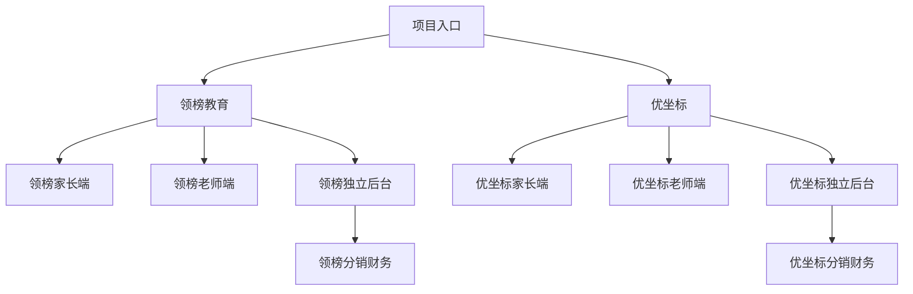
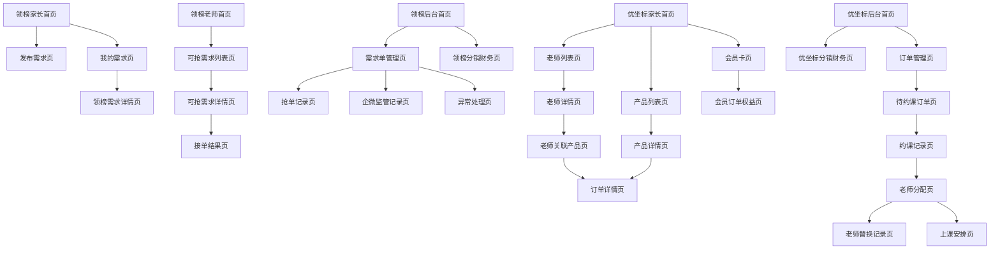

# 信息架构_页面结构_v1_20260603

## 背景

本稿由 `04 - 信息架构助手` 基于已确认的需求分析、用户确认 MVP 边界和 03 业务流程产物生成。当前已确认：领榜教育与优坐标为两个独立项目，两个后台完全独立，不设计共享后台或共享中台；领榜教育采用 C2C 家教撮合模式；优坐标采用 B2C 产品购买与客服排课模式；分销、提现、佣金进入 MVP。

本稿只输出页面级信息架构，不输出组件交互细节、表单字段规则、接口字段、视觉稿、Figma、HTML 原型或最终 PRD。

## 目标

- 将已确认业务流程转成页面级模块、页面、导航、入口、出口、状态和上下游关系。
- 明确家长端、老师端、领榜独立后台、优坐标独立后台的页面结构。
- 支撑下游交互设计、数据交互、高保真原型和 PRD 编写。
- 将上游仍未细化的规则记录为待确认或回流项，不在本阶段编造页面细节。

## 输入来源

- `/Users/xuyunfeng/Documents/k12/AGENTS.md`
- `/Users/xuyunfeng/Documents/k12/00_项目规则/项目总览_工作流程_v1_20260602.md`
- `/Users/xuyunfeng/Documents/k12/00_项目规则/助手向主控回报规则_v1_20260603.md`
- `/Users/xuyunfeng/Documents/k12/13_任务卡片/信息架构助手_任务说明_v1_20260602.md`
- `/Users/xuyunfeng/Documents/k12/00_项目规则/信息架构输出模板_v1_20260602.md`
- `/Users/xuyunfeng/Documents/k12/05_需求分析/需求分析_领榜优坐标MVP范围_v1_20260603.md`
- `/Users/xuyunfeng/Documents/k12/05_需求分析/需求分析_用户确认MVP边界_v1_20260603.md`
- `/Users/xuyunfeng/Documents/k12/06_业务流程/业务流程_领榜教育C2C流程_v1_20260603.md`
- `/Users/xuyunfeng/Documents/k12/06_业务流程/业务流程_优坐标B2C流程_v1_20260603.md`
- `/Users/xuyunfeng/Documents/k12/06_业务流程/业务流程_分销提现佣金流程_v1_20260603.md`
- `/Users/xuyunfeng/Documents/k12/06_业务流程/业务流程_状态流转与权限边界_v1_20260603.md`

## 关键结论

- 信息架构按 `领榜教育` 与 `优坐标` 两套独立产品域拆分，后台入口、后台模块、权限域和财务管理页面均不共享。
- 领榜教育页面主链路为：家长发布需求单 -> 老师查看可抢需求 -> 老师付费购买/接单 -> 需求单锁定 -> 客服建立企业微信监管记录 -> 成交形成服务安排，或未成交/退单后重新开放。
- 领榜教育不设计家长系统内确认老师页面。
- 优坐标页面主链路为：家长购买老师关联产品或直接购买产品 -> 客服约课 -> 客服选老师或替换老师 -> 系统外确认留痕 -> 形成最小上课安排。
- 优坐标会员卡作为独立购买和权益开通页面处理，不设计复杂抵扣页面。
- 分销页面按项目分别进入领榜后台和优坐标后台，支持 2 级分销、拉新注册家长/老师、销售提成、拉新老师课消提成；课消提成仅一级。
- 领榜企微监管记录已确认系统内至少留痕接单老师、关联需求单、当前监管状态和客服备注；不强制系统自动同步企微聊天内容。
- 领榜老师退单或未成交后，由系统自动重新开放需求单；退款及退款金额由客服人工处理，当前不在系统内处理。
- 优坐标 MVP 不做老师端确认接课，由客服后台直接分配；客服替换老师时，系统内记录已联系家长确认、确认时间、客服和备注，不强制上传截图或录音。
- 分销配置已确认支持销售提成比例、注册奖励、课消提成比例按系统配置调整；支付成功后生成候选佣金，订单完成或课消完成后转为可结算，退款或退单时佣金失效或冲正；提现人工审核、系统外打款，系统不限制提现门槛，结算周期按月，平台内所有用户都可成为分销员；提现由财务审核，管理员可查看和复核，客服无审核权限。
- 领榜老师付费购买需求单金额按需求单金额的 3 倍课时费计算；无人抢单时客服可人工发送推送消息给老师，提醒需求单可抢，不做系统派单。
- 老师抢单资格已确认：认证成功后可正常接单；未认证老师允许查看未接单需求单并付款接单，但前端需要提醒进行认证。
- 分销归因已确认：拉新注册永久有效；销售按购买时分享链接归因；无销售分享人时归属于注册归因人。
- 客服推送老师规则已确认：渠道为微信服务号、企业微信机器人、短信通知，频率暂按 3 天一次，推送范围为符合需求单性别、科目、年级等要求的老师。
- 第三方排课后续通过 API 接口对接；当前页面仍保留最小排课闭环，并为同步、失败、重试和冲突状态预留数据承接。

## 需求覆盖范围

| 需求 | 来源 | 是否纳入信息架构 | 对应模块 | 对应页面 | 说明 |
| --- | --- | --- | --- | --- | --- |
| 两后台完全独立 | CFM-01 | 是 | 领榜后台、优坐标后台 | 两套后台首页及管理页面 | 不设计共享后台或共享中台 |
| 领榜家长发布需求单 | CFM-03 | 是 | 领榜家长需求 | 需求发布页、我的需求页、需求详情页 | 页面级承接需求单生命周期 |
| 领榜老师抢单 | CFM-04/CFM-16 | 是 | 领榜老师抢单 | 可抢需求列表、需求详情、接单结果页 | 老师付费购买/接单后锁单 |
| 领榜企微监管记录 | CFM-16；主控补充确认 | 是 | 领榜客服监管 | 监管记录列表、监管记录详情 | 系统内至少留痕接单老师、关联需求单、当前监管状态、客服备注；不自动同步企微聊天 |
| 领榜未成交/退单重新开放 | CFM-17；主控补充确认 | 是 | 领榜需求状态管理 | 需求单管理、异常处理页 | 老师退单或未成交后系统自动重新开放；退款由客服人工处理，当前不进系统 |
| 优坐标老师关联产品购买 | CFM-06 | 是 | 优坐标购买 | 老师详情页、关联产品页、订单详情页 | 家长可按老师购买关联产品 |
| 优坐标直接产品购买 | CFM-07 | 是 | 优坐标购买 | 产品列表、产品详情、订单详情页 | 不经过老师也可购买 |
| 优坐标会员卡购买 | CFM-11/CFM-19 | 是 | 优坐标会员 | 会员卡页、会员订单页、权益开通页 | 当前不做复杂抵扣 |
| 优坐标客服约课和选老师 | CFM-08/09/10/15 | 是 | 优坐标排课 | 待约课订单、约课记录、上课安排页 | 最小排课闭环，不依赖第三方 |
| 优坐标客服替换老师并系统外确认 | CFM-18；主控补充确认 | 是 | 优坐标排课 | 老师替换记录页、上课安排详情页 | 不设计家长二次确认页；系统内留痕已联系家长确认、确认时间、客服、备注 |
| 优坐标老师端查看上课安排 | CFM-15；主控补充确认 | 是 | 优坐标老师端授课 | 我的上课安排页、上课安排详情页 | MVP 不做老师确认接课，由客服后台直接分配 |
| 分销、提现、佣金 | CFM-12/13/14/20；主控补充确认 | 是 | 分销财务 | 分销关系、佣金记录、提现申请、提现审核页 | 所有平台用户均可成为分销员；提成、注册奖励、课消比例支持配置；提现人工审核、系统外打款、按月结算 |

## 角色与页面权限视图

| 角色 | 可见模块 | 可访问页面 | 不可访问页面 | 权限说明 |
| --- | --- | --- | --- | --- |
| 领榜家长 | 领榜家长端需求模块 | 需求发布页、我的需求页、需求详情页、企微沟通入口提示页 | 领榜老师抢单页、领榜后台、优坐标后台 | 不做系统内确认老师 |
| 领榜老师 | 领榜老师端抢单模块 | 可抢需求列表、需求详情页、接单结果页、我的接单页 | 家长需求发布页、后台管理页、优坐标业务页 | 只能查看可抢且未锁定需求 |
| 领榜客服/教务 | 领榜后台需求与监管模块 | 需求单管理、抢单记录、企微监管记录、异常处理页 | 优坐标排课后台、提现审核页 | 可处理领榜客服监管与异常，不处理优坐标 |
| 领榜管理员 | 领榜后台全部业务模块 | 领榜后台首页、需求管理、老师管理、分销财务、监管记录 | 优坐标后台 | 仅管理领榜教育 |
| 优坐标家长 | 优坐标家长端购买模块 | 老师列表、老师详情、产品列表、产品详情、会员卡页、我的订单、约课状态页 | 客服排课页、优坐标后台、领榜后台 | 可指定偏好老师，但不分配老师 |
| 优坐标客服 | 优坐标后台排课模块 | 待约课订单、约课记录、老师分配、老师替换、上课安排页 | 财务审核页、领榜后台 | 可约课、选老师、替换老师、记录系统外确认 |
| 优坐标老师 | 优坐标老师端授课模块 | 我的上课安排页、安排详情页 | 客服排课页、家长购买页、后台管理页 | MVP 只查看客服分配结果，不做确认接课 |
| 优坐标管理员 | 优坐标后台全部业务模块 | 产品管理、老师管理、会员管理、订单管理、排课管理、分销财务 | 领榜后台 | 仅管理优坐标 |
| 分销员 | 所属项目分销中心 | 我的分销关系、我的佣金、提现申请页 | 跨项目分销数据、后台审核页 | 平台内所有用户都可成为分销员，包括老师和家长；仅查看和申请所属项目收益 |
| 财务 | 所属项目财务审核模块 | 提现审核、打款确认、到账记录 | 抢单、约课、排课操作页 | 不决定业务成交、抢单或排课 |

## 模块结构图

### Mermaid

### 节点清单

| 节点ID | 节点名称 | 节点类型 | 说明 |
| --- | --- | --- | --- |
| Root | 项目入口 | 产品入口 | 仅表示两项目入口关系，不代表共享后台 |
| LB | 领榜教育 | 项目域 | C2C 家教撮合 |
| UZ | 优坐标 | 项目域 | B2C 产品购买与客服排课 |
| LBP | 领榜家长端 | 端侧模块 | 家长发布和查看需求 |
| LBT | 领榜老师端 | 端侧模块 | 老师查看需求和接单 |
| LBA | 领榜独立后台 | 管理模块 | 管理领榜需求、老师、监管、分销财务 |
| UZP | 优坐标家长端 | 端侧模块 | 家长购买产品、会员卡和查看约课状态 |
| UZT | 优坐标老师端 | 端侧模块 | 老师查看上课安排 |
| UZA | 优坐标独立后台 | 管理模块 | 管理产品、会员、订单、约课、排课、分销财务 |
| LBF | 领榜分销财务 | 管理模块 | 领榜分销、佣金、提现 |
| UZF | 优坐标分销财务 | 管理模块 | 优坐标分销、佣金、提现 |

### 连线清单

| 起点 | 终点 | 关系 | 说明 |
| --- | --- | --- | --- |
| 项目入口 | 领榜教育 | 项目分流 | 用户进入领榜业务域 |
| 项目入口 | 优坐标 | 项目分流 | 用户进入优坐标业务域 |
| 领榜教育 | 领榜独立后台 | 后台归属 | 仅管理领榜 |
| 优坐标 | 优坐标独立后台 | 后台归属 | 仅管理优坐标 |
| 领榜独立后台 | 领榜分销财务 | 后台内模块 | 不与优坐标共享 |
| 优坐标独立后台 | 优坐标分销财务 | 后台内模块 | 不与领榜共享 |

## 模块结构表

| 模块 | 模块类型 | 模块目标 | 覆盖需求 | 服务角色 | 关联业务对象 | 对应流程阶段 | 是否纳入 MVP |
| --- | --- | --- | --- | --- | --- | --- | --- |
| 领榜家长端需求模块 | 核心模块 | 支持家长发布和跟进需求单 | 领榜需求单 | 领榜家长 | 需求单 | 发布、锁定、企微沟通、服务安排 | 是 |
| 领榜老师端抢单模块 | 核心模块 | 支持老师查看可抢需求并付费接单 | 老师抢单、锁单 | 领榜老师 | 需求单、抢单记录 | 查看、接单、锁定、重新开放 | 是 |
| 领榜后台需求管理模块 | 管理模块 | 管理需求单、抢单、状态和异常 | 需求管理、重新开放 | 客服/教务、管理员 | 需求单、抢单记录、服务安排 | 全流程监管 | 是 |
| 领榜后台企微监管模块 | 支撑模块 | 对系统外企业微信群沟通进行留痕 | 企微监管记录 | 客服/教务、管理员 | 企业微信监管记录 | 锁单后监管 | 是 |
| 领榜分销财务模块 | 管理模块 | 管理领榜分销、佣金、提现 | 分销、提现、佣金 | 分销员、财务、管理员 | 分销关系、佣金记录、提现申请 | 来源、佣金、提现 | 是 |
| 优坐标家长端购买模块 | 核心模块 | 支持老师关联产品、直接产品和会员卡购买 | 产品购买、会员卡 | 优坐标家长 | 产品订单、会员卡订单 | 购买、开通、待约课 | 是 |
| 优坐标老师端授课模块 | 支撑模块 | 支持老师查看被分配的上课安排 | 最小排课 | 优坐标老师 | 上课安排 | 分配后承接 | 是 |
| 优坐标后台商品会员模块 | 管理模块 | 管理产品、老师关联产品和会员卡 | 产品、会员 | 管理员 | 产品、老师关联产品、会员卡 | 上架、购买承接 | 是 |
| 优坐标后台约课排课模块 | 核心模块 | 支持客服约课、选老师、替换老师、形成安排 | 客服约课、最小排课 | 客服、管理员 | 约课记录、上课安排 | 购买后排课 | 是 |
| 优坐标分销财务模块 | 管理模块 | 管理优坐标分销、佣金、提现 | 分销、提现、佣金 | 分销员、财务、管理员 | 分销关系、佣金记录、提现申请 | 来源、佣金、提现 | 是 |
| 共享后台/共享中台 | 暂不纳入模块 | 不设计共用后台 | 两后台独立 | 不适用 | 不适用 | 不适用 | 否 |
| 复杂会员抵扣模块 | 暂不纳入模块 | 后续确认后再设计 | 会员复杂抵扣 | 不适用 | 会员权益、订单 | 不适用 | 否 |
| 第三方排课深度对接模块 | 暂不纳入模块 | 不作为强依赖 | 第三方排课 | 不适用 | 上课安排 | 不适用 | 否 |

## 页面结构图

### Mermaid

### 节点清单

| 节点ID | 页面名称 | 所属模块 | 页面类型 | 说明 |
| --- | --- | --- | --- | --- |
| LPH | 领榜家长首页 | 领榜家长端需求模块 | 一级入口 | 家长进入领榜需求服务 |
| LPD | 发布需求页 | 领榜家长端需求模块 | 操作页 | 家长发布需求单 |
| LPM | 我的需求页 | 领榜家长端需求模块 | 列表页 | 查看自己的需求单 |
| LPDtl | 领榜需求详情页 | 领榜家长端需求模块 | 详情页 | 查看需求状态和企微沟通提示 |
| LTH | 领榜老师首页 | 领榜老师端抢单模块 | 一级入口 | 老师进入抢单业务 |
| LTL | 可抢需求列表页 | 领榜老师端抢单模块 | 列表页 | 查看未锁定需求 |
| LTD | 可抢需求详情页 | 领榜老师端抢单模块 | 详情页 | 判断是否接单 |
| LTR | 接单结果页 | 领榜老师端抢单模块 | 结果页 | 展示接单成功、锁单或失败状态 |
| LBAH | 领榜后台首页 | 领榜后台 | 一级入口 | 领榜后台总入口 |
| LBAD | 需求单管理页 | 领榜后台需求管理模块 | 列表页 | 管理需求单状态 |
| LBAR | 抢单记录页 | 领榜后台需求管理模块 | 列表页 | 查看老师抢单记录 |
| LBAW | 企微监管记录页 | 领榜后台企微监管模块 | 列表/详情页 | 记录系统外沟通监管 |
| LBAE | 异常处理页 | 领榜后台需求管理模块 | 操作承接页 | 承接未成交、退单、重新开放 |
| LBAF | 领榜分销财务页 | 领榜分销财务模块 | 管理页 | 分销关系、佣金、提现入口 |
| UZPH | 优坐标家长首页 | 优坐标家长端购买模块 | 一级入口 | 家长进入优坐标购买服务 |
| UZTL | 老师列表页 | 优坐标家长端购买模块 | 列表页 | 选择老师入口 |
| UZTD | 老师详情页 | 优坐标家长端购买模块 | 详情页 | 查看老师及关联产品入口 |
| UZOP | 老师关联产品页 | 优坐标家长端购买模块 | 详情页 | 按老师购买产品 |
| UZPL | 产品列表页 | 优坐标家长端购买模块 | 列表页 | 直接购买产品入口 |
| UZPD | 产品详情页 | 优坐标家长端购买模块 | 详情页 | 直接产品购买承接 |
| UZMC | 会员卡页 | 优坐标会员模块 | 详情页 | 会员卡购买入口 |
| UZOD | 订单详情页 | 优坐标家长端购买模块 | 详情页 | 查看产品订单与约课状态 |
| UZMD | 会员订单权益页 | 优坐标会员模块 | 结果页 | 会员权益开通状态 |
| UZAH | 优坐标后台首页 | 优坐标后台 | 一级入口 | 优坐标后台总入口 |
| UZAO | 订单管理页 | 优坐标后台 | 列表页 | 管理产品、关联产品、会员订单 |
| UZAS | 待约课订单页 | 优坐标后台约课排课模块 | 列表页 | 客服处理购买后约课 |
| UZAC | 约课记录页 | 优坐标后台约课排课模块 | 列表/详情页 | 记录与家长约定时间 |
| UZAT | 老师分配页 | 优坐标后台约课排课模块 | 操作承接页 | 客服选择指定或可承接老师 |
| UZAR | 老师替换记录页 | 优坐标后台约课排课模块 | 记录页 | 记录系统外确认后的替换结果 |
| UZAA | 上课安排页 | 优坐标后台约课排课模块 | 列表/详情页 | 最小排课结果 |
| UZAF | 优坐标分销财务页 | 优坐标分销财务模块 | 管理页 | 分销关系、佣金、提现入口 |

### 连线清单

| 起点页面 | 终点页面 | 触发条件 | 说明 |
| --- | --- | --- | --- |
| 领榜家长首页 | 发布需求页 | 家长发起需求 | 主流程入口 |
| 发布需求页 | 我的需求页 | 需求发布成功 | 查看需求状态 |
| 我的需求页 | 领榜需求详情页 | 查看某一需求 | 承接状态变化 |
| 领榜老师首页 | 可抢需求列表页 | 老师进入抢单 | 查看可抢需求 |
| 可抢需求列表页 | 可抢需求详情页 | 老师选择需求 | 接单前详情 |
| 可抢需求详情页 | 接单结果页 | 老师付费购买/接单 | 成功锁单或失败 |
| 领榜后台首页 | 需求单管理页 | 后台人员进入管理 | 管理需求生命周期 |
| 需求单管理页 | 企微监管记录页 | 需求已锁定 | 建立或查看监管记录 |
| 需求单管理页 | 异常处理页 | 未成交或老师退单 | 重新开放承接 |
| 优坐标家长首页 | 老师列表页 | 按老师购买 | 老师路径 |
| 老师详情页 | 老师关联产品页 | 选择老师关联产品 | 生成产品订单前置 |
| 优坐标家长首页 | 产品列表页 | 直接购买产品 | 产品路径 |
| 产品详情页 | 订单详情页 | 购买产品 | 进入订单状态 |
| 会员卡页 | 会员订单权益页 | 购买会员卡 | 权益开通结果 |
| 优坐标后台首页 | 订单管理页 | 后台处理订单 | 管理购买结果 |
| 订单管理页 | 待约课订单页 | 产品订单购买成功 | 进入客服约课 |
| 待约课订单页 | 约课记录页 | 客服联系家长 | 记录约定结果 |
| 约课记录页 | 老师分配页 | 时间确认 | 分配老师 |
| 老师分配页 | 老师替换记录页 | 指定老师不可承接 | 记录替换和系统外确认 |
| 老师分配页 | 上课安排页 | 老师确定 | 形成最小排课 |

## 页面清单

| 页面 | 所属模块 | 页面目标 | 服务角色 | 对应需求 | 对应业务动作 | 关联业务对象 | 页面类型 | 是否纳入 MVP |
| --- | --- | --- | --- | --- | --- | --- | --- | --- |
| 领榜家长首页 | 领榜家长端需求模块 | 聚合家长需求入口 | 领榜家长 | CFM-03 | 进入发布或查看需求 | 需求单 | 一级入口 | 是 |
| 发布需求页 | 领榜家长端需求模块 | 发布家教需求 | 领榜家长 | CFM-03 | 发布需求单 | 需求单 | 操作页 | 是 |
| 我的需求页 | 领榜家长端需求模块 | 查看本人需求状态 | 领榜家长 | CFM-03/16/17 | 查看状态 | 需求单 | 列表页 | 是 |
| 领榜需求详情页 | 领榜家长端需求模块 | 承接需求状态和沟通提示 | 领榜家长 | CFM-16/17 | 查看锁定、沟通、重新开放状态 | 需求单、监管记录 | 详情页 | 是 |
| 领榜老师首页 | 领榜老师端抢单模块 | 聚合老师抢单入口 | 领榜老师 | CFM-04 | 进入可抢需求 | 需求单 | 一级入口 | 是 |
| 可抢需求列表页 | 领榜老师端抢单模块 | 展示可抢需求 | 领榜老师 | CFM-04/16 | 查看未锁定需求 | 需求单 | 列表页 | 是 |
| 可抢需求详情页 | 领榜老师端抢单模块 | 支持老师判断是否接单 | 领榜老师 | CFM-04/16 | 发起付费购买/接单 | 需求单、抢单记录 | 详情页 | 是 |
| 接单结果页 | 领榜老师端抢单模块 | 展示接单结果 | 领榜老师 | CFM-16/17 | 接单成功、锁单失败、状态冲突 | 抢单记录、需求单 | 结果页 | 是 |
| 我的接单页 | 领榜老师端抢单模块 | 查看老师接单历史 | 领榜老师 | CFM-16/17 | 查看已接、退单、失效记录 | 抢单记录 | 列表页 | 是 |
| 领榜后台首页 | 领榜后台 | 聚合领榜后台入口 | 领榜管理员、客服/教务 | CFM-01 | 进入领榜管理 | 多对象 | 一级入口 | 是 |
| 需求单管理页 | 领榜后台需求管理模块 | 管理需求单状态 | 领榜客服/教务、管理员 | CFM-03/16/17 | 查看、监管、重新开放承接 | 需求单 | 列表页 | 是 |
| 抢单记录页 | 领榜后台需求管理模块 | 查看老师抢单情况 | 领榜客服/教务、管理员 | CFM-04/16 | 查看接单、失败、冲突 | 抢单记录 | 列表页 | 是 |
| 企微监管记录页 | 领榜后台企微监管模块 | 留痕系统外企微沟通 | 领榜客服/教务、管理员 | CFM-16；主控补充确认 | 查看监管状态和客服备注 | 企业微信监管记录 | 列表/详情页 | 是 |
| 异常处理页 | 领榜后台需求管理模块 | 承接未成交、退单、重新开放 | 领榜客服/教务、管理员 | CFM-17；主控补充确认 | 查看自动重新开放结果，承接退款人工处理留痕边界 | 需求单、抢单记录 | 操作承接页 | 是 |
| 领榜分销关系页 | 领榜分销财务模块 | 查看领榜分销归因 | 领榜管理员 | CFM-12/20；主控补充确认 | 查看 2 级关系、拉新来源、平台用户分销身份 | 分销关系 | 列表页 | 是 |
| 领榜佣金记录页 | 领榜分销财务模块 | 查看领榜佣金状态 | 领榜管理员、财务 | CFM-14/20；主控补充确认 | 查看销售提成、注册奖励、课消提成配置承接状态 | 佣金记录 | 列表页 | 是 |
| 领榜提现审核页 | 领榜分销财务模块 | 审核领榜提现 | 财务 | CFM-14；主控补充确认 | 人工审核、系统外打款、按月结算状态承接 | 提现申请 | 审核页 | 是 |
| 优坐标家长首页 | 优坐标家长端购买模块 | 聚合购买入口 | 优坐标家长 | CFM-05 | 进入老师、产品、会员路径 | 产品、老师、会员卡 | 一级入口 | 是 |
| 老师列表页 | 优坐标家长端购买模块 | 支持按老师购买入口 | 优坐标家长 | CFM-06 | 选择老师 | 老师 | 列表页 | 是 |
| 老师详情页 | 优坐标家长端购买模块 | 查看老师及关联产品入口 | 优坐标家长 | CFM-06 | 进入关联产品 | 老师、老师关联产品 | 详情页 | 是 |
| 老师关联产品页 | 优坐标家长端购买模块 | 承接指定老师购买 | 优坐标家长 | CFM-06 | 购买老师关联产品 | 产品订单 | 详情页 | 是 |
| 产品列表页 | 优坐标家长端购买模块 | 支持直接产品购买 | 优坐标家长 | CFM-07 | 选择产品 | 产品 | 列表页 | 是 |
| 产品详情页 | 优坐标家长端购买模块 | 承接直接产品购买 | 优坐标家长 | CFM-07 | 购买产品 | 产品订单 | 详情页 | 是 |
| 会员卡页 | 优坐标会员模块 | 支持会员卡购买 | 优坐标家长 | CFM-11/19 | 购买会员卡 | 会员卡订单 | 详情页 | 是 |
| 订单详情页 | 优坐标家长端购买模块 | 查看产品订单和约课进度 | 优坐标家长 | CFM-06/07/08 | 查看购买后服务状态 | 产品订单、约课记录、上课安排 | 详情页 | 是 |
| 会员订单权益页 | 优坐标会员模块 | 查看会员权益开通 | 优坐标家长 | CFM-19 | 查看开通结果 | 会员卡订单 | 结果页 | 是 |
| 优坐标老师端首页 | 优坐标老师端授课模块 | 聚合老师授课入口 | 优坐标老师 | CFM-15 | 进入上课安排 | 上课安排 | 一级入口 | 是 |
| 我的上课安排页 | 优坐标老师端授课模块 | 查看客服直接分配的安排 | 优坐标老师 | CFM-15；主控补充确认 | 查看排课结果，不做确认接课 | 上课安排 | 列表页 | 是 |
| 上课安排详情页 | 优坐标老师端授课模块 | 查看单次安排状态 | 优坐标老师 | CFM-15；主控补充确认 | 承接安排信息，不做老师确认动作 | 上课安排 | 详情页 | 是 |
| 优坐标后台首页 | 优坐标后台 | 聚合优坐标后台入口 | 优坐标客服、管理员 | CFM-01 | 进入优坐标管理 | 多对象 | 一级入口 | 是 |
| 产品管理页 | 优坐标后台商品会员模块 | 管理产品 | 优坐标管理员 | CFM-06/07 | 支撑产品购买 | 产品 | 管理页 | 是 |
| 老师关联产品管理页 | 优坐标后台商品会员模块 | 管理老师与产品关联 | 优坐标管理员 | CFM-06 | 支撑按老师购买 | 老师关联产品 | 管理页 | 是 |
| 会员卡管理页 | 优坐标后台商品会员模块 | 管理会员卡和权益开通 | 优坐标管理员 | CFM-11/19 | 支撑会员购买 | 会员卡订单 | 管理页 | 是 |
| 订单管理页 | 优坐标后台 | 管理订单状态 | 优坐标客服、管理员 | CFM-06/07/11 | 查看购买结果 | 产品订单、会员卡订单 | 列表页 | 是 |
| 待约课订单页 | 优坐标后台约课排课模块 | 承接购买后待约课 | 优坐标客服 | CFM-08 | 发起约课 | 产品订单、约课记录 | 列表页 | 是 |
| 约课记录页 | 优坐标后台约课排课模块 | 记录客服与家长约课结果 | 优坐标客服 | CFM-08 | 确认上课时间 | 约课记录 | 列表/详情页 | 是 |
| 老师分配页 | 优坐标后台约课排课模块 | 客服选择或替换老师 | 优坐标客服 | CFM-09/10/18 | 选择指定或可承接老师 | 上课安排 | 操作承接页 | 是 |
| 老师替换记录页 | 优坐标后台约课排课模块 | 留痕系统外确认 | 优坐标客服、管理员 | CFM-18；主控补充确认 | 记录已联系家长确认、确认时间、客服和备注，不强制截图或录音 | 上课安排 | 记录页 | 是 |
| 上课安排页 | 优坐标后台约课排课模块 | 管理最小排课结果 | 优坐标客服、管理员 | CFM-15 | 查看排课状态 | 上课安排 | 列表/详情页 | 是 |
| 优坐标分销关系页 | 优坐标分销财务模块 | 查看优坐标分销归因 | 优坐标管理员 | CFM-12/20；主控补充确认 | 查看 2 级关系、拉新来源、平台用户分销身份 | 分销关系 | 列表页 | 是 |
| 优坐标佣金记录页 | 优坐标分销财务模块 | 查看优坐标佣金状态 | 优坐标管理员、财务 | CFM-14/20；主控补充确认 | 查看销售提成、注册奖励、课消提成配置承接状态 | 佣金记录 | 列表页 | 是 |
| 优坐标提现审核页 | 优坐标分销财务模块 | 审核优坐标提现 | 财务 | CFM-14；主控补充确认 | 人工审核、系统外打款、按月结算状态承接 | 提现申请 | 审核页 | 是 |

## 导航关系

| 页面 | 导航层级 | 入口类型 | 上级页面 | 下级页面 | 跨模块入口 | 是否可直达 | 说明 |
| --- | --- | --- | --- | --- | --- | --- | --- |
| 发布需求页 | 二级 | 主流程入口 | 领榜家长首页 | 我的需求页 | 无 | 是 | 家长发起领榜需求 |
| 领榜需求详情页 | 三级 | 详情页入口 | 我的需求页 | 无 | 企微沟通提示 | 否 | 由本人需求进入 |
| 可抢需求列表页 | 二级 | 主流程入口 | 领榜老师首页 | 可抢需求详情页 | 无 | 是 | 老师查看可抢需求 |
| 接单结果页 | 三级 | 操作结果入口 | 可抢需求详情页 | 我的接单页 | 无 | 否 | 接单后生成 |
| 需求单管理页 | 二级 | 后台入口 | 领榜后台首页 | 抢单记录、监管记录、异常处理 | 分销财务 | 是 | 领榜后台核心 |
| 企微监管记录页 | 三级 | 详情页入口 | 需求单管理页 | 无 | 异常处理页 | 否 | 锁单后进入 |
| 异常处理页 | 三级 | 异常流程入口 | 需求单管理页 | 可抢需求列表页 | 监管记录 | 否 | 重新开放后回到抢单流 |
| 老师列表页 | 二级 | 主流程入口 | 优坐标家长首页 | 老师详情页 | 产品列表 | 是 | 按老师购买路径 |
| 产品列表页 | 二级 | 主流程入口 | 优坐标家长首页 | 产品详情页 | 老师列表 | 是 | 直接产品购买路径 |
| 会员卡页 | 二级 | 主流程入口 | 优坐标家长首页 | 会员订单权益页 | 无 | 是 | 独立会员路径 |
| 订单详情页 | 三级 | 详情页入口 | 老师关联产品页、产品详情页 | 无 | 约课状态 | 否 | 家长查看订单进度 |
| 待约课订单页 | 二级 | 后台任务入口 | 优坐标后台首页 | 约课记录页 | 订单管理页 | 是 | 客服约课队列 |
| 老师分配页 | 三级 | 操作承接入口 | 约课记录页 | 老师替换记录、上课安排 | 老师管理 | 否 | 客服排课关键页 |
| 老师替换记录页 | 四级 | 异常流程入口 | 老师分配页 | 上课安排页 | 无 | 否 | 系统外确认留痕 |
| 上课安排页 | 三级 | 结果页入口 | 老师分配页 | 上课安排详情页 | 老师端 | 是 | 最小排课闭环 |
| 分销关系页 | 二级 | 后台财务入口 | 所属项目后台首页 | 佣金记录页 | 提现审核页 | 是 | 领榜和优坐标分别存在 |
| 佣金记录页 | 三级 | 管理入口 | 分销关系页 | 提现审核页 | 无 | 是 | 承接佣金状态 |
| 提现审核页 | 三级 | 审核入口 | 分销财务页 | 无 | 无 | 是 | 财务审核与打款 |

## 页面入口与出口

| 页面 | 主流程入口 | 异常流程入口 | 角色入口 | 外部入口 | 完成后出口 | 失败或中止后出口 | 返回路径 |
| --- | --- | --- | --- | --- | --- | --- | --- |
| 发布需求页 | 领榜家长首页 | 发布失败状态 | 领榜家长 | 无 | 我的需求页 | 发布页保留或返回首页 | 领榜家长首页 |
| 可抢需求详情页 | 可抢需求列表页 | 需求已锁定、老师无资格 | 领榜老师 | 无 | 接单结果页 | 可抢需求列表页 | 可抢需求列表页 |
| 接单结果页 | 可抢需求详情页 | 状态冲突、接单失败 | 领榜老师 | 无 | 我的接单页 | 可抢需求列表页 | 领榜老师首页 |
| 需求单管理页 | 领榜后台首页 | 无人抢单、未成交、退单 | 客服/管理员 | 无 | 监管记录或异常处理页 | 需求单管理页 | 领榜后台首页 |
| 企微监管记录页 | 需求单管理页 | 建群异常、监管状态异常 | 客服/管理员 | 企业微信实际沟通 | 需求单详情或服务安排 | 异常处理页 | 需求单管理页 |
| 异常处理页 | 需求单管理页 | 未成交、老师退单、状态冲突 | 客服/管理员 | 无 | 自动重新开放后的可抢需求列表页 | 需求单管理页；退款由客服人工处理 | 需求单管理页 |
| 老师关联产品页 | 老师详情页 | 购买失败 | 优坐标家长 | 无 | 订单详情页 | 老师详情页 | 老师详情页 |
| 产品详情页 | 产品列表页 | 购买失败 | 优坐标家长 | 无 | 订单详情页 | 产品列表页 | 产品列表页 |
| 会员卡页 | 优坐标家长首页 | 购买失败、权益开通异常 | 优坐标家长 | 无 | 会员订单权益页 | 优坐标家长首页 | 优坐标家长首页 |
| 待约课订单页 | 优坐标后台首页、订单管理页 | 无法联系家长 | 优坐标客服 | 无 | 约课记录页 | 待约课订单页 | 优坐标后台首页 |
| 约课记录页 | 待约课订单页 | 无法约定时间 | 优坐标客服 | 系统外联系家长 | 老师分配页 | 待约课订单页 | 待约课订单页 |
| 老师分配页 | 约课记录页 | 指定老师不可承接 | 优坐标客服 | 无 | 上课安排页 | 老师替换记录页 | 约课记录页 |
| 老师替换记录页 | 老师分配页 | 系统外确认未完成 | 优坐标客服 | 系统外联系家长 | 上课安排页 | 老师分配页 | 老师分配页 |
| 分销关系页 | 所属项目后台首页 | 项目归属不清 | 管理员 | 推荐来源 | 佣金记录页 | 分销关系页 | 所属项目后台首页 |
| 佣金记录页 | 分销关系页 | 佣金配置缺失 | 管理员、财务 | 业务结果 | 提现审核页 | 佣金记录页 | 分销关系页 |
| 提现审核页 | 佣金记录页 | 审核不通过、打款异常 | 财务 | 无 | 已到账状态 | 驳回状态 | 佣金记录页 |

## 页面状态

| 页面 | 默认状态 | 空状态 | 加载状态 | 错误状态 | 无权限状态 | 不可操作状态 | 已完成状态 | 异常业务状态 |
| --- | --- | --- | --- | --- | --- | --- | --- | --- |
| 我的需求页 | 显示本人需求 | 暂无需求 | 读取需求中 | 读取失败 | 非本人不可见 | 需求已锁定时部分操作不可用 | 服务安排已形成 | 未成交、退单后重新开放 |
| 可抢需求列表页 | 显示可抢需求 | 暂无可抢需求 | 读取需求中 | 读取失败 | 非领榜老师不可见 | 需求已锁定不可抢 | 接单后不再出现在可抢列表 | 状态冲突、资格不符 |
| 接单结果页 | 显示接单结果 | 不适用 | 处理中 | 接单失败 | 非接单老师不可见 | 已锁定不可重复接单 | 接单成功并锁单 | 需求已被他人锁定 |
| 需求单管理页 | 显示领榜需求 | 暂无需求 | 读取中 | 读取失败 | 非领榜后台角色不可见 | 终态记录不可随意处理 | 服务安排已形成 | 无人抢单、退单、重新开放 |
| 企微监管记录页 | 显示监管记录 | 暂无监管记录 | 读取中 | 读取失败 | 非领榜客服/管理员不可见 | 已归档记录不可重复处理 | 监管完成 | 建群异常、监管状态异常；不承接企微聊天自动同步 |
| 订单详情页 | 显示订单状态 | 不适用 | 读取订单中 | 读取失败 | 非订单本人不可见 | 会员订单不进入约课 | 约课或权益开通完成 | 购买失败、约课异常 |
| 会员订单权益页 | 显示权益开通 | 暂无会员权益 | 读取中 | 读取失败 | 非订单本人不可见 | 当前不做复杂抵扣 | 权益已开通 | 开通异常 |
| 待约课订单页 | 显示待约课订单 | 暂无待约课订单 | 读取中 | 读取失败 | 非优坐标客服不可见 | 会员独立订单不可排课 | 已转约课记录 | 无法联系家长 |
| 老师分配页 | 显示可分配上下文 | 无可承接老师 | 读取中 | 读取失败 | 非优坐标客服不可见 | 已形成安排不可重复分配 | 上课安排已形成 | 指定老师不可承接 |
| 老师替换记录页 | 显示替换留痕 | 暂无替换记录 | 读取中 | 读取失败 | 非优坐标客服/管理员不可见 | 未记录系统外确认结果不可进入终态 | 替换老师已确认并形成安排 | 系统外确认异常；不强制截图或录音 |
| 上课安排页 | 显示排课结果 | 暂无安排 | 读取中 | 读取失败 | 非相关角色不可见 | 已取消或异常安排不可继续；老师端不做确认接课 | 安排已形成 | 状态冲突、老师不可承接 |
| 佣金记录页 | 显示佣金记录 | 暂无佣金 | 读取中 | 读取失败 | 非所属项目角色不可见 | 未配置规则的佣金不可进入最终结算 | 可提现或已提现 | 具体比例或归因有效期待配置 |
| 提现审核页 | 显示提现申请 | 暂无待审申请 | 读取中 | 读取失败 | 非财务不可见；管理员可查看和复核；客服不可审核 | 已打款不可重复审核；系统不限制提现门槛 | 已到账 | 驳回、系统外打款异常 |

## 页面上下游关系

| 前置页面 | 当前页面 | 后续页面 | 承接业务对象 | 承接业务状态 | 触发角色 | 触发条件 | 权限条件 |
| --- | --- | --- | --- | --- | --- | --- | --- |
| 领榜家长首页 | 发布需求页 | 我的需求页 | 需求单 | 草稿到抢单中 | 领榜家长 | 发布需求 | 领榜家长本人 |
| 发布需求页 | 我的需求页 | 领榜需求详情页 | 需求单 | 抢单中、已锁定、重新开放 | 领榜家长 | 查看进度 | 需求发布人 |
| 可抢需求列表页 | 可抢需求详情页 | 接单结果页 | 需求单、抢单记录 | 抢单中到已锁定 | 领榜老师 | 付费购买/接单 | 具备领榜老师权限且需求未锁定 |
| 需求单管理页 | 企微监管记录页 | 领榜需求详情页 | 监管记录 | 已锁定到企微沟通中 | 领榜客服/教务 | 锁单后拉群并留痕监管状态 | 领榜客服/管理员 |
| 需求单管理页 | 异常处理页 | 可抢需求列表页 | 需求单 | 未成交/退单到系统自动重新开放 | 系统、领榜客服/教务 | 未成交或老师退单 | 领榜客服/管理员查看处理结果 |
| 老师列表页 | 老师详情页 | 老师关联产品页 | 老师、关联产品 | 可购买 | 优坐标家长 | 选择老师 | 优坐标家长 |
| 产品列表页 | 产品详情页 | 订单详情页 | 产品订单 | 待购买到已购买 | 优坐标家长 | 购买产品 | 优坐标家长 |
| 会员卡页 | 会员订单权益页 | 无 | 会员卡订单 | 待购买到会员已开通 | 优坐标家长 | 购买会员卡 | 优坐标家长 |
| 订单管理页 | 待约课订单页 | 约课记录页 | 产品订单、约课记录 | 已购买到待约课 | 优坐标客服 | 购买成功后处理 | 优坐标客服 |
| 待约课订单页 | 约课记录页 | 老师分配页 | 约课记录 | 待约课到已约课 | 优坐标客服 | 系统外联系家长约课 | 优坐标客服 |
| 约课记录页 | 老师分配页 | 上课安排页 | 上课安排 | 待分配到已分配指定老师 | 优坐标客服 | 选择老师 | 优坐标客服 |
| 老师分配页 | 老师替换记录页 | 上课安排页 | 上课安排 | 待替换老师到已分配替换老师 | 优坐标客服 | 指定老师不可承接且已系统外联系家长确认 | 优坐标客服 |
| 所属项目订单或服务结果 | 佣金记录页 | 提现审核页 | 佣金记录 | 佣金候选到可提现 | 系统/财务 | 支付成功生成候选佣金，订单完成或课消完成后转可结算，比例和奖励配置生效 | 所属项目管理员/财务 |
| 佣金记录页 | 提现审核页 | 佣金记录页 | 提现申请 | 提现审核中到已到账或驳回 | 财务 | 人工审核、系统外打款、按月结算 | 财务审核，管理员查看和复核，客服无审核权限 |

## 权限差异说明

| 页面 | 角色 | 可见内容 | 可进入条件 | 不可进入原因 | 替代去向 |
| --- | --- | --- | --- | --- | --- |
| 领榜后台首页 | 领榜管理员 | 领榜全部后台模块 | 具备领榜后台权限 | 优坐标角色不可进入 | 优坐标后台首页 |
| 优坐标后台首页 | 优坐标管理员 | 优坐标全部后台模块 | 具备优坐标后台权限 | 领榜角色不可进入 | 领榜后台首页 |
| 可抢需求列表页 | 领榜老师 | 未锁定可抢需求 | 领榜老师身份有效 | 家长、优坐标老师、无资格老师不可进入 | 所属端首页 |
| 需求单管理页 | 领榜客服/管理员 | 领榜需求与状态 | 领榜后台角色 | 优坐标后台角色不可进入 | 优坐标后台首页 |
| 企微监管记录页 | 领榜客服/管理员 | 领榜监管记录 | 需求已锁定且有客服监管权限 | 家长、老师不可管理 | 需求详情页或我的接单页 |
| 待约课订单页 | 优坐标客服 | 待约课订单 | 优坐标客服权限 | 财务、领榜角色不可进入 | 优坐标后台首页 |
| 老师分配页 | 优坐标客服 | 约课后分配上下文 | 约课已完成 | 家长、老师不可分配 | 订单详情页或上课安排详情 |
| 提现审核页 | 财务 | 所属项目提现申请 | 财务权限 | 客服、老师、家长不可审核 | 我的佣金或后台首页 |
| 分销关系页 | 所属项目管理员 | 所属项目分销关系 | 所属项目后台权限 | 跨项目角色不可看 | 所属项目后台首页 |

## 暂不纳入页面或模块

| 页面或模块 | 暂不纳入原因 | 来源依据 | 后续建议 |
| --- | --- | --- | --- |
| 共享后台/共享中台 | 用户已确认两个后台完全独立 | CFM-01 | 后续如变更需回流需求分析与业务流程 |
| 家长系统内确认领榜老师页面 | 用户已确认领榜不需要家长系统内确认老师 | CFM-16 | 不进入交互和原型 |
| 优坐标家长二次确认替换老师页面 | 用户已确认系统外确认，系统内由客服留痕 | CFM-18 | 仅保留客服后台记录页 |
| 会员卡复杂抵扣页面 | 当前会员卡只独立购买和权益开通 | CFM-19 | 后续确认抵扣关系后再补 |
| 第三方排课深度对接页面 | 第三方对接不确定，不作为强依赖 | CFM-15 | 当前只做最小排课页面 |
| 跨项目统一分销财务页面 | 两项目分销规则不同且后台独立 | CFM-13 | 分别在两个后台建模 |

## 下游交接说明

| 下游助手 | 需要关注的内容 |
| --- | --- |
| 交互设计助手 | 按页面级入口、出口和状态细化操作路径；重点处理领榜锁单后企微监管留痕、自动重新开放、优坐标客服约课选老师替换老师、系统外确认留痕；不要新增家长确认老师、家长二次确认替换老师或老师端确认接课流程。 |
| 数据交互助手 | 关注需求单、抢单记录、监管记录、产品订单、会员卡订单、约课记录、上课安排、分销关系、佣金记录、提现申请的状态支撑；不要设计共享后台接口；分销具体数值按配置项处理，佣金触发条件和提现审核角色已确认。 |
| 高保真原型助手 | 原型需分别呈现领榜后台和优坐标后台；覆盖家长端、老师端、后台；覆盖空状态、加载状态、错误状态、无权限状态、不可操作状态和异常业务状态。 |
| 需求文档助手 | PRD 需把本稿页面范围与业务流程逐项对应；将企微监管最小留痕、自动重新开放、客服人工处理退款、老师端不确认接课、系统外打款、按月结算、平台用户均可成为分销员写为已确认规则。 |
| 评审助手 | 重点检查两后台是否混用、是否误加共享中台、是否误加家长确认老师页面、是否把系统外确认做成家长端系统内确认。 |

## 待确认问题

| 问题 | 影响范围 | 建议确认对象 | 处理建议 |
| --- | --- | --- | --- |
| 会员卡后续是否与产品、课时、折扣建立抵扣关系 | 会员页、订单页、排课、数据交互 | 业务负责人、财务负责人 | 当前不做复杂抵扣页面 |
| 分销具体默认数值 | 分销财务、数据交互、验收标准 | 财务负责人、业务负责人 | 具体数值作为配置项，不阻塞 06 |
| 客服单次推送老师数量上限 | 领榜需求管理、客服推送提醒 | 客服负责人、技术负责人 | 当前已确认渠道、频率和筛选范围，数量上限后续配置 |
| 第三方排课 API 具体协议 | 优坐标排课、数据交互 | 技术负责人 | 当前只确认 API 对接方式，具体字段和认证方式后续细化 |

## 风险与依赖

- 若后续重新引入共享后台或共享中台，会与当前确认边界冲突，需要回流需求分析、业务流程和信息架构。
- 分销具体默认数值未配置，会影响验收默认值，但不阻塞 06 数据交互。
- 领榜核心沟通发生在企业微信，当前已确认不自动同步聊天内容；若后续要求聊天同步，需要重新评估信息架构和数据交互边界。
- 领榜退款当前系统内不处理，退款责任和财务归属均为系统外事项，后续 PRD 需避免把退款闭环写成系统能力。
- 优坐标第三方排课确认采用 API 接口形式对接；当前仍不得把第三方排课作为 MVP 页面闭环强依赖。
- 上游个别早期表格仍残留“是否确认待定”字样，但同文件已通过“03 关口确认规则优先级”明确覆盖；本稿按优先级确认规则建模。

## 下一步动作

- 可进入 `08_交互设计/`，由交互设计助手基于本稿细化页面流程、操作路径、反馈机制和异常交互。
- 主控需继续跟踪会员卡复杂抵扣、分销默认数值、客服单次推送老师数量上限和第三方排课 API 具体协议。
- `08_交互设计/` 已完成；`06 数据交互` 可启动，并按最新确认规则处理分销、提现、领榜接单金额和无人抢单推送。
