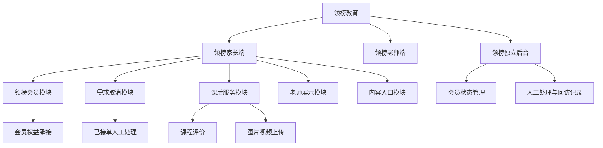
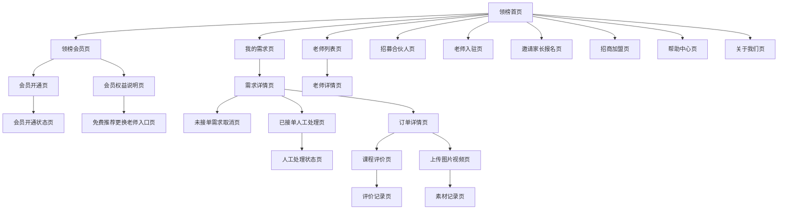

# 信息架构_领榜v4新增规则补充_v1_20260604

## 背景

领榜小程序端 v4 原型已确认新增领榜会员、未接单需求取消、已接单取消/退款人工处理、订单完成后课程评价、订单完成后上传图片/视频、老师展示页和内容入口。为避免后续 UI/UX、数据交互和 PRD 出现“原型有、信息架构没有”的不一致，本稿在既有 `信息架构_页面结构_v1_20260603.md` 基础上补充领榜 v4 页面级信息架构。

本稿只补充领榜教育，不修改优坐标信息架构。不输出组件交互细节、表单字段规则、接口字段、HTML 原型、视觉稿或最终 PRD。

## 目标

- 补充领榜会员页、会员开通页、会员权益承接入口和会员状态。
- 补充未接单需求取消入口、已接单取消/退款人工处理入口。
- 补充订单完成后的课程评价页和图片/视频上传页。
- 补充老师列表、老师详情展示页边界，明确只展示，不作为家长系统内确认老师或选老师成交入口。
- 补充招募合伙人、老师入驻、邀请家长报名、招商加盟、帮助中心、关于我们等内容入口。
- 明确页面入口、页面出口、页面状态、上下游关系和权限可见性。

## 输入来源

- `/Users/xuyunfeng/Documents/k12/AGENTS.md`
- `/Users/xuyunfeng/Documents/k12/00_项目规则/项目总览_工作流程_v1_20260602.md`
- `/Users/xuyunfeng/Documents/k12/13_任务卡片/信息架构助手_任务说明_v1_20260602.md`
- `/Users/xuyunfeng/Documents/k12/00_项目规则/信息架构输出模板_v1_20260602.md`
- `/Users/xuyunfeng/Documents/k12/00_项目规则/助手向主控回报规则_v1_20260603.md`
- `/Users/xuyunfeng/Documents/k12/work/任务交接_领榜v4上游回流_v1_20260604.md`
- `/Users/xuyunfeng/Documents/k12/05_需求分析/需求分析_领榜v4新增规则补充_v1_20260604.md`
- `/Users/xuyunfeng/Documents/k12/06_业务流程/业务流程_领榜v4新增规则补充_v1_20260604.md`
- `/Users/xuyunfeng/Documents/k12/07_信息架构/信息架构_页面结构_v1_20260603.md`
- `/Users/xuyunfeng/Documents/k12/10_高保真原型/高保真原型_领榜离线原型适配说明_v1_20260604.md`
- `/Users/xuyunfeng/Documents/k12/10_高保真原型/高保真原型_问题记录_v1_20260603.md`

## 关键结论

- 领榜会员进入当前领榜业务范围，补充 `领榜会员页`、`会员开通页`、`会员权益说明页` 和 `会员开通状态页`。
- 领榜会员包含 1 年会员和 3 年会员：1 年会员 300 元/年，3 年会员 500 元/3 年。
- 会员权益页面需要承接“免费推荐/更换老师”入口；该入口进入客服/教务服务承接，不等同于家长系统内选老师成交。
- 未接单需求取消入口只在未被老师付费接单的需求详情中可见。
- 已接单后的取消/退款不做自动退款页，只保留客服人工处理入口、人工处理状态和备注承接。
- 课程评价页、上传图片/视频页只在订单完成后可进入。
- 老师列表页和老师详情页只展示老师资料，不作为家长系统内确认老师、选择老师成交或系统派单入口。
- 招募合伙人、老师入驻、邀请家长报名、招商加盟、帮助中心、关于我们纳入领榜内容入口；是否由后台配置仍待确认。

## 需求覆盖范围

| 需求 | 来源 | 是否纳入信息架构 | 对应模块 | 对应页面 | 说明 |
| --- | --- | --- | --- | --- | --- |
| 领榜 1 年/3 年会员 | 需求分析补充 LBV4-DA-01/02/03/04 | 是 | 领榜会员模块 | 领榜会员页、会员开通页、会员开通状态页 | 1 年 300 元/年，3 年 500 元/3 年 |
| 会员期内免费推荐/更换老师 | 需求分析补充 LBV4-DA-05/06 | 是 | 领榜会员权益模块 | 会员权益说明页、免费推荐/更换老师入口页 | 覆盖在校大学生、在读硕博、专业教师、星级教员 |
| 未接单需求可取消 | 需求分析补充 LBV4-DA-07 | 是 | 领榜需求取消模块 | 需求详情页、未接单需求取消页 | 仅未被老师付费接单时可见 |
| 已接单取消/退款人工处理 | 需求分析补充 LBV4-DA-08 | 是 | 领榜人工处理模块 | 已接单人工处理页、人工处理状态页 | 不做系统内自动退款闭环 |
| 完成后课程评价 | 需求分析补充 LBV4-DA-09/11 | 是 | 领榜课后服务模块 | 课程评价页、评价记录页 | 只在订单完成后开放 |
| 完成后图片/视频上传 | 需求分析补充 LBV4-DA-10/11 | 是 | 领榜课后服务模块 | 上传图片/视频页、素材记录页 | 只在订单完成后开放 |
| 老师列表/详情展示 | 需求分析补充 LBV4-DA-12；问题记录 P-015 | 是 | 领榜老师展示模块 | 老师列表页、老师详情页 | 只展示，不做家长系统内确认老师 |
| 内容入口 | v4 交接和原型适配说明 | 是 | 领榜内容入口模块 | 招募合伙人、老师入驻、邀请家长报名、招商加盟、帮助中心、关于我们 | 后台可配置性待确认 |

## 角色与页面权限视图

| 角色 | 可见模块 | 可访问页面 | 不可访问页面 | 权限说明 |
| --- | --- | --- | --- | --- |
| 领榜家长 | 会员、需求、订单、老师展示、课后服务、内容入口 | 会员页、会员开通页、需求详情页、未接单需求取消页、课程评价页、上传图片/视频页、老师列表/详情、帮助/关于 | 已接单自动退款页、家长系统内确认老师页 | 只能取消未接单需求；完成订单后才能评价和上传素材 |
| 领榜老师 | 老师入驻、老师展示、接单相关页面 | 老师入驻页、老师详情展示关联页、可抢需求页、我的接单页 | 家长会员开通页、家长取消需求页、课程评价提交页 | 老师资料可被展示，但不触发家长系统内确认老师 |
| 领榜客服/教务 | 会员权益承接、人工处理、课后回访 | 免费推荐/更换老师承接页、已接单人工处理页、人工处理状态页、评价记录页、素材记录页 | 系统自动退款页、优坐标后台 | 承接会员服务和已接单后人工处理 |
| 领榜管理员 | 领榜后台管理、内容管理候选 | 会员状态管理页、需求管理页、评价/素材记录页、内容入口管理候选页 | 优坐标后台 | 内容入口后台配置性仍待确认 |
| 财务 | 会员支付确认候选、系统外退款处理 | 会员开通状态页、已接单人工处理页 | 自动退款页、老师展示管理成交页 | 支付方式和退款财务处理不在本稿定义为系统闭环 |
| 访客/潜在合作方 | 内容入口 | 招募合伙人、招商加盟、关于我们、帮助中心 | 后台管理页、订单相关页 | 只访问公开内容入口 |

## 模块结构图

### Mermaid

### 节点清单

| 节点ID | 节点名称 | 节点类型 | 说明 |
| --- | --- | --- | --- |
| LB | 领榜教育 | 项目域 | 本稿只补充领榜 |
| Parent | 领榜家长端 | 端侧模块 | 家长使用会员、需求、订单和内容入口 |
| Teacher | 领榜老师端 | 端侧模块 | 老师入驻、资料展示和接单 |
| Admin | 领榜独立后台 | 管理模块 | 管理会员、需求、人工处理、评价和素材 |
| Member | 领榜会员模块 | 核心模块 | 会员购买、权益说明、开通状态 |
| Service | 会员权益承接 | 支撑模块 | 免费推荐/更换老师入口 |
| Demand | 需求取消模块 | 核心模块 | 未接单取消与已接单人工处理边界 |
| Manual | 已接单人工处理 | 支撑模块 | 客服/财务系统外处理承接 |
| AfterClass | 课后服务模块 | 支撑模块 | 完成后评价和素材上传 |
| TeacherShow | 老师展示模块 | 展示模块 | 老师列表和详情，只展示 |
| Content | 内容入口模块 | 展示模块 | 招募、入驻、邀请、加盟、帮助、关于 |
| MemberAdmin | 会员状态管理 | 管理模块 | 后台查看会员状态和开通状态 |
| ServiceAdmin | 人工处理与回访记录 | 管理模块 | 承接人工处理、评价、素材和回访 |

### 连线清单

| 起点 | 终点 | 关系 | 说明 |
| --- | --- | --- | --- |
| 领榜教育 | 领榜家长端 | 端侧归属 | 家长访问新增页面 |
| 领榜家长端 | 领榜会员模块 | 主入口 | 进入会员购买与权益 |
| 领榜会员模块 | 会员权益承接 | 权益承接 | 会员有效期内进入免费推荐/更换老师服务 |
| 领榜家长端 | 需求取消模块 | 订单/需求入口 | 从需求详情进入取消或人工处理 |
| 需求取消模块 | 已接单人工处理 | 异常承接 | 已接单后不做自动退款 |
| 领榜家长端 | 课后服务模块 | 完成订单入口 | 完成后进入评价和上传 |
| 领榜家长端 | 老师展示模块 | 展示入口 | 只浏览老师资料 |
| 领榜家长端 | 内容入口模块 | 内容入口 | 承接招募、入驻、邀请、加盟、帮助、关于 |
| 领榜独立后台 | 会员状态管理 | 后台管理 | 查看会员开通和状态 |
| 领榜独立后台 | 人工处理与回访记录 | 后台管理 | 查看人工处理、评价和素材 |

## 模块结构表

| 模块 | 模块类型 | 模块目标 | 覆盖需求 | 服务角色 | 关联业务对象 | 对应流程阶段 | 是否纳入 MVP |
| --- | --- | --- | --- | --- | --- | --- | --- |
| 领榜会员模块 | 核心模块 | 支持会员购买、权益说明和开通状态查看 | 1 年/3 年会员 | 家长、财务、管理员 | 会员、会员订单 | 购买、支付/收款确认、开通 | 是 |
| 会员权益承接模块 | 支撑模块 | 支持会员免费推荐/更换老师入口 | 免费推荐/更换老师 | 家长、客服/教务 | 会员、老师类型、服务记录 | 会员有效期内服务 | 是 |
| 需求取消模块 | 核心模块 | 支持未接单需求取消 | 未接单取消 | 家长、系统 | 需求单 | 未接单状态取消 | 是 |
| 已接单人工处理模块 | 支撑模块 | 承接已接单后的取消/退款人工处理 | 已接单人工处理 | 客服/教务、财务、家长 | 服务安排、人工处理记录 | 已接单后异常处理 | 是 |
| 课后服务模块 | 支撑模块 | 支持完成后评价和素材上传 | 课程评价、上传图片/视频 | 家长、客服/运营 | 订单、评价记录、素材记录 | 订单完成后 | 是 |
| 老师展示模块 | 展示模块 | 展示老师列表和详情 | 老师展示边界 | 家长、老师、运营 | 老师展示资料 | 浏览展示 | 是 |
| 内容入口模块 | 展示模块 | 提供招募、入驻、邀请、加盟、帮助、关于入口 | 内容入口 | 家长、老师、合作方、访客 | 内容页面 | 内容浏览/报名入口 | 是 |
| 内容入口后台配置模块 | 管理模块 | 支持内容入口配置 | 后台可配置性 | 管理员、运营 | 内容页面 | 内容维护 | 待确认 |

## 页面结构图

### Mermaid

### 节点清单

| 节点ID | 页面名称 | 所属模块 | 页面类型 | 说明 |
| --- | --- | --- | --- | --- |
| Home | 领榜首页 | 领榜家长端 | 一级入口 | 新增页面的主要入口 |
| Member | 领榜会员页 | 领榜会员模块 | 一级/二级入口 | 展示会员档位和入口 |
| MemberOpen | 会员开通页 | 领榜会员模块 | 操作承接页 | 承接 1 年/3 年会员开通 |
| MemberRights | 会员权益说明页 | 会员权益承接模块 | 说明页 | 展示免费推荐/更换老师权益 |
| MemberStatus | 会员开通状态页 | 领榜会员模块 | 状态页 | 展示待确认、已开通、已到期等状态 |
| FreeService | 免费推荐更换老师入口页 | 会员权益承接模块 | 服务入口页 | 进入客服/教务服务承接 |
| DemandList | 我的需求页 | 需求取消模块 | 列表页 | 既有页面，新增取消入口上游 |
| DemandDetail | 需求详情页 | 需求取消模块 | 详情页 | 根据接单状态展示不同入口 |
| CancelUnaccepted | 未接单需求取消页 | 需求取消模块 | 操作承接页 | 只对未被老师付费接单需求开放 |
| ManualCancel | 已接单人工处理页 | 已接单人工处理模块 | 人工处理入口页 | 已接单后取消/退款诉求承接 |
| ManualStatus | 人工处理状态页 | 已接单人工处理模块 | 状态页 | 展示客服人工处理状态和备注 |
| OrderDetail | 订单详情页 | 课后服务模块 | 详情页 | 完成后开放评价和素材上传 |
| ReviewPage | 课程评价页 | 课后服务模块 | 操作承接页 | 订单完成后可进入 |
| MediaPage | 上传图片视频页 | 课后服务模块 | 操作承接页 | 订单完成后可进入 |
| ReviewRecord | 评价记录页 | 课后服务模块 | 记录页 | 客服回访和服务记录依据 |
| MediaRecord | 素材记录页 | 课后服务模块 | 记录页 | 课后图片/视频记录 |
| TeacherList | 老师列表页 | 老师展示模块 | 列表页 | 只展示老师资料 |
| TeacherDetail | 老师详情页 | 老师展示模块 | 详情页 | 只展示，不成交 |
| Partner | 招募合伙人页 | 内容入口模块 | 内容页 | 后台可配置性待确认 |
| TeacherApply | 老师入驻页 | 内容入口模块 | 内容/报名入口页 | 老师入驻入口 |
| InviteParent | 邀请家长报名页 | 内容入口模块 | 内容/邀请入口页 | 邀请家长报名 |
| Franchise | 招商加盟页 | 内容入口模块 | 内容页 | 后台可配置性待确认 |
| Help | 帮助中心页 | 内容入口模块 | 内容页 | 帮助说明 |
| About | 关于我们页 | 内容入口模块 | 内容页 | 品牌/机构说明 |

### 连线清单

| 起点页面 | 终点页面 | 触发条件 | 说明 |
| --- | --- | --- | --- |
| 领榜首页 | 领榜会员页 | 家长进入会员入口 | 查看会员档位和权益 |
| 领榜会员页 | 会员开通页 | 家长选择开通 | 进入会员开通 |
| 领榜会员页 | 会员权益说明页 | 查看权益 | 了解免费推荐/更换老师 |
| 会员开通页 | 会员开通状态页 | 提交开通后 | 查看开通状态 |
| 会员权益说明页 | 免费推荐更换老师入口页 | 会员有效期内发起服务 | 进入客服/教务服务承接 |
| 我的需求页 | 需求详情页 | 查看需求 | 判断是否可取消 |
| 需求详情页 | 未接单需求取消页 | 需求未被老师付费接单 | 家长可取消 |
| 需求详情页 | 已接单人工处理页 | 需求已被老师付费接单且有取消/退款诉求 | 不做自动退款 |
| 已接单人工处理页 | 人工处理状态页 | 客服受理后 | 查看处理状态和备注 |
| 订单详情页 | 课程评价页 | 订单已完成 | 完成后开放 |
| 订单详情页 | 上传图片视频页 | 订单已完成 | 完成后开放 |
| 课程评价页 | 评价记录页 | 评价提交后 | 形成服务记录 |
| 上传图片视频页 | 素材记录页 | 上传后 | 形成素材记录 |
| 领榜首页 | 老师列表页 | 查看老师 | 只展示 |
| 老师列表页 | 老师详情页 | 查看详情 | 只展示，不确认老师 |
| 领榜首页 | 招募合伙人页 | 点击内容入口 | 内容浏览 |
| 领榜首页 | 老师入驻页 | 点击入驻入口 | 老师入驻 |
| 领榜首页 | 邀请家长报名页 | 点击邀请入口 | 邀请报名 |
| 领榜首页 | 招商加盟页 | 点击加盟入口 | 内容浏览 |
| 领榜首页 | 帮助中心页 | 点击帮助入口 | 查看帮助 |
| 领榜首页 | 关于我们页 | 点击关于入口 | 查看关于 |

## 页面清单

| 页面 | 所属模块 | 页面目标 | 服务角色 | 对应需求 | 对应业务动作 | 关联业务对象 | 页面类型 | 是否纳入 MVP |
| --- | --- | --- | --- | --- | --- | --- | --- | --- |
| 领榜会员页 | 领榜会员模块 | 展示会员档位和会员入口 | 家长 | LBV4-DA-01/02 | 查看会员 | 会员 | 一级/二级入口 | 是 |
| 会员开通页 | 领榜会员模块 | 承接 1 年/3 年会员开通 | 家长、财务 | LBV4-DA-02/03/04 | 选择会员档位并开通 | 会员订单 | 操作承接页 | 是 |
| 会员权益说明页 | 会员权益承接模块 | 说明免费推荐/更换老师权益 | 家长、客服/教务 | LBV4-DA-05/06 | 查看权益 | 会员权益 | 说明页 | 是 |
| 会员开通状态页 | 领榜会员模块 | 展示会员开通和有效状态 | 家长、财务、管理员 | LBV4-DA-01/02 | 查看开通状态 | 会员、会员订单 | 状态页 | 是 |
| 免费推荐更换老师入口页 | 会员权益承接模块 | 承接会员权益服务入口 | 家长、客服/教务 | LBV4-DA-05/06 | 申请免费推荐/更换老师 | 会员、服务记录 | 服务入口页 | 是 |
| 未接单需求取消页 | 需求取消模块 | 家长取消未接单需求 | 家长 | LBV4-DA-07 | 取消需求 | 需求单 | 操作承接页 | 是 |
| 已接单人工处理页 | 已接单人工处理模块 | 承接已接单取消/退款诉求 | 家长、客服、财务 | LBV4-DA-08 | 发起人工处理 | 服务安排、人工处理记录 | 人工处理入口页 | 是 |
| 人工处理状态页 | 已接单人工处理模块 | 展示人工处理进度和备注 | 家长、客服、财务 | LBV4-DA-08 | 查看人工处理状态 | 人工处理记录 | 状态页 | 是 |
| 课程评价页 | 课后服务模块 | 订单完成后提交评价 | 家长 | LBV4-DA-09/11 | 提交课程评价 | 订单、评价记录 | 操作承接页 | 是 |
| 评价记录页 | 课后服务模块 | 查看评价记录 | 家长、客服/运营 | LBV4-DA-09/11 | 查看评价 | 评价记录 | 记录页 | 是 |
| 上传图片视频页 | 课后服务模块 | 订单完成后上传课后素材 | 家长 | LBV4-DA-10/11 | 上传图片/视频 | 订单、素材记录 | 操作承接页 | 是 |
| 素材记录页 | 课后服务模块 | 查看课后素材记录 | 家长、客服/运营 | LBV4-DA-10/11 | 查看素材 | 素材记录 | 记录页 | 是 |
| 老师列表页 | 老师展示模块 | 展示老师列表 | 家长、老师、运营 | LBV4-DA-12 | 浏览老师 | 老师展示资料 | 列表页 | 是 |
| 老师详情页 | 老师展示模块 | 展示老师详情 | 家长、老师、运营 | LBV4-DA-12 | 查看老师资料 | 老师展示资料 | 详情页 | 是 |
| 招募合伙人页 | 内容入口模块 | 展示合伙人招募信息 | 合作方、运营 | 内容入口 | 内容浏览 | 内容页面 | 内容页 | 是 |
| 老师入驻页 | 内容入口模块 | 承接老师入驻入口 | 老师 | 内容入口 | 老师入驻 | 老师入驻信息 | 内容/报名入口页 | 是 |
| 邀请家长报名页 | 内容入口模块 | 承接邀请家长报名 | 家长、分销员、运营 | 内容入口 | 邀请报名 | 邀请关系 | 内容/邀请入口页 | 是 |
| 招商加盟页 | 内容入口模块 | 展示招商加盟信息 | 合作方、运营 | 内容入口 | 内容浏览 | 内容页面 | 内容页 | 是 |
| 帮助中心页 | 内容入口模块 | 提供帮助说明 | 全部端侧用户 | 内容入口 | 查看帮助 | 帮助内容 | 内容页 | 是 |
| 关于我们页 | 内容入口模块 | 展示机构信息 | 全部端侧用户、访客 | 内容入口 | 查看关于 | 关于内容 | 内容页 | 是 |
| 内容入口管理候选页 | 内容入口后台配置模块 | 后台维护内容入口 | 管理员、运营 | 待确认需求 | 内容配置 | 内容页面 | 管理页 | 待确认 |

## 导航关系

| 页面 | 导航层级 | 入口类型 | 上级页面 | 下级页面 | 跨模块入口 | 是否可直达 | 说明 |
| --- | --- | --- | --- | --- | --- | --- | --- |
| 领榜会员页 | 二级 | 主入口 | 领榜首页、我的页 | 会员开通页、会员权益说明页 | 免费推荐更换老师入口页 | 是 | 领榜会员主入口 |
| 会员开通页 | 三级 | 操作入口 | 领榜会员页 | 会员开通状态页 | 无 | 否 | 由会员页进入 |
| 会员权益说明页 | 三级 | 说明入口 | 领榜会员页 | 免费推荐更换老师入口页 | 老师展示页 | 是 | 权益说明和服务入口 |
| 免费推荐更换老师入口页 | 四级 | 权益服务入口 | 会员权益说明页、会员开通状态页 | 人工服务承接 | 老师列表页 | 否 | 会员有效期内可用 |
| 未接单需求取消页 | 三级 | 异常流程入口 | 需求详情页 | 我的需求页 | 无 | 否 | 仅未接单需求可进入 |
| 已接单人工处理页 | 三级 | 人工处理入口 | 需求详情页、订单详情页 | 人工处理状态页 | 客服入口 | 否 | 不做自动退款 |
| 课程评价页 | 三级 | 完成后入口 | 订单详情页 | 评价记录页 | 无 | 否 | 只在完成订单可进入 |
| 上传图片视频页 | 三级 | 完成后入口 | 订单详情页 | 素材记录页 | 无 | 否 | 只在完成订单可进入 |
| 老师列表页 | 二级 | 展示入口 | 领榜首页 | 老师详情页 | 会员权益说明页 | 是 | 只展示 |
| 老师详情页 | 三级 | 详情入口 | 老师列表页 | 无 | 发布需求页 | 否 | 可辅助了解老师，不成交 |
| 招募合伙人页 | 二级 | 内容入口 | 领榜首页、我的页 | 无 | 海报/邀请入口 | 是 | 后台配置待确认 |
| 老师入驻页 | 二级 | 内容/报名入口 | 领榜首页、我的页 | 无 | 老师端 | 是 | 老师入驻入口 |
| 邀请家长报名页 | 二级 | 内容/邀请入口 | 领榜首页、海报页 | 无 | 分销中心 | 是 | 邀请报名入口 |
| 招商加盟页 | 二级 | 内容入口 | 领榜首页、我的页 | 无 | 无 | 是 | 后台配置待确认 |
| 帮助中心页 | 二级 | 内容入口 | 领榜首页、我的页 | 无 | 多页面帮助入口 | 是 | 公共帮助 |
| 关于我们页 | 二级 | 内容入口 | 领榜首页、我的页 | 无 | 无 | 是 | 机构说明 |

## 页面入口与出口

| 页面 | 主流程入口 | 异常流程入口 | 角色入口 | 外部入口 | 完成后出口 | 失败或中止后出口 | 返回路径 |
| --- | --- | --- | --- | --- | --- | --- | --- |
| 会员开通页 | 领榜会员页 | 支付/收款未确认 | 家长 | 无 | 会员开通状态页 | 领榜会员页 | 领榜会员页 |
| 会员开通状态页 | 会员开通页 | 会员开通待处理、会员到期 | 家长、财务、管理员 | 无 | 会员权益说明页 | 领榜会员页 | 领榜会员页 |
| 免费推荐更换老师入口页 | 会员权益说明页 | 会员未开通、会员已到期 | 家长、客服/教务 | 系统外客服服务 | 人工服务承接 | 会员权益说明页 | 会员权益说明页 |
| 未接单需求取消页 | 需求详情页 | 状态已变化为已接单 | 家长 | 无 | 我的需求页 | 需求详情页 | 需求详情页 |
| 已接单人工处理页 | 需求详情页、订单详情页 | 取消/退款诉求 | 家长、客服、财务 | 系统外客服/财务处理 | 人工处理状态页 | 订单详情页 | 订单详情页 |
| 课程评价页 | 订单详情页 | 订单未完成 | 家长 | 无 | 评价记录页 | 订单详情页 | 订单详情页 |
| 上传图片视频页 | 订单详情页 | 订单未完成 | 家长 | 无 | 素材记录页 | 订单详情页 | 订单详情页 |
| 老师列表页 | 领榜首页 | 无 | 家长 | 无 | 老师详情页 | 领榜首页 | 领榜首页 |
| 老师详情页 | 老师列表页 | 无 | 家长 | 无 | 返回老师列表或发布需求页 | 老师列表页 | 老师列表页 |
| 内容入口页面 | 领榜首页、我的页 | 内容不可用 | 家长、老师、合作方、访客 | 分享入口 | 原页面或报名结果候选 | 领榜首页 | 领榜首页 |

## 页面状态

| 页面 | 默认状态 | 空状态 | 加载状态 | 错误状态 | 无权限状态 | 不可操作状态 | 已完成状态 | 异常业务状态 |
| --- | --- | --- | --- | --- | --- | --- | --- | --- |
| 领榜会员页 | 显示 1 年/3 年会员和权益摘要 | 暂无会员配置 | 读取会员信息中 | 读取失败 | 非家长不可开通 | 会员已开通时不可重复开通同档位 | 已进入开通页 | 会员配置异常 |
| 会员开通页 | 显示会员档位和开通入口 | 暂无可开通档位 | 开通处理中 | 开通失败 | 非家长不可开通 | 支付/收款待确认时不可重复开通 | 已提交开通 | 支付方式待确认、收款待确认 |
| 会员开通状态页 | 显示会员有效状态 | 暂无会员 | 读取状态中 | 读取失败 | 非本人不可见 | 已到期不可享受权益 | 会员已开通 | 会员开通待处理、会员已到期 |
| 会员权益说明页 | 显示免费推荐/更换老师权益 | 暂无权益说明 | 读取权益中 | 读取失败 | 非家长仅可浏览公开说明 | 未开通或到期不可发起权益服务 | 可进入权益服务 | 权益状态异常 |
| 免费推荐更换老师入口页 | 显示权益服务入口 | 暂无可用权益 | 读取会员状态中 | 读取失败 | 非会员不可进入服务 | 会员已到期不可发起 | 服务已发起 | 客服待处理 |
| 未接单需求取消页 | 显示可取消状态 | 不适用 | 取消处理中 | 取消失败 | 非需求发布人不可取消 | 已接单不可系统内取消 | 需求已取消 | 状态已变更为已接单 |
| 已接单人工处理页 | 显示人工处理入口 | 暂无人工处理记录 | 读取中 | 读取失败 | 非相关家长/客服/财务不可见 | 不提供自动退款 | 已进入人工处理 | 人工处理异常 |
| 人工处理状态页 | 显示处理进度和备注 | 暂无处理记录 | 读取中 | 读取失败 | 非相关角色不可见 | 已完成不可重复处理 | 人工处理完成 | 人工处理异常 |
| 课程评价页 | 显示评价入口 | 不适用 | 提交中 | 提交失败 | 非订单家长不可评价 | 订单未完成不可评价 | 评价已提交 | 订单状态异常 |
| 上传图片视频页 | 显示上传入口 | 不适用 | 上传中 | 上传失败 | 非订单家长不可上传 | 订单未完成不可上传 | 素材已上传 | 素材限制待确认 |
| 老师列表页 | 显示老师展示列表 | 暂无展示老师 | 读取老师中 | 读取失败 | 无 | 不提供选老师成交 | 已进入详情 | 展示资料异常 |
| 老师详情页 | 显示老师展示资料 | 不适用 | 读取详情中 | 读取失败 | 无 | 不提供确认老师成交 | 浏览完成 | 展示资料异常 |
| 内容入口页面 | 显示内容 | 暂无内容 | 读取内容中 | 读取失败 | 后台内容管理仅管理员可见 | 内容下线不可访问 | 浏览完成 | 内容配置待确认 |

## 页面上下游关系

| 前置页面 | 当前页面 | 后续页面 | 承接业务对象 | 承接业务状态 | 触发角色 | 触发条件 | 权限条件 |
| --- | --- | --- | --- | --- | --- | --- | --- |
| 领榜首页 | 领榜会员页 | 会员开通页、会员权益说明页 | 会员 | 待购买 | 家长 | 进入会员入口 | 家长可见 |
| 领榜会员页 | 会员开通页 | 会员开通状态页 | 会员订单 | 会员订单待确认 | 家长 | 选择 1 年或 3 年会员 | 家长本人 |
| 会员开通页 | 会员开通状态页 | 会员权益说明页 | 会员、会员订单 | 已开通或待处理 | 家长、财务 | 支付或收款确认状态变化 | 家长本人、财务、管理员 |
| 会员权益说明页 | 免费推荐更换老师入口页 | 人工服务承接 | 会员、服务记录 | 会员服务中 | 家长 | 会员有效期内发起 | 会员有效 |
| 我的需求页 | 需求详情页 | 未接单需求取消页 | 需求单 | 抢单中/未接单 | 家长 | 查看未接单需求 | 需求发布人 |
| 需求详情页 | 未接单需求取消页 | 我的需求页 | 需求单 | 需求已取消 | 家长 | 未被老师付费接单时取消 | 需求发布人 |
| 需求详情页 | 已接单人工处理页 | 人工处理状态页 | 服务安排、人工处理记录 | 人工取消退款处理中 | 家长、客服 | 已接单后产生诉求 | 相关家长、客服、财务 |
| 订单详情页 | 课程评价页 | 评价记录页 | 评价记录 | 评价已记录 | 家长 | 订单已完成 | 订单家长本人 |
| 订单详情页 | 上传图片视频页 | 素材记录页 | 素材记录 | 素材已记录 | 家长 | 订单已完成 | 订单家长本人 |
| 领榜首页 | 老师列表页 | 老师详情页 | 老师展示资料 | 展示中 | 家长 | 查看老师展示 | 所有家长可见 |
| 老师列表页 | 老师详情页 | 老师列表页或发布需求页 | 老师展示资料 | 浏览完成 | 家长 | 查看详情 | 所有家长可见 |
| 领榜首页/我的页 | 内容入口页面 | 原页面或报名结果候选 | 内容页面 | 展示中 | 家长、老师、合作方 | 点击内容入口 | 公开可见 |

## 权限差异说明

| 页面 | 角色 | 可见内容 | 可进入条件 | 不可进入原因 | 替代去向 |
| --- | --- | --- | --- | --- | --- |
| 会员开通页 | 领榜家长 | 会员档位和开通入口 | 家长身份 | 非家长不能开通 | 领榜会员页 |
| 免费推荐更换老师入口页 | 领榜家长 | 会员权益服务入口 | 会员有效 | 未开通或已到期 | 领榜会员页 |
| 未接单需求取消页 | 领榜家长 | 取消未接单需求入口 | 本人需求且未被老师付费接单 | 已接单或非本人需求 | 需求详情页、已接单人工处理页 |
| 已接单人工处理页 | 领榜家长 | 人工处理入口和状态 | 本人订单或需求已接单 | 未接单需求应走取消页 | 需求详情页 |
| 课程评价页 | 领榜家长 | 评价入口 | 本人订单已完成 | 订单未完成 | 订单详情页 |
| 上传图片视频页 | 领榜家长 | 素材上传入口 | 本人订单已完成 | 订单未完成 | 订单详情页 |
| 老师列表/详情页 | 领榜家长 | 老师展示资料 | 进入展示入口 | 不适用 | 发布需求页 |
| 内容入口页面 | 访客/家长/老师/合作方 | 公开内容 | 内容可用 | 内容下线或无权限 | 领榜首页 |
| 内容入口管理候选页 | 管理员/运营 | 内容维护入口 | 后台配置能力确认后 | 后台可配置性未确认 | 暂无 |

## 暂不纳入页面或模块

| 页面或模块 | 暂不纳入原因 | 来源依据 | 后续建议 |
| --- | --- | --- | --- |
| 家长系统内确认老师成交页 | 老师列表/详情已确认只展示 | 需求分析补充 LBV4-DA-12；问题记录 P-015 | PRD 和原型说明继续标注禁止误用 |
| 系统内自动退款页 | 已接单后取消/退款走系统外人工处理 | 需求分析补充 LBV4-DA-08 | 如后续要自动退款，需回流需求、流程、财务和数据交互 |
| 未完成订单评价页 | 评价只在订单完成后开放 | 需求分析补充 LBV4-DA-09 | 订单未完成仅展示不可操作状态 |
| 未完成订单素材上传页 | 上传图片/视频只在订单完成后开放 | 需求分析补充 LBV4-DA-10 | 订单未完成仅展示不可操作状态 |
| 系统自动派单页 | 老师展示不改变 C2C 主线 | 需求分析补充暂不纳入范围 | 如未来派单需单独确认 |
| 内容入口后台配置正式模块 | 是否后台可配置未确认 | v4 交接待确认问题 | 先作为候选管理页，不进入已确认后台能力 |
| 优坐标信息架构修改 | 本次只处理领榜 v4 回流 | 主控派发边界 | 保持既有优坐标信息架构不变 |

## 下游交接说明

| 下游助手 | 需要关注的内容 |
| --- | --- |
| UI/UX 设计助手 | 补充会员权益表达、会员开通状态、未接单取消可见条件、已接单人工处理提示、完成后评价/上传入口、老师展示边界和内容入口状态。 |
| 数据交互助手 | 后续需补充会员订单、会员权益、取消状态、人工处理记录、评价记录、素材记录、老师展示资料、内容入口数据；会员支付方式、素材限制、内容配置、返佣基数仍需标注待确认。 |
| 高保真原型助手 | 领榜小程序端继续以 v4 离线原型适配版为当前引用；新增页面必须保持老师展示只展示、取消不自动退款、评价/上传只完成后开放。 |
| 需求文档助手 | PRD 必须吸收本补充稿，禁止写成家长系统内确认老师、系统内自动退款、未完成订单评价/上传或系统派单。 |
| 评审助手 | 重点检查 v4 原型、需求分析、流程、信息架构和后续 PRD 是否一致，尤其检查旧“领榜会员暂不纳入”口径是否被清理。 |

## 待确认问题

| 问题 | 影响范围 | 建议确认对象 | 处理建议 |
| --- | --- | --- | --- |
| 领榜会员支付是否接入线上支付，还是先记录支付状态并人工确认 | 会员开通页、会员开通状态页、数据交互、PRD | 业务负责人、财务负责人、技术负责人 | 信息架构保留开通状态页，不定义支付方式 |
| 招募合伙人、招商加盟等内容入口是否需要后台可配置 | 内容入口页面、后台候选管理页、数据交互 | 业务负责人、运营负责人 | 当前保留内容入口和候选配置页 |
| 领榜海报/返佣佣金基数 | 邀请家长报名、海报/返佣、分销财务、PRD | 财务负责人、业务负责人 | 信息架构保留邀请入口，不定义佣金基数 |
| 上传图片/视频数量、格式、大小、存储和审核策略 | 上传图片视频页、素材记录页、数据交互、技术实现 | 技术负责人、运营负责人 | 信息架构只保留页面和状态，不定义素材规则 |

## 风险与依赖

- 既有信息架构曾把领榜会员列为暂不纳入；本补充稿按 v4 用户确认规则覆盖该旧口径。后续 PRD 必须以本补充稿为准。
- 老师列表和老师详情容易被误写为家长选老师成交，后续 UI/UX、原型说明和 PRD 必须继续标注“只展示”。
- 取消入口纳入后，不能推导为系统内自动退款；已接单后的取消/退款仍为系统外人工处理。
- 评价和图片/视频上传已进入当前范围，但素材数量、格式、大小、存储和审核策略依赖数据交互和技术确认。
- 内容入口后台配置性未确认，当前只能作为候选后台能力，不能写成已确认后台配置模块。
- 本次不修改优坐标信息架构；若后续优坐标也有回流，应另行派发。

## 下一步动作

- 可进入 `05 UI/UX 回流`，基于本稿补充领榜会员、取消、评价、素材上传、老师展示和内容入口的页面级体验说明。
- 主控需继续确认会员支付方式、内容入口后台配置性、海报/返佣佣金基数、素材上传技术限制。
- 后续数据交互阶段需补充会员订单、会员权益、取消状态、人工处理记录、评价记录、素材记录和内容入口数据契约。
